# Workspace Dependency Graph

Baseline graph for the 25 workspace crates captured from `cargo metadata --no-deps --format-version 1`.

```mermaid
graph TD
  engine_biofield["engine-biofield"]
  engine_biorhythm["engine-biorhythm"]
  engine_face_reading["engine-face-reading"]
  engine_gene_keys["engine-gene-keys"]
  engine_human_design["engine-human-design"]
  engine_nadabrahman["engine-nadabrahman"]
  engine_numerology["engine-numerology"]
  engine_panchanga["engine-panchanga"]
  engine_transits["engine-transits"]
  engine_vedic_clock["engine-vedic-clock"]
  engine_vimshottari["engine-vimshottari"]
  noesis_api["noesis-api"]
  noesis_auth["noesis-auth"]
  noesis_bridge["noesis-bridge"]
  noesis_cache["noesis-cache"]
  noesis_core["noesis-core"]
  noesis_data["noesis-data"]
  noesis_integration["noesis-integration"]
  noesis_metrics["noesis-metrics"]
  noesis_orchestrator["noesis-orchestrator"]
  noesis_sdk["noesis-sdk"]
  noesis_tui["noesis-tui"]
  noesis_western_api["noesis-western-api"]
  noesis_witness["noesis-witness"]

  engine_biofield --> engine_human_design
  engine_biofield --> noesis_core
  engine_biorhythm --> noesis_core
  engine_face_reading --> noesis_core
  engine_gene_keys --> engine_human_design
  engine_gene_keys --> noesis_core
  engine_human_design --> noesis_core
  engine_nadabrahman --> noesis_core
  engine_numerology --> noesis_core
  engine_panchanga --> engine_human_design
  engine_panchanga --> noesis_core
  engine_transits --> engine_human_design
  engine_transits --> noesis_core
  engine_vedic_clock --> noesis_core
  engine_vimshottari --> engine_human_design
  engine_vimshottari --> noesis_core
  noesis_api --> engine_biofield
  noesis_api --> engine_biorhythm
  noesis_api --> engine_face_reading
  noesis_api --> engine_gene_keys
  noesis_api --> engine_human_design
  noesis_api --> engine_nadabrahman
  noesis_api --> engine_numerology
  noesis_api --> engine_panchanga
  noesis_api --> engine_transits
  noesis_api --> engine_vedic_clock
  noesis_api --> engine_vimshottari
  noesis_api --> noesis_auth
  noesis_api --> noesis_bridge
  noesis_api --> noesis_cache
  noesis_api --> noesis_core
  noesis_api --> noesis_data
  noesis_api --> noesis_metrics
  noesis_api --> noesis_orchestrator
  noesis_api --> noesis_witness
  noesis_auth --> noesis_core
  noesis_bridge --> noesis_core
  noesis_cache --> noesis_core
  noesis_data --> noesis_core
  noesis_integration --> engine_biorhythm
  noesis_integration --> engine_numerology
  noesis_integration --> engine_panchanga
  noesis_integration --> engine_vimshottari
  noesis_integration --> noesis_core
  noesis_orchestrator --> engine_biofield
  noesis_orchestrator --> noesis_bridge
  noesis_orchestrator --> noesis_cache
  noesis_orchestrator --> noesis_core
  noesis_orchestrator --> noesis_witness
  noesis_sdk --> noesis_core
  noesis_tui --> noesis_core
  noesis_tui --> noesis_sdk
  noesis_western_api --> noesis_core
  noesis_witness --> noesis_core
```

Source of truth for machine validation: [dependency-graph.json](./dependency-graph.json)
