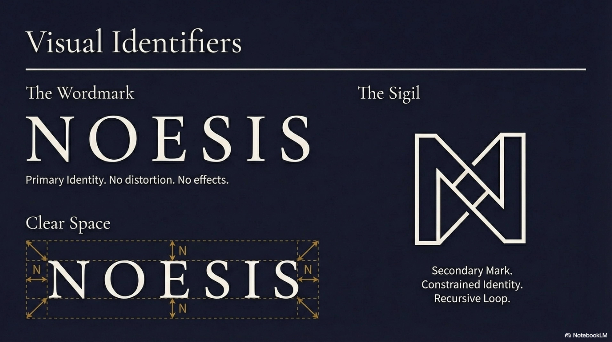

# NOESIS Brand Identity Specification
**Version:** 1.6 (Public Release)
**Category:** Living Inquiry Field
**Core Stance:** Assumed Capability
**Metric:** User Independence

## Visual Identity System

### Primary Palette: "The Unlit Space"
Concept: The interplay of light and dark represents the transition from the unknown to the known.
- **Deep Ink** (Primary Background/UI)
  - Hex: `#1A1A2E` (Deep Blue/Black)
  - Role: The "unlit space" of potential (not absence).
- **Bone** (Substrate/Text)
  - Hex: `#F0F0E8` (Off-white/Beige)
  - Role: The material substrate (paper, stone, ground).

### Accent & Utility Palette
- **Aged Gold** (`#B8860B`) - Role: Value, Gravitas. "Earned value," not polished shine. Use for key interactions.
- **Stone Grey** (`#6B6B6B`) - Role: Structure. Neutral ground, transition space.
- **Terracotta** (`#C65D3B`) - Role: Alert. "Earth-fire." Natural attention without alarm.

### Typography System
1.  **Philosophical / Authoritative (Headlines)**
    - **Font:** Cormorant Garamond
    - **Weights:** Light (300), Regular (400), SemiBold (600)
    - **Usage:** Headlines, definitive statements.
2.  **Humanist / Interface (Body)**
    - **Font:** Source Sans 3
    - **Weights:** Regular (400), SemiBold (600)
    - **Usage:** Body copy, core UI text.
3.  **Data / Code (Technical)**
    - **Font:** JetBrains Mono
    - **Weight:** Regular (400)
    - **Usage:** Technical data, specs, code blocks.

### UI & Graphic constraints
- **Corner Radius:** 0px (Sharp edges = Intentionality).
- **Borders:** 1px Solid (Deep Ink or Stone Grey).
- **Fills:** Flat color. No gradients.
- **Layout:** "Subtle architectural grid (5-10% opacity) used as foundation."
- **Imagery:** Texture over emotion. Evidence of work. No faces looking at camera. Technical/Architectural line work.

---

## Brand Voice & Ethos

### The Builder's Ethos
> "We do not build cages; we build scaffolding."
> "Success Metric: The User outgrowing the system."

### Voice Principles
1.  **Grounded:** Deep, substantial, no floating elements.
2.  **Direct:** Sharp edges, clear typography, minimal decoration.
3.  **Respectful-Challenging:** High information density, treats user as capable.
4.  **Earned Authority:** Classical typography, timeless materials.
5.  **Protects Ambiguity:** Generous negative space. Not everything is labeled.

### The Anti-Patterns
To differentiate from "Guru" or standard SaaS products, Noesis explicitly rejects:
- **Gamification:** No streaks, badges, points (creates dependency).
- **Guru Aesthetics:** No hero images of founders.
- **False Urgency:** No countdown timers.
- **Community as Product:** No forced social feeds ("echo chambers").
- **Rounded Softness:** Rejection of startup-friendly aesthetics.

---

## Target Audience: "Seeker Simon"
- **Profile:** Age 32-48, High-Income, Post-Therapy.
- **Mindset:** Exhausted by performative growth. Reads philosophy.
- **Status:** Highly functional but feels "flatness."
- **Quote:** "I've optimized the hell out of a life I never consciously chose."
- **Anti-Goal:** Does NOT want another guru, streak counter, or "community."
