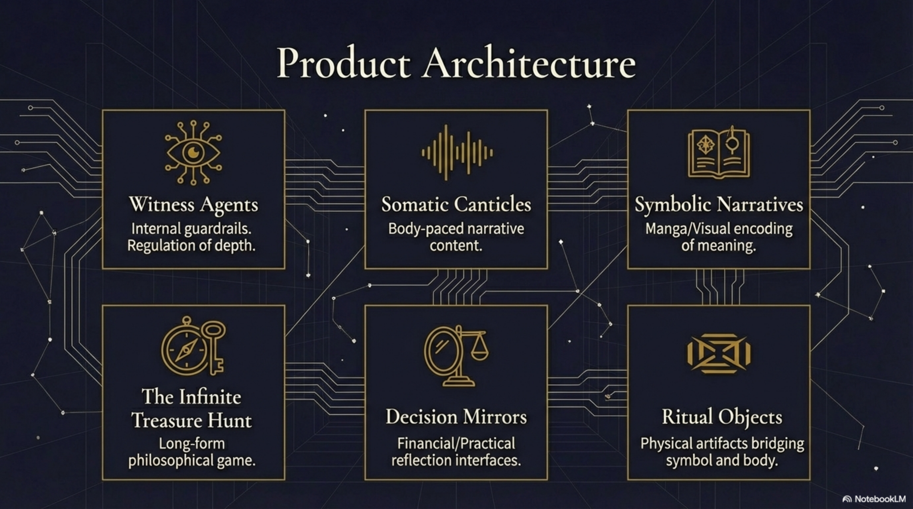

# NOESIS Product Concepts & Architecture
**Note:** This describes the user-facing product architecture ("Noesis"), which is typically powered by the backend calculation engine ("Selemene").

## UX Philosophy: Somatic Pacing
- **Anti-Pattern:** Binge Consumption, Dopamine Loops.
- **Noesis Model:** Cultivation, Friction, Natural Breaks.
- **The "Stop" Feature:** System literally prevents access until integration occurs. Enforced pauses to ensure "Inhabitation over Transcendence."

## Core Components

### 1. Witness Agents
- **Function:** Internal guardrails and regulation of depth.
- **Role:** They ensure users don't collapse into the void but also don't bypass the work.
- **Nature:** "They will not do the work for you."

### 2. Somatic Canticles
- **Function:** Body-paced narrative content.
- **Mechanism:** Content unlocking based on biological rhythm or integration status.
- **Goal:** Bypass intellectual defense mechanisms using story, symbol, and body timing.

### 3. The Infinite Treasure Hunt
- **Function:** Long-form philosophical game rewarding depth.
- **Structure:** Likely non-linear, exploration-based rather than curriculum-based.

### 4. Decision Mirrors
- **Function:** Interfaces reflecting internal states.
- **Use Case:** Financial/Practical reflection.
- **Mechanism:** Probably uses valid calculation engines (like Selemene) to mirror the user's "code" or "metrics" back to them for examination.

### 5. Symbolic Narratives (Manga)
- **Function:** Visual encoding of meaning.
- **Format:** Manga/Graphic novel style.
- **Purpose:** Pattern recognition that bypasses analytical mind.

### 6. Ritual Objects
- **Function:** Physical artifacts bridging symbol and body.
- **Materials:** Natural materials (wood, metal), debossed/engraved.

## Application Ecosystem

### Web Interface
- **Typography:** JetBrains Mono (Dark Mode Default).
- **Interactions:** Aged Gold.
- **Style:** Deep Ink dominant. Tactile feel.

### Print Artifacts
- **Typography:** Source Sans 3 (Body), JetBrains Mono (Specs).
- **Material:** Uncoated paper stock.

### Physical Objects
- **Style:** Natural materials.
- **Detail:** Debossed/Engraved marks.
