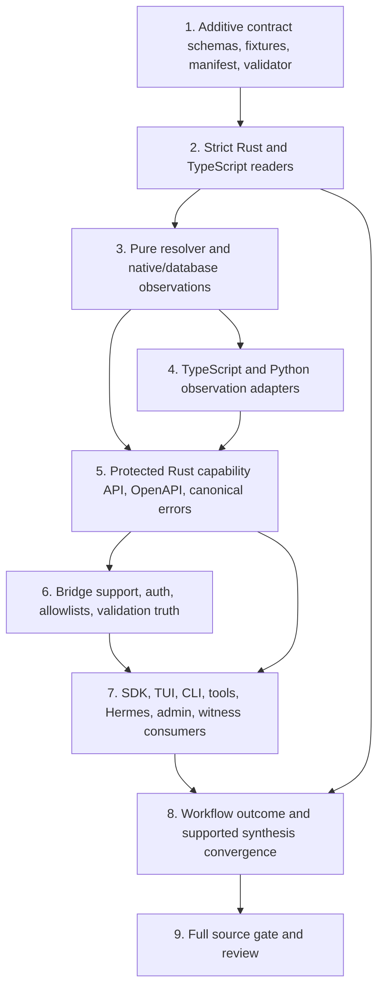

# Phase 3 Pattern Map: Capability and Contract Closure

**Purpose:** Give the Phase 3 planner a source-grounded change map for closing capability identity, availability, cross-language contract, routing, validation, and workflow-truth gaps without crossing into semantic proof, release, deployment, or production mutation.

**Inputs:** `03-CONTEXT.md`, `03-RESEARCH.md`, `03-VALIDATION.md`, the live repository, and project instructions.

**Scope boundary:** This map covers source contracts and source-level routing behavior. It does not recommend new dependencies, database migrations, provider calls, deployment changes, production probes, or production data mutation.

## File Classification

| File group | Role / data flow | Closest analog | Plan owner |
|---|---|---|---|
| `package.json`, `ts-engines/package.json`, `ts-engines/bun.lock`, `python-services/pyproject.toml`, `python-services/uv.lock`, `bridges/cli/package.json`, `bridges/cli/bun.lock` | Frozen dependency hydration and locked test runtime inputs; Plan 01 only verifies these inputs and does not own shared SDK dependency declarations; `ts-engines` remains an independent Bun project | Existing Phase 2 frozen hydration commands | 03-01 |
| `contracts/v1/manifest.json`, `contracts/v1/registries/engines.json`, `contracts/v1/schemas/engine-capability*.json`, `contracts/v1/fixtures/engine-capability*.json` | Canonical identity, schema and 19-row/17-mirror data flow into every reader and validator | Existing manifest, registry and capability item fixture | 03-01 |
| `contracts/v1/schemas/workflow-outcome.schema.json`, `contracts/v1/fixtures/workflow-outcome-*.json`, `scripts/validate_contracts.py`, `tests/scripts/test_validate_contracts.py` | Workflow outcome authority and manifest/schema/fixture negative validation | Existing contract validator and error fixture tests | 03-02 |
| `crates/noesis-core/src/contract.rs`, `crates/noesis-core/src/types.rs`, `crates/noesis-core/src/error.rs`, `crates/noesis-core/tests/contract_v1_authority.rs` | Strict Rust wire readers, status/error types and identity/conservation assertions | Existing `deny_unknown_fields` readers and authority test | 03-03, 03-08, 03-16 |
| `crates/noesis-orchestrator/src/capability.rs`, `crates/noesis-orchestrator/src/lib.rs` | Registry observations reduce into executable registration and expose declared identity separately from the executable registry | Existing `EngineRegistry` and centralized runtime construction | 03-04 |
| `ts-engines/src/types/engine.ts`, `ts-engines/tests/contract-v1.test.ts`, `ts-engines/src/server/registry.ts`, `ts-engines/src/server/app.ts`, `ts-engines/src/server/__tests__/*` | TypeScript non-decoder capability types/tests reuse the shared SDK reader; registry projection and self-check route data flow remain separate | Existing registry authority and server tests | 03-03, 03-05 |
| `python-services/shared/models.py`, `python-services/biofield_cv_service/health.py`, `python-services/mediapipe_service/health.py`, `python-services/tests/test_capability_health.py`, `python-services/tests/test_biofield_health.py`, `python-services/tests/test_mediapipe_health.py`, `python-services/README.md` | Locked sidecar dependency observations flow into canonical Python subcapability adapters and the final-gate documentation parity view for scope, counts and auth | Existing health models and module tests | 03-06 |
| `crates/noesis-api/src/lib.rs`, `crates/noesis-api/src/handlers/admin.rs`, `crates/noesis-api/tests/capability_route_tests.rs` | Protected capability route plus retained legacy admin-array compatibility adapter | Existing API router/admin handler and capability route tests | 03-07 |
| `crates/noesis-api/src/error.rs`, `crates/noesis-api/src/lib.rs`, `crates/noesis-api/src/error_mapper.rs`, `crates/noesis-api/src/handlers/biofield.rs`, `crates/noesis-api/tests/error_handling_tests.rs`, `crates/noesis-api/tests/error_response_snapshot_tests.rs`, `crates/noesis-api/tests/openapi_schema_tests.rs`, `crates/noesis-api/tests/auth_rate_limit_openapi_tests.rs` | Canonical bounded errors and authenticated OpenAPI response contract, generated from the existing API library module | Existing error mapper, handlers, snapshots and in-library OpenAPI tests | 03-08 |
| `crates/noesis-bridge/src/lib.rs`, `crates/noesis-bridge/src/error.rs`, `crates/noesis-bridge/src/python_client.rs`, `crates/noesis-bridge/src/ts_client.rs`, `crates/noesis-api/tests/common/test_harness.rs`, `crates/noesis-api/tests/routing_enforcement_tests.rs`, `crates/noesis-api/tests/integration_tests.rs`, `crates/noesis-api/tests/route_inventory_tests.rs` | Authenticated bridge dispatch, route allowlists, zero-call rejection and route inventory | Existing bridge clients and API routing test harness | 03-09 |
| `crates/noesis-sdk/src/*.rs`, `crates/noesis-tui/src/*.rs`, related tests | Rust client and TUI dynamic capability view data flow | Existing SDK client and picker/list rendering | 03-10 |
| `packages/noesis-sdk-ts/src/index.ts`, `packages/noesis-sdk-ts/tests/index.test.ts` | General TypeScript SDK contract projection and authenticated client behavior | Existing SDK index/client tests | 03-11 |
| `packages/noesis-engine-sdk/src/index.ts`, `packages/noesis-engine-sdk/src/contract-v1.ts`, `packages/noesis-engine-sdk/src/*.ts`, `packages/noesis-engine-sdk/tests/*.ts` | Sole shared strict capability/workflow decoder authority and focus SDK four-engine subset/client transport; generated outputs are produced separately | Existing focus SDK public entrypoint, package exports, client and contract tests | 03-03, 03-12 |
| `packages/noesis-engine-sdk/package.json`, `packages/noesis-sdk-ts/package.json`, `apps/admin-web/package.json`, `packages/witness-pipeline/package.json`, `packages/verification/package.json`, `pnpm-lock.yaml` | Actual pnpm workspace links for shared decoder consumers; lock metadata resolves only existing local packages before generated SDK build; independent `ts-engines` is excluded | Existing workspace package declarations and pnpm lockfile | 03-03b |
| `packages/noesis-engine-sdk/dist/index.js`, `packages/noesis-engine-sdk/dist/index.d.ts` | Generated public runtime and declaration outputs consumed by SDK, admin, Witness and verification tests | Existing package build output convention | 03-03b |
| `bridges/cli/package.json`, `bridges/cli/src/core/*`, `bridges/cli/src/commands/*` | CLI transport/config/diagnostics and source-level auth/error recording | Existing CLI core HTTP/config/doctor modules | 03-13 |
| `bridges/cli/src/generators/*` and generator tests | CLI emitted source preserves canonical operations, auth and unsupported behavior | Existing LangChain generator templates and snapshots | 03-14 |
| `bridges/universal-tool-server/main.py`, `bridges/universal-tool-server/tests/*` | Locked Python universal tool adapter routes public calls through Rust and rejects unsupported/invalid work | Existing universal server transport and tool definitions | 03-15 |
| `crates/noesis-orchestrator/src/workflow/models.rs`, `crates/noesis-orchestrator/src/workflow/executor.rs`, `crates/noesis-orchestrator/src/workflow/mod.rs`, `crates/noesis-orchestrator/src/workflow/registry.rs`, `crates/noesis-orchestrator/src/workflow/synthesis/*`, `crates/noesis-core/src/contract.rs`, `crates/noesis-core/src/types.rs` | Workflow producer maps canonical request/outcomes to supported synthesizers with failure conservation | Existing workflow models, executor, synthesis modules and `WorkflowRegistry` | 03-16 |
| `bridges/hermes/*.py`, `bridges/hermes/tests/*` | Hermes workflow consumer uses the corrected producer and locked Python transport; `bridges/hermes/README.md` is the final-gate parity view for auth, inventory and Full Spectrum unsupported wording | Existing Hermes tool/agent modules | 03-17 |
| `apps/admin-web/app/(protected)/engines/page.tsx`, `apps/admin-web/app/(protected)/engines/[id]/page.tsx`, `apps/admin-web/app/(protected)/bridge/page.tsx`, `apps/admin-web/src/lib/api.ts`, `apps/admin-web/src/lib/engine-capability.ts`, `apps/admin-web/src/lib/engine-capability.test.mjs`, `apps/admin-web/src/types/admin.ts` | Admin dual-axis capability projection retains legacy array while reading canonical envelope | Existing admin engine/detail/bridge pages and API/types | 03-18 |
| `packages/witness-pipeline/src/selemene/types.ts`, `packages/witness-pipeline/src/selemene/fetcher.ts`, `packages/witness-pipeline/src/selemene/fetcher.test.ts`, `packages/verification/src/sources/selemene.ts`, `packages/verification/src/sources/selemene.test.ts` | Witness preflight and authenticated per-engine calculate fan-out consume canonical manifest/registry/list fixture | Existing source fetcher and verification adapter tests | 03-19 |
| `crates/noesis-api/src/lib.rs`, `crates/noesis-api/src/handlers/witness.rs`, `crates/noesis-api/tests/workflow_execution_tests.rs`, `crates/noesis-api/tests/workflow_tests.rs`, `crates/noesis-api/tests/workflow_openapi_tests.rs`, `crates/noesis-witness/src/interpret.rs`, `crates/noesis-witness/src/llm.rs` | API/Witness integration consumes actual workflow/synthesis outputs and canonical fixtures | Existing API workflow tests and witness interpreter/LLM seams | 03-20 |
| `llms.txt`, `docs/api/openapi.yaml`, `docs/api/TUI_INTEGRATION.md`, `docs/API_QUICKSTART.md`, `docs/engines/README.md`, `bridges/cli/README.md` | Maintained API, AI-facing, quickstart, engine and CLI views derive counts, operations, auth and workflow support from `contracts/v1` | Existing API/OpenAPI, quickstart, engine and CLI documentation | 03-20b |
| `docs/portal/README.md`, `docs/portal/docs/index.md`, `docs/portal/docs/authentication.md`, `docs/portal/docs/engines/index.md`, `docs/portal/docs/workflows/index.md` | Portal shell, auth and indexes expose canonical 19/17 inventory and truthful workflow support | Existing portal navigation and authentication pages | 03-20c |
| `docs/portal/docs/engines/biofield.md`, `docs/portal/docs/engines/biorhythm.md`, `docs/portal/docs/engines/enneagram.md`, `docs/portal/docs/engines/face-reading.md`, `docs/portal/docs/engines/gene-keys.md`, `docs/portal/docs/engines/human-design.md`, `docs/portal/docs/engines/i-ching.md`, `docs/portal/docs/engines/nadabrahman.md` | First portal engine-page slice reflects canonical identity, operation, auth and availability metadata | Existing per-engine portal pages | 03-20d |
| `docs/portal/docs/engines/numerology.md`, `docs/portal/docs/engines/panchanga.md`, `docs/portal/docs/engines/sacred-geometry.md`, `docs/portal/docs/engines/sigil-forge.md`, `docs/portal/docs/engines/tarot.md`, `docs/portal/docs/engines/transits.md`, `docs/portal/docs/engines/vedic-clock.md`, `docs/portal/docs/engines/vimshottari.md` | Remaining portal engine pages reflect canonical identity, operation, auth and availability metadata | Existing per-engine portal pages | 03-20e |
| `docs/portal/docs/workflows/birth-blueprint.md`, `docs/portal/docs/workflows/creative-expression.md`, `docs/portal/docs/workflows/daily-practice.md`, `docs/portal/docs/workflows/decision-support.md`, `docs/portal/docs/workflows/full-spectrum.md`, `docs/portal/docs/workflows/self-inquiry.md` | Maintained portal workflow pages describe canonical outcome statuses and explicit Full Spectrum unsupported state | Existing portal workflow guides and outcome fixtures | 03-20f |
| `tests/scripts/test_gate_wiring.py`, `package.json` | Machine-readable decision/threat command map and one ordered database-free root gate | Existing root gate scripts and validation test conventions | 03-21 |

## 1. Immutable planning authority

The planner must preserve these decisions as acceptance constraints, not reinterpret them as implementation suggestions.

| Decision | Required Phase 3 behavior | Planning consequence |
|---|---|---|
| **D-01** | One canonical catalogue contains **19 runtime rows**: **12 native**, **1 database-conditional**, and **6 TypeScript**. It projects exactly **17 public mirror groups**. Runtime availability overlays identity; it never removes identity. | Every canonical capability-list response contains 19 identities in deterministic order. `biofield-capture` and `financial-biosensor` remain real runtime rows but are excluded from the 17 public mirrors. A missing database changes `biofield-capture.availability`, not row count. |
| **D-02** | Availability is exactly `declared`, `available`, `degraded`, or `unavailable`. A failed required dependency means `unavailable`; an unavailable optional dependency may mean `degraded`. Reasons use a bounded vocabulary. | Put the state reducer in one pure source boundary. Do not pass through arbitrary provider text, internal URLs, exception messages, or response bodies as reason codes. |
| **D-03** | Maintained catalogues and views are generated from, or parity-validated against, `contracts/v1`. They cannot own IDs, envelopes, or auth semantics independently. | Consumer subsets may be explicit, but every claimed canonical/public set needs a parity test against the registry. Keep product-specific subsets named as subsets. |
| **D-04** | Contract evolution is additive. Fixtures and adapters preserve legacy consumers. Incompatible contract versions or schemas fail closed with canonical JSON and a stable code. | Update strict consumers before a producer emits additive fields. Retain compatibility aliases such as legacy workflow `engine_results` only through explicit adapters. |
| **D-05** | Cross-language tests exercise route, auth, timeout, failure, and envelope behavior. Rejected auth or input produces zero downstream calls. Responses exclude secrets, internal URLs, and raw upstream bodies. | Use recording transports/servers already supported by each package. A source recording test proves dispatch behavior only; it is not a production receipt. |
| **D-06** | `validate` is exposed only where meaningful validation exists. Otherwise the operation is explicitly unsupported and returns no success-looking stub. | The TypeScript bridge currently calls a route that does not exist. Either implement a real validator with contract tests or advertise `validate` as unsupported and make zero downstream calls. |
| **D-07** | Public workflows use richer synthesis only where supported. Unsupported synthesis and engine failures are explicit. Empty or partial output cannot be labelled fully successful or LLM-powered. | Preserve requested IDs, successful outputs, failure receipts, execution status, synthesis status, and the distinction between rule-based and actual LLM completion. |
| **CON-01** | Consumers report actual runtime capability state. | Identity, registration, dependency observation, reachability, and recent operational metrics must remain separate facts. |
| **CON-02** | Rust, TypeScript, Python, SDKs, bridges, tools, and UI agree on schema, error, auth, routing, and catalogue semantics. | Contract fixtures plus executable consumer tests form the source gate. No hand-copied list may silently become a competing authority. |

### Canonical count rule

The authority is already explicit in `contracts/v1/registries/engines.json:1-30`:

```json
"counts": {
  "runtime_ids": 19,
  "public_mirror_groups": 17,
  "runtime_classes": {
    "native": 12,
    "database-conditional": 1,
    "typescript": 6
  }
}
```

The same file states at `contracts/v1/registries/engines.json:14` that the 17 public mirrors exclude `financial-biosensor` and `biofield-capture`. The exact 19 runtime IDs are also frozen in `crates/noesis-orchestrator/src/lib.rs:255-275`. These two source assertions must converge, rather than becoming parallel authorities.

### Evidence boundary

Phase 3 may establish the following:

- JSON-schema and fixture validity.
- Registry count, class, public-mirror, and deterministic-order parity.
- Pure state-reducer truth tables.
- Source-level auth header selection, allowlisting, path encoding, timeouts, redaction, zero-call rejection, and routed downstream calls.
- API/OpenAPI envelope agreement and source-level consumer compatibility.
- Explicit workflow partial/failed/unsupported outcomes.

Phase 3 does **not** establish deployed code, ingress protection, provider health, database availability, production authentication, semantic correctness, or a successful real user journey. Semantic golden proof belongs to Phase 4, stateful/database behavior to Phase 5, packaging/release to Phase 6, and deployed/operational proof to Phase 7.

## 2. Live-tree corrections to the research inventory

The planner should use the current filesystem over stale Wave 0 assumptions:

- `python-services/tests/test_capability_health.py` already exists and covers required/optional dependency matrices. Extend it; do not plan it as a new file.
- `ts-engines/src/server/__tests__/capability-route.test.ts` does not exist and is a valid create target.
- The admin pages live at `apps/admin-web/app/(protected)/engines/page.tsx` and `apps/admin-web/app/(protected)/bridge/page.tsx`, while shared clients and types live at `apps/admin-web/src/lib/api.ts` and `apps/admin-web/src/types/admin.ts`.
- No focused tests currently exist under the proposed create directories `bridges/universal-tool-server/tests/` or `bridges/hermes/tests/`; their nearest repository parents exist and the test tasks may create those directories.
- The untracked `03-RESEARCH.md` and `03-VALIDATION.md` are concurrent planning inputs. They must remain untouched by Phase 3 pattern work.

## 3. File and data-flow map

Legend: **M** = modify, **C** = create. A create target may be folded into the named closest existing module when the planner assigns one owner and keeps the same test boundary.

### 3.1 Canonical contract, registry, fixtures, and readers

**Likely files**

| Action | File or coherent group | Role and data flow |
|---|---|---|
| M | `contracts/v1/registries/engines.json` | Sole identity and classification authority: 19 runtime rows -> runtime resolver and public-mirror projections. Preserve six evidence axes; do not infer deployed/operational truth from declaration. |
| M | `contracts/v1/schemas/engine-capability.schema.json` | Strict item schema. Add only bounded, additive state explanation/dependency/operation fields needed by D-02 and D-06. |
| C | `contracts/v1/schemas/engine-capability-list.schema.json` | Canonical 19-row envelope and deterministic count/order constraints that consumers read from the protected Rust API. |
| C | `contracts/v1/schemas/workflow-outcome.schema.json` | Canonical D-07 execution/synthesis/failure envelope; keeps workflow truth independent of legacy response aliases. |
| M | `contracts/v1/manifest.json` | Registers every schema and fixture so validation cannot silently skip a new contract. |
| C | `contracts/v1/fixtures/engine-capability-list.json` | Golden structural fixture with 19 identities and 17 public mirror projections. Availability values are fixture observations, not deployment claims. |
| C | `contracts/v1/fixtures/workflow-outcome-complete.json`, `contracts/v1/fixtures/workflow-outcome-partial.json`, `contracts/v1/fixtures/workflow-outcome-failed.json` | Minimal complete/partial/failed D-07 fixtures. An unsupported-synthesis case may be a fourth fixture or the partial fixture if the schema keeps axes orthogonal. |
| M | `scripts/validate_contracts.py`, `tests/scripts/test_validate_contracts.py` | Fail-closed manifest/schema/registry validator and negative mutation tests. It is the lowest-cost cross-language authority gate. |
| M | `crates/noesis-core/src/contract.rs`, `crates/noesis-core/tests/contract_v1_authority.rs` | Strict Rust readers and registry-authority assertions. Update readers before the producer emits fields because `deny_unknown_fields` is active. |
| M | `packages/noesis-engine-sdk/src/contract-v1.ts`, `packages/noesis-sdk-ts/src/index.ts` | TypeScript contract projections. These accept additive fields before route response changes; neither owns canonical IDs. |

**Closest patterns**

- Manifest enumeration is explicit at `contracts/v1/manifest.json:1-21`: schemas and fixtures are separate arrays with fixture-to-schema links. New contract files must enter both the manifest and negative validator tests.
- Rust already models the exact four-state enum and strict item reader at `crates/noesis-core/src/contract.rs:184-205`:

```rust
pub enum CapabilityAvailability {
    Declared,
    Available,
    Degraded,
    Unavailable,
}

#[serde(deny_unknown_fields)]
pub struct EngineCapability { /* canonical item fields */ }
```

- The existing authority test at `crates/noesis-core/tests/contract_v1_authority.rs:97-165` asserts 19 unique IDs, the 12/1/6 split, 17 public groups, existing owner paths, all six evidence axes, and that registry declaration does not claim deployed/operational evidence. Retain this shape and replace the current identity-filter assertion at `crates/noesis-core/tests/contract_v1_authority.rs:198-216`: database absence must leave 19 identities and alter only availability.
- `scripts/validate_contracts.py:638-705` already validates registry counts and required keys; `scripts/validate_contracts.py:842-920` validates sorted IDs/classes, the 17 groups/exclusions, manifest schemas, and fixtures. Extend those functions rather than creating another validator.

**Planner rule:** Land additive readers and fixtures before route producers. A generated projection is optional; if used, it must be deterministic and checked in the source gate. No new generation dependency is warranted.

### 3.2 Pure capability resolution and runtime observations

**Likely files**

| Action | File or coherent group | Role and data flow |
|---|---|---|
| C | `crates/noesis-orchestrator/src/capability.rs` | Pure registry-row + registration + bounded dependency-observation reducer. Keep unit truth tables beside the reducer. |
| M | `crates/noesis-orchestrator/src/lib.rs` | Export the reducer, retain executable registry behavior, and expose declared catalogue identity separately from registered executable lookup. |
| M | `crates/noesis-api/src/lib.rs` | Build bounded native, TypeScript, Python, and database-conditional observations; resolve them against all 19 registry rows; serialize one protected envelope. |
| M | `crates/noesis-api/tests/capability_route_tests.rs` | Assert 19 rows with/without database configuration, exact state precedence, stable reasons, auth, deterministic order, and no secret/URL/body leakage. |
| M | `crates/noesis-core/tests/contract_v1_authority.rs` | Replace the current 18-row database-off view with 19-row identity plus an unavailable/declared observation. |

**Closest patterns**

- `EngineRegistry` is registration/lookup infrastructure at `crates/noesis-orchestrator/src/lib.rs:81-133`; its sorted `list()` is a useful deterministic executable-view pattern, but it must not be the catalogue source.
- Runtime construction is centralized at `crates/noesis-orchestrator/src/lib.rs:297-348` for native engines and `crates/noesis-orchestrator/src/lib.rs:356-378` for bridged engines. The intended pure boundary is:

```rust
fn resolve_capability(
    declared: &RegistryEngine,
    registered: bool,
    observations: &[DependencyObservation],
) -> EngineCapability
```

Required precedence is: failed required observation -> `unavailable`; otherwise optional failure/partial support -> `degraded`; otherwise registered with satisfied required observations -> `available`; otherwise `declared`. Identity always comes from `declared`.

- `crates/noesis-api/src/lib.rs:2111-2209` is the closest bounded-observation seam: it uses short timeouts, joins independent probes, and emits sanitized entries. Reuse its bounded shape, but do not copy its current `configured => ready` assumption at `:2180-2187`; configuration is not health.
- The database construction seam is `crates/noesis-api/src/lib.rs:3973-3986`, with no-real-database tests at `crates/noesis-api/src/lib.rs:4361-4399`. The Phase 3 test should cover `None` and a lazy pool without network or schema mutation.

### 3.3 TypeScript and Python observation adapters

**Likely files**

| Action | File or coherent group | Role and data flow |
|---|---|---|
| M | `ts-engines/src/server/registry.ts`, `ts-engines/src/server/app.ts` | The TS runtime reports observations for its six registered engines. The Rust resolver retains canonical 19-row identity. |
| C | `ts-engines/src/server/__tests__/capability-route.test.ts` | Exercise six-row deterministic TS observation output, four-state reduction inputs, timeouts/errors, and bounded public fields. |
| M | `ts-engines/src/server/__tests__/registry-authority.test.ts` | Continue proving that the six TS IDs project from the canonical registry. |
| M | `python-services/shared/models.py`, `python-services/biofield_cv_service/health.py`, `python-services/mediapipe_service/health.py` | Sidecars report local dependency observations only. They are subcapabilities of `biofield` and `face-reading`, not additional runtime identities. |
| M | `python-services/tests/test_capability_health.py` | Extend the existing pure required/optional dependency truth tables and serialization bounds. |

**Closest patterns**

- `ts-engines/src/server/registry.ts:48-65` already projects engine metadata to canonical item-shaped observations, and `:78-86` is the exact six-engine registration seam. `ts-engines/src/server/__tests__/registry-authority.test.ts:15-32` already reads the canonical registry rather than freezing another list.
- `ts-engines/src/server/app.ts:21-62` currently turns a missing `selfCheck` into healthy and reduces a boolean directly to available/unavailable. Phase 3 must avoid claiming `available` without a real observation and allow an optional dependency to produce `degraded`.
- `python-services/biofield_cv_service/health.py:35-43` is the strongest existing reducer analog:

```python
if not (opencv_available and numpy_available):
    return "unavailable"
if not mediapipe_available:
    return "degraded"
return "available"
```

`python-services/shared/models.py:13-25` intentionally allows only `available|degraded|unavailable` because a sidecar is emitting a current local observation; central identity may still remain `declared` when no observation exists.

**Boundary:** Wildcard sidecar CORS or public ingress is not a Phase 3 source-contract fix. Mark sidecars internal-only in operation metadata and defer deployed ingress proof to Phase 7 (T3-06).

### 3.4 Protected Rust API, OpenAPI, auth, and canonical errors

**Likely files**

| Action | File or coherent group | Role and data flow |
|---|---|---|
| M | `crates/noesis-api/src/lib.rs` | Add the protected public capability route, canonical list DTO/OpenAPI schema, and runtime-observation composition. Keep `/engines` compatibility through an explicit adapter. |
| M | `crates/noesis-api/src/handlers/admin.rs` | Make admin capability data consume the same resolver; join it with recent-run metrics without overwriting either axis. |
| M | `crates/noesis-api/src/error_mapper.rs`, `crates/noesis-core/src/error.rs` | Add or map stable unsupported/contract/bridge outcomes and redact internal context. Any new `EngineError` variant requires exhaustive mapping and snapshots. |
| M, only if reached by the Phase 3 path | `crates/noesis-api/src/handlers/biofield.rs` | Remove raw upstream URL/body disclosure from the canonical boundary if capability/validation work traverses this handler. Avoid unrelated semantic changes. |
| M | `crates/noesis-api/tests/capability_route_tests.rs`, `crates/noesis-api/tests/openapi_schema_tests.rs`, `crates/noesis-api/tests/auth_rate_limit_openapi_tests.rs` | Contract envelope, 19-row authority, OpenAPI security, and exact auth-mode tests. |
| M | `crates/noesis-api/tests/error_response_snapshot_tests.rs`, `crates/noesis-api/tests/error_handling_tests.rs`, `crates/noesis-api/tests/snapshots/error_response_snapshot_tests__*.snap` | Canonical JSON and redaction tests. Update only snapshots whose intentional stable output changes. |
| M | `crates/noesis-api/tests/routing_enforcement_tests.rs`, `crates/noesis-api/tests/common/test_harness.rs` | Source routing/zero-call/validate support tests and stale six-engine bridge inventory correction. |

**Closest patterns**

- Public engine routes live together at `crates/noesis-api/src/lib.rs:1019-1039`; add the capability route in this protected router. The present list DTO at `crates/noesis-api/src/lib.rs:1266-1269` and handler at `:3124-3140` return only registered strings. Preserve it only as a legacy projection; it cannot answer CON-01.
- Auth semantics are already canonical at `crates/noesis-api/src/middleware.rs:181-237`: JWT uses `Authorization: Bearer`, API keys use `X-API-Key`, and failed authentication returns before the handler. Consumer tests must match those distinct credential types (T3-01).
- `crates/noesis-api/src/error_mapper.rs:12-23` defines the canonical response envelope and `:131-159` builds it. Centralize sanitization here and in bridge conversion. Existing mappings at `:32-119` expose raw auth/service strings in some branches and must be narrowed rather than propagated.
- Admin currently reports an analytics-derived operational `status` at `crates/noesis-api/src/handlers/admin.rs:4147-4249`, while `engine_capabilities` at `:4634-4688` reports only six raw bridge rows. Join both by `engine_id` so capability state and recent operational status remain visibly distinct.

**Test-harness warning:** `crates/noesis-api/tests/common/test_harness.rs:84-147` is a useful injected recording engine, but its `validate` method currently returns success without meaningful validation. Replace that behavior for D-06 or create an explicitly unsupported test engine; never use the stub as evidence of validation.

### 3.5 Rust bridge and operation support

**Likely files**

| Action | File or coherent group | Role and data flow |
|---|---|---|
| M | `crates/noesis-bridge/src/lib.rs` | Six-engine bridge registration, operation-support metadata, calculate/validate routing, bounded timeouts, and zero-call unsupported validation. |
| M | `crates/noesis-bridge/src/error.rs` | Convert transport failures into stable external codes/messages without URL, raw body, socket, or deserialization internals. Invert current tests that explicitly preserve leaks. |
| M | `crates/noesis-bridge/src/python_client.rs`, `crates/noesis-bridge/src/ts_client.rs` | Bounded sidecar/TS observations and sanitized boundary failures. Preserve detailed diagnostics only in controlled logs after redaction. |

**Closest patterns**

- `BridgeManager::new` at `crates/noesis-bridge/src/lib.rs:620-665` is the exact six-TS-engine construction seam and already includes `raaga`.
- `BridgeEngine::validate` at `crates/noesis-bridge/src/lib.rs:549-596` unconditionally posts to `/engines/{id}/validate`, while `ts-engines/src/server/app.ts:122-180` exposes list/info/calculate and no validate route. D-06 requires a support check before any request. An unsupported call returns canonical JSON and records zero network calls.
- `crates/noesis-bridge/src/error.rs:52-96` currently embeds URL, body, socket text, and parse details in `EngineError`; its tests at `:117-179` assert those leaks. Rewrite the contract around stable external messages/codes and separate private tracing fields (T3-02).
- `crates/noesis-bridge/src/python_client.rs:31-70` supplies the existing bounded client builder; `:92-133` and `:142-210` are the health/analyze seams to sanitize.

**Proof limit:** A local recording server proves URL selection, method, timeout, payload, and call count. It does not prove a deployed TS or Python service supports the operation.

### 3.6 Rust SDK, TUI, general TypeScript SDK, and four-engine SDK

**Likely files**

| Action | File or coherent group | Role and data flow |
|---|---|---|
| M | `crates/noesis-sdk/src/client.rs`, `crates/noesis-sdk/src/lib.rs` | Parse the capability envelope with canonical auth, retain a named legacy list adapter, and expose typed capability state to the TUI. |
| M | `crates/noesis-tui/src/app.rs`, `crates/noesis-tui/src/screens/engine_picker.rs` | Fetch dynamic capabilities; show unavailable/degraded reasons; do not label client construction or raw reachability as connected/available. |
| M | `packages/noesis-sdk-ts/src/index.ts`, `packages/noesis-sdk-ts/src/index.test.ts` | Parse the 19-row capability envelope, preserve the legitimate 17 public mirrors, handle non-JSON errors safely, and retain distinct bearer/API-key headers. |
| M | `packages/noesis-engine-sdk/src/contract-v1.ts`, `packages/noesis-engine-sdk/src/client.ts`, `packages/noesis-engine-sdk/tests/engine-client.test.ts` | Additive contract reader and protected-Rust routing for the explicitly four-engine SDK. Preserve consent-before-network behavior and the named four-engine product scope. |

**Closest patterns**

- Rust SDK `crates/noesis-sdk/src/client.rs:14-36` freezes a stale 17-ID set; `:89-114` expects the wrong list shape and lacks authenticated capability semantics. Its wiremock tests at `:442-575`, especially auth at `:490-541`, are the correct recording-test style.
- TUI `crates/noesis-tui/src/screens/engine_picker.rs:1-131` freezes a 16-row picker; filtering/selection already lives at `:150-165`. Replace the source of rows, not the interaction model. `crates/noesis-tui/src/app.rs:85-149` treats client construction as connectivity and must wait for an authenticated response.
- General TS SDK `packages/noesis-sdk-ts/src/index.ts:4-39` is a legitimate 17-public-mirror projection and must remain 17. `:360-405` already separates auth token from API key, and `:642-690` emits the correct headers. Fix the unconditional `JSON.parse` at `:666-667` and the raw-list assumption at `:442-445`.
- The focused SDK declares its intentional four-engine surface at `packages/noesis-engine-sdk/src/index.ts:1-26`. Its safe payload/error parsing at `packages/noesis-engine-sdk/src/client.ts:86-107`, API route selection at `:143-155`, and consent-before-network tests at `packages/noesis-engine-sdk/tests/engine-client.test.ts:497-517` are patterns to preserve. Do not inflate this product subset to 19.

### 3.7 CLI generation, universal tool server, and Hermes

**Likely files**

| Action | File or coherent group | Role and data flow |
|---|---|---|
| M | `bridges/cli/src/core/types.ts`, `bridges/cli/src/core/http.ts`, `bridges/cli/src/core/config.ts` | Preserve credential type, bound timeouts, safely parse canonical errors, and distinguish reachability from authenticated capability. |
| M | `bridges/cli/src/generators/merge.ts`, `bridges/cli/src/generators/langchain.ts`, `bridges/cli/src/commands/init.ts`, `bridges/cli/src/commands/generate.ts`, `bridges/cli/src/commands/check.ts`, `bridges/cli/src/commands/doctor.ts` | Generate public tools from protected Rust operations/capabilities; stop publishing direct TS routes as public. Keep check/doctor labels evidence-accurate. |
| C | `bridges/cli/src/core/http.test.ts`, `bridges/cli/src/generators/langchain.test.ts` | Recording tests for exact headers, timeout/redaction, generated paths, and absence of direct TS public operations. |
| M | `bridges/cli/package.json` | Add the existing Bun test command only; add no dependency. |
| M | `bridges/universal-tool-server/main.py` | Allowlisted tool/parameter routing to protected Rust, path encoding, X-API-Key auth, bounded errors, and explicit support metadata. |
| C | `bridges/universal-tool-server/tests/test_main.py` | Inject/monkeypatch `httpx` transport; assert unknown operation/path input yields zero calls and errors do not echo upstream internals. |
| M | `bridges/hermes/tools.py`, `bridges/hermes/agent.py`, `bridges/hermes/README.md` | Canonical 17 public mirror projection, capability-aware tool advertisement, protected Rust auth, allowlisted dispatch, and truthful workflow support. |
| C | `bridges/hermes/tests/test_tools.py`, `bridges/hermes/tests/test_agent.py` | Pure catalogue and injected HTTP tests; no live Noesis/Hermes/provider calls. |

**Closest patterns**

- CLI auth confusion is concrete: `bridges/cli/src/core/types.ts:5-15` stores a generic `apiKey`, while `bridges/cli/src/core/http.ts:8-38` sends it as bearer. Model credential type explicitly and follow Rust middleware semantics. `checkHealth` at `:40-62` is only reachability.
- `bridges/cli/src/generators/merge.ts:34-111` fetches both Rust and TS OpenAPI and republishes TS under `/ts`; the description at `:48-55` is stale. Phase 3 public generation should consume the protected Rust surface. `bridges/cli/src/generators/langchain.ts:260-321` returns generated content in `files[]`, so tests can snapshot returned strings without writing generated artifacts.
- Universal bridge `TOOL_ROUTES` at `bridges/universal-tool-server/main.py:17-33` exposes direct TS operations; `execute_tool` at `:45-77` performs unchecked placeholder replacement, mislabels an API key as bearer, and returns raw response text. Replace string substitution with an allowlisted route descriptor and URL encoding (T3-01, T3-02, T3-04).
- Hermes already has the correct API-key header at `bridges/hermes/agent.py:56-64` and an allowlisted dispatch that rejects unknown names before HTTP at `:88-112`. Preserve those. Replace the stale 16-engine/six-workflow lists in `bridges/hermes/tools.py:10-21`; add `raaga` to the 17 public mirrors, exclude `financial-biosensor` and `biofield-capture`, and advertise only workflows whose synthesis path is actually supported. `full-spectrum` remains explicit `unsupported` unless a lossless tested adapter exists.

### 3.8 Admin UI, witness pipeline, and verification adapter

**Likely files**

| Action | File or coherent group | Role and data flow |
|---|---|---|
| M | `apps/admin-web/src/types/admin.ts`, `apps/admin-web/src/lib/api.ts` | Type and fetch canonical capability data separately from operational analytics/bridge reachability. |
| C | `apps/admin-web/src/lib/engine-capability.ts`, `apps/admin-web/src/lib/engine-capability.test.mjs` | Pure join/projection helper: 19 capability rows + optional recent-run rows -> dual-axis view. |
| M | `apps/admin-web/app/(protected)/engines/page.tsx`, `apps/admin-web/app/(protected)/engines/[id]/page.tsx` | Render capability and operational state separately with bounded reasons; never hide an unavailable identity. |
| M, if shared wording is reused | `apps/admin-web/app/(protected)/bridge/page.tsx` | Label bridge reachability/health as observations, not canonical engine identity or deployed proof. |
| M | `packages/witness-pipeline/src/selemene/types.ts`, `packages/witness-pipeline/src/selemene/fetcher.ts`, and their existing `*.test.ts` files | Separate canonical 17 public mirrors from witness-eligible subset; fetch capability first; preserve unavailable/failed receipts instead of silent omission. |
| M | `packages/verification/src/sources/selemene.ts`, `packages/verification/src/sources/selemene.test.ts` | Adapt the additive witness receipt and canonical errors without expanding into Phase 4 semantic scoring. |

**Closest patterns**

- Admin API types at `apps/admin-web/src/types/admin.ts:709-754` currently keep operational engine items and bridge health separate. Retain that separation and add canonical capability state rather than renaming analytics `status`. `apps/admin-web/src/lib/api.ts:790-809` is the matching typed client seam.
- `apps/admin-web/app/(protected)/engines/page.tsx:30-143` renders the analytics-derived field as engine status. The bridge page at `apps/admin-web/app/(protected)/bridge/page.tsx:177-293` is the closest two-surface layout analog, though its boolean wording must remain observation-scoped. The pure helper test fits the existing `node --test src/lib/*.test.mjs` command at `apps/admin-web/package.json:5-13`; no browser acceptance is required for Phase 3.
- Witness types at `packages/witness-pipeline/src/selemene/types.ts:4-60` freeze 16 IDs and routing aliases. Keep a canonical public-mirror projection distinct from the product's eligible set. `fetcher.ts:18-49` already injects `fetchImpl` and uses `X-API-Key`, but leaks response text and fans out without checking capability. Its tests at `fetcher.test.ts:15-51` are the right recording seam; invert the raw-body expectation.
- Verification `packages/verification/src/sources/selemene.ts:28-59` intentionally delegates one engine through the witness fetcher. Preserve that narrow role and adapt explicit failure codes rather than duplicating network logic.

### 3.9 Workflow outcomes, synthesis support, and witness truth

**Likely files**

| Action | File or coherent group | Role and data flow |
|---|---|---|
| M | `crates/noesis-core/src/types.rs`, `crates/noesis-core/src/contract.rs` | Additive canonical workflow outcome/failure/synthesis-status types and versioned serialization. |
| M | `crates/noesis-orchestrator/src/lib.rs` | Public workflow entry must preserve requested engines and failures and invoke the richer supported synthesis path. |
| M | `crates/noesis-orchestrator/src/workflow/models.rs`, `crates/noesis-orchestrator/src/workflow/executor.rs`, `crates/noesis-orchestrator/src/workflow/mod.rs`, `crates/noesis-orchestrator/src/workflow/registry.rs` | One rich executor model, explicit supported/unsupported synthesis, and complete/partial/failed execution status. |
| M | `crates/noesis-orchestrator/src/workflow/synthesis/mod.rs`, `decision_support.rs`, `self_inquiry.rs`, `creative_expression.rs`, `full_spectrum.rs` | Wire existing real synthesizers. Treat `full-spectrum` as unsupported until its different input contract has a lossless tested adapter. |
| M | `crates/noesis-api/src/lib.rs`, `crates/noesis-api/tests/workflow_execution_tests.rs`, `crates/noesis-api/tests/workflow_tests.rs`, `crates/noesis-api/tests/workflow_openapi_tests.rs` | Serialize canonical D-07 outcome, retain legacy aliases additively, and reject tests that call partial/all-failed execution fully successful. |
| M | `crates/noesis-api/src/handlers/witness.rs`, `crates/noesis-witness/src/interpret.rs`, `crates/noesis-witness/src/llm.rs` and their unit tests | Preserve engine failures, report actual LLM completion, and emit explicit synthesis failure/unsupported state without provider calls in tests. |

**Closest patterns**

- The current public model at `crates/noesis-core/src/types.rs:179-189` has only `engine_outputs` and optional `synthesis`. Add requested IDs, stable failure receipts, `execution_status`, and `synthesis_status` while keeping legacy fields through an adapter.
- The richer internal model already exists at `crates/noesis-orchestrator/src/workflow/models.rs:13-41` (`WorkflowOutput` + `SynthesisResult`), and `WorkflowRegistry` is already the source for base definitions through `crates/noesis-orchestrator/src/lib.rs:559-567`. Use it rather than building a second workflow catalogue.
- Public execution at `crates/noesis-orchestrator/src/lib.rs:430-530` drops every failed engine and hardcodes `synthesis: None`. Rich execution at `crates/noesis-orchestrator/src/workflow/executor.rs:59-142` performs synthesis, but `:148-197` also drops failures and `:199-228` uses a generic “pending” summary for unsupported types. The convergence change must preserve failures and make unsupported explicit before connecting these paths.
- `DecisionSupport`, `SelfInquiry`, and `CreativeExpression` already implement the shared synthesis trait in `crates/noesis-orchestrator/src/workflow/synthesis/decision_support.rs:28-45`, `self_inquiry.rs:21-37`, and `creative_expression.rs:15-31`. `full_spectrum.rs:386` consumes `FullSpectrumResult`, so it cannot be claimed supported by passing the common engine-output map.
- Witness API `crates/noesis-api/src/handlers/witness.rs:94-139` drops failed engine results, and `:188-228` infers availability. `crates/noesis-witness/src/interpret.rs:382-440` can return an empty synthesis/question after LLM failure. Replace both with the same explicit outcome axes (T3-07); do not call a real provider in the gate.

**Ownership warning:** `WorkflowExecutor` holds `Arc<EngineRegistry>` (`crates/noesis-orchestrator/src/workflow/executor.rs:20-39`), while `WorkflowOrchestrator` currently owns a plain `EngineRegistry` (`crates/noesis-orchestrator/src/lib.rs:277-289`). Connecting them is an ownership refactor. One plan/worker should own orchestrator `lib.rs`, workflow executor/models, and their tests to avoid parallel incompatible registry changes.

### 3.10 Root source gate

**Likely file:** **M** `package.json`.

The existing `gate:contracts` script at `package.json:9-13` does not cover all Phase 3 consumers. Expand the root source gate only after component tests exist. It should sequence contract validation, Rust contract/orchestrator/bridge/API tests, TS engine tests, Python health tests, SDK/TUI tests, CLI/tool/Hermes tests, admin pure tests, witness/verification tests, and typechecks. Reuse checked-in lockfiles and installed tooling; add no dependency.

Database environment must be unset or replaced by lazy/no-connect fixtures for the source gate. A green gate is source validation, not evidence of production deployment, production credentials, provider reachability, or database behavior.

## 4. Dependency ordering for executable plans



Concrete ordering:

1. Hydrate from existing lockfiles only; record missing-tool blockers without adding packages.
2. Freeze new item/list/workflow schemas, fixtures, manifest entries, bounded reason/support vocabulary, and negative validator cases.
3. Update strict Rust and TypeScript readers. Prove old fixtures still deserialize and incompatible versions fail closed.
4. Implement the pure 19-row resolver and database/native truth tables.
5. Normalize six-engine TS and Python subcapability observations.
6. Expose the protected Rust envelope and canonical errors/OpenAPI; keep legacy route adapters additive.
7. Make bridge operation support, auth, allowlist, path encoding, redaction, and validation behavior executable in recording tests.
8. Migrate consumers in dependency order: general SDKs -> TUI/CLI/tools -> Hermes/admin -> witness/verification.
9. Converge public workflows on explicit requested/success/failure/execution/synthesis axes, then update witness LLM truth.
10. Run the complete source gate and review counts, threat traces, compatibility, and evidence wording.

Do not let a producer emit additive fields before strict readers accept them. Do not migrate consumers against a temporary noncanonical envelope.

## 5. File-overlap and ownership hazards

| Hot file/group | Why overlap is dangerous | Planner ownership rule |
|---|---|---|
| `contracts/v1/manifest.json`, capability schemas/fixtures, `scripts/validate_contracts.py` | Item/list/workflow changes can disagree on version, enum, fixture registration, or count rules. | One contract-authority task owns all manifest/schema/fixture/validator edits; consumer tasks depend on its committed interface. |
| `crates/noesis-core/src/contract.rs`, `crates/noesis-core/src/types.rs` | Strict capability readers and workflow outcome types share serialization and OpenAPI effects. | One Rust-contract owner lands additive types before API/orchestrator producers. |
| `crates/noesis-orchestrator/src/lib.rs` plus `workflow/{executor,models,registry}.rs` | Capability resolver, registry ownership, workflow failure retention, and synthesis wiring touch the same registry and response path. | One orchestrator owner. Do not split capability and workflow ownership refactors across simultaneous workers. |
| `crates/noesis-api/src/lib.rs` | Router, DTO/OpenAPI, database registration, engine list, workflow response, and dependency observations all converge here. | One API-integration owner sequences capability route first, workflow adapter second, then route/OpenAPI tests. |
| `crates/noesis-api/src/handlers/admin.rs` and admin UI types | Admin analytics `status` can overwrite canonical capability state. | Backend owner defines dual-axis DTO; UI task starts only after DTO freezes. |
| `crates/noesis-api/src/error_mapper.rs`, `crates/noesis-core/src/error.rs`, bridge errors, snapshots | Adding a variant or changing redaction fans out through exhaustive matches and snapshots. | One canonical-error owner coordinates bridge conversion and snapshot intent. |
| `ts-engines/src/server/app.ts` and bridge validation | Adding a route and advertising support from different tasks can create a false window. | One operation-support task owns both the TS route decision and Rust bridge support test. |
| `packages/noesis-sdk-ts/src/index.ts` | Contract projection, canonical 17 public set, auth, request parsing, and many SDK methods share one file. | One general TS SDK owner; preserve unrelated route behavior unless required by the frozen contract. |
| `packages/witness-pipeline/src/selemene/{types,fetcher}.ts` | Changing the engine union cascades through maps, verification, and semantic consumers. | Land additive catalogue/eligibility types first; migrate verification in the same plan or a strictly dependent plan. |
| `bridges/cli/src/generators/merge.ts` and generator files | Public surface selection changes every generated tool snapshot. | One CLI-generation owner; test returned file contents and do not write generated artifacts. |
| Root `package.json` | Concurrent tasks may rewrite the same gate string and erase coverage. | Final gate task owns only scripts after all component commands are known. |

## 6. Threat-to-pattern trace

| Threat | Source controls to plan | Executable source evidence | Deferred evidence |
|---|---|---|---|
| **T3-01 credential-type confusion** | Typed bearer/API-key config; JWT -> `Authorization: Bearer`, API key -> `X-API-Key`; no generic token coercion. | API middleware tests plus recording tests in SDK, CLI, universal bridge, Hermes, and witness assert exact headers and zero downstream calls on rejected auth. | Production credential acceptance and revocation belong to Phase 7. |
| **T3-02 internal URL/secret/raw body disclosure** | Canonical bounded external errors; redact bridge URL, response body, socket, provider, and parse internals. | Error snapshots and non-JSON/upstream failure tests assert absent sentinel secrets, URLs, and body text. | Production logging/sink configuration and deployed response sampling belong to Phase 7. |
| **T3-03 fail-open or disappearing capability** | Always emit 19 identities; reducer precedence; stable reason/support fields; consumers show unavailable rows. | Registry mutation tests, resolver matrices, database-off 19-row API tests, SDK/TUI/admin projections. | Real dependency and database availability belongs to Phase 5/7. |
| **T3-04 operation/path injection** | Allowlisted operation descriptors, canonical engine/workflow IDs, URL encoding, no free template replacement. | Invalid tool/ID/placeholder tests record zero HTTP calls; valid IDs record one expected path. | Deployed WAF/ingress controls belong to Phase 7. |
| **T3-05 stale executable inventory** | Canonical registry parity for 19 runtime and 17 public mirrors; explicit named product subsets. | Python validator, Rust authority test, TS registry projection, SDK/Hermes/witness subset parity tests. | Deployed binary/source revision matching belongs to Phase 7. |
| **T3-06 unauthenticated sidecar exposure** | Public consumers route through protected Rust; TS/Python operations marked internal-only. | Source route inventory asserts public tools contain no direct sidecar route; API auth tests cover Rust boundary. | Actual network ingress, firewall, and sidecar exposure proof belongs to Phase 7. |
| **T3-07 false successful workflow** | Preserve requested engines and failures; explicit complete/partial/failed and synthesis available/failed/unsupported; truthful `llm_powered`. | Orchestrator/API/witness tests cover one failure, all failures, unsupported synthesis, LLM failure, and successful fake completion. | Real provider completion quality and operational workflow journey belong to Phase 4/7. |
| **T3-08 validation bypass** | Operation-support metadata; meaningful validator or explicit unsupported; zero-call unsupported behavior. | Bridge/API recording tests distinguish supported validation from unsupported and reject stub success. | Deployed engine validator and semantic validation quality belong to Phase 4/7. |

## 7. Source validation versus production evidence

| Observation | What Phase 3 may say | What it must not say |
|---|---|---|
| Registry/schema/fixture gate is green | Source contract and declared authority are internally consistent. | All engines are running, deployed, or operational. |
| Pure reducer test passes | Given bounded observations, state precedence is correct. | Those observations match the current production environment. |
| Recording transport saw one expected call | Source routing, method, path, header, payload, and call count behave as tested. | The deployed upstream exists, accepts credentials, or returns correct semantics. |
| Auth rejection recorded zero calls | The tested source boundary fails before downstream dispatch. | Every deployed ingress layer enforces the same rule. |
| `/health` responds in a local fixture | That fixture is reachable under the test configuration. | The engine is authenticated, contract-compatible, available, or semantically correct. |
| OpenAPI contains the route/security schemes | The generated source description includes the intended path and schemes. | The deployed route uses that source/image/configuration. |
| SDK/tool parses canonical fixtures | Source consumer compatibility is proven for the fixture set. | A published package or installed runtime contains the change. |
| Workflow fake synthesizer test succeeds | Outcome truth and supported wiring work under deterministic source injection. | A real provider is healthy or the synthesis is semantically good. |

Required later receipts remain separate:

- **Phase 4:** golden semantic outputs and validation quality.
- **Phase 5:** stateful/database behavior with controlled fixtures and rollback.
- **Phase 6:** package build/export/publish or release artifact identity.
- **Phase 7:** deployed source/image/config receipt, protected ingress receipt, authenticated operational journey, and monitoring evidence.

No Phase 3 task should open a browser, mutate Railway/Cloudflare/provider/database state, call production Selemene/Hermes, or convert a source check into a deployment claim.

## 8. Planner acceptance checklist

- Every plan cites D-01 through D-07 and the CON-01/CON-02 requirement it closes.
- The canonical response always has 19 runtime rows and the public projection always has 17 mirror groups.
- `financial-biosensor` and `biofield-capture` are excluded only from public mirrors; neither disappears from canonical identity.
- Python services remain observations beneath existing engine identities.
- Availability uses only four states and bounded reasons; required and optional dependencies have different precedence.
- Strict readers land before producers; legacy adapters remain explicit and tested.
- Every external boundary has auth, allowlist/encoding, timeout, canonical error, redaction, and zero-call rejection tests.
- `validate` is meaningful or explicitly unsupported.
- Workflow output preserves requested IDs and failures and reports execution/synthesis/LLM axes truthfully.
- Product subsets (four-engine SDK, witness-eligible engines) stay named subsets and are parity-checked; they do not masquerade as canonical catalogue authority.
- The source gate uses existing lockfiles/tooling, a no-connect database setup, injected HTTP/provider fakes, and no new dependency.
- Final Phase 3 reporting states source evidence only and names the Phase 4/5/6/7 receipts still required.
