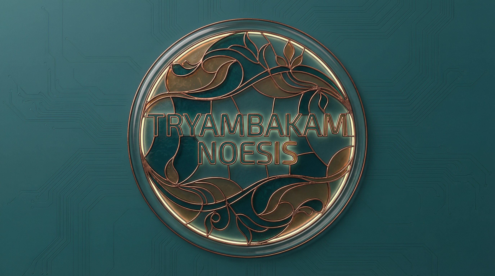

<p align="center">
  <video src="docs/assets/images/engines/logo-wide.mp4" autoplay loop muted playsinline width="560"></video>
</p>

<h1 align="center">Selemene Engine</h1>

<p align="center">
  <em>Reflection-First Consciousness Calculation Engine</em><br>
  <sub>Part of the Tryambakam Noesis Project</sub>
</p>

<p align="center">
  <strong>Live:</strong> <a href="https://selemene.tryambakam.space/health/live">selemene.tryambakam.space</a>
  &nbsp;·&nbsp;
  <strong>17 engines</strong>
  &nbsp;·&nbsp;
  <strong>6 workflows</strong>
  &nbsp;·&nbsp;
  <strong>Two surfaces</strong>
  &nbsp;·&nbsp;
  <strong>Rust + TypeScript witness pipeline</strong>
</p>

<p align="center">
  
  
  
  
</p>

<p align="center">
  
</p>

<br>

<p align="center">
  
</p>

<br>

<p align="center">
  <strong>Not prediction. Reflection. Inquiry. Witness.</strong>
</p>

<!-- readme-gen:start:hero -->
<!-- Deployment trigger: 2026-07-10 -->

> **Reflection-first astronomical and consciousness calculation engine.**
>
> **Every system you've tried positioned you as user, not author.**
>
> Selemene Engine offers something different: 17 symbolic mirrors that reflect patterns in your birth data, timing, and energetic signature. Not to give answers, but to train self-consciousness.
>
> Built in Rust. Sub-millisecond calculations. 100% astronomical accuracy.
>
> Two surfaces for different callers:
> - **Deterministic (Rust)** — direct engine + workflow calls via `@selemene/bridge` or `/api/v1/workflows/{id}/execute`.
> - **Narrative Witness** — rich multi-subject reports (language, relationship_context, L0–L5, Folio headers, NotebookLM-ready) via `packages/witness-pipeline` surfaced at `/api/v1/assets/generate`.
>
> Part of [Tryambakam Noesis](https://tryambakam.space) — a living inquiry field where success means you outgrow the system.
<!-- readme-gen:end:hero -->

<br>

## Every System You've Tried...

...positioned you as user, not author.

Apps that gamify meditation. Courses that promise transformation. Retreats that crack you open then leave you alone with the fragments.

Each delivered value while creating dependency.

Selemene offers something different: **17 symbolic mirrors** that reflect patterns in your birth data, timing, and energetic signature. Not to give answers, but to train the capacity to witness yourself.

### Built Different
- **Sub-millisecond calculations** — Technical rigor in service of inquiry
- **Swiss Ephemeris-backed Vedic core** — Panchanga, Vimshottari, and Transits validated against trusted chart references
- **17 engines, one coherence** — Vedic, Western, and biofield traditions integrated
- **Two surfaces** — Deterministic Rust + agent-friendly narrative witness pipeline (language, relationship, Folio, NotebookLM)
- **Anti-dependency design** — Succeeds when you outgrow it

<br>

<details>
<summary><strong>✦ The Philosophy — Kha-Ba-La, Consciousness Levels & Why This Exists</strong></summary>

<br>

### The Problem
You've tried the apps. The courses. The retreats.

Each promised clarity while positioning you as dependent user, not sovereign author.

- **Therapy:** Narrates your wounds, but who is the narrator?
- **Meditation:** Observes thoughts, but who observes the observer?
- **Productivity:** Optimizes actions, but who chose the target?

### The Alternative
Selemene doesn't deliver answers. It offers **mirrors** — 17 symbolic lenses calibrated to reflect different frequencies of your pattern.

**Not prediction. Reflection. Inquiry. Witness.**

### Kha-Ba-La: The Three Forces
Every calculation operates on three co-arising principles:

| Force | Domain | Function |
|-------|--------|----------|
| **Kha** (Spirit) | Awareness, witness | The field that observes |
| **Ba** (Body) | Embodiment, action | Vehicle for knowing → doing |
| **La** (Inertia) | Resistance, gravity | Friction that gives form |

Your "stuckness" isn't the enemy. It's the necessary resistance that makes authorship possible.

### Self-Consciousness Levels
The system adapts to your relationship with awareness:

- **Level 0 (Dormant):** "What sensations arise?"
- **Level 1 (Glimpsing):** "When does this pattern show up?"
- **Level 2 (Practicing):** "What might this pattern protect?"
- **Level 3 (Integrated):** "How do you choose to work with this?"
- **Level 4+ (Embodied):** "What witnesses this pattern arising?"

This isn't gamification. It's meeting you where you are.

</details>

<br>

## ✦ Quick Start

*First call in 30 seconds. Experience the mirror. Not the answer.*

<table>
<tr>
<td width="25%" align="center">
<a href="docs/API_QUICKSTART.md"><strong>📖 API Quickstart</strong></a><br>
<sub>Zero to first call in 5 minutes</sub>
</td>
<td width="25%" align="center">
<a href="crates/noesis-tui"><strong>🖥 Terminal TUI</strong></a><br>
<sub>Interactive Ratatui interface</sub>
</td>
<td width="25%" align="center">
<a href="scripts/explore-api.sh"><strong>🔮 Terminal Explorer</strong></a><br>
<sub>CLI for every engine</sub>
</td>
<td width="25%" align="center">
<a href="https://selemene.tryambakam.space/api/docs"><strong>📜 Swagger UI</strong></a><br>
<sub>Full API documentation</sub>
</td>
</tr>
</table>

<br>

<details>
<summary><strong>First Call in 30 Seconds</strong></summary>

```bash
# Set your API key
export NOESIS_API_KEY="nk_your_key_here"

# Ask the mirror a question
curl -s -X POST https://selemene.tryambakam.space/api/v1/engines/numerology/calculate \
  -H "X-API-Key: $NOESIS_API_KEY" \
  -H "Content-Type: application/json" \
  -d '{
    "birth_data": {
      "name": "Your Name",
      "date": "1991-08-13",
      "time": "13:31",
      "latitude": 12.9716,
      "longitude": 77.5946,
      "timezone": "Asia/Kolkata"
    }
  }' | python3 -m json.tool
```

```json
{
    "engine_id": "numerology",
    "result": {
        "life_path": { "value": 5, "meaning": "Freedom, change, adventure" },
        "expression": { "value": 1, "meaning": "Leadership, independence, pioneering" },
        "soul_urge": { "value": 5, "meaning": "Freedom, change, adventure" }
    },
    "witness_prompt": "What patterns arise when freedom meets discipline?",
    "consciousness_level": 0,
    "metadata": { "calculation_time_ms": 0, "backend": "native" }
}
```

</details>

<br>

<!-- readme-gen:start:agents -->
## ✦ For Agents & Integrators (Canonical)

**Primary reference:** [`docs/api/AGENT_FLOW.md`](./docs/api/AGENT_FLOW.md)

Two surfaces. One canonical contract for rich narrative reports.

### 3 Key Shapes (copy these)

**1. ReportGenerationRequest** (recommended for most agents)
```json
{
  "report_level": "L2",
  "report_mode": "synastry",
  "subjects": [
    {
      "role": "mother",
      "name": "Aarav",
      "birth_date": "1970-01-01",
      "birth_time": "10:30",
      "birth_time_confidence": "exact",
      "birth_location_query": "Bengaluru, India",
      "normalized_location": {
        "display_name": "Bengaluru, Karnataka, India",
        "latitude": 12.9716,
        "longitude": 77.5946,
        "timezone": "Asia/Kolkata",
        "provider": "manual",
        "confidence": "manual"
      }
    }
  ],
  "relationship_context": {
    "type": "family",
    "mapping_goal": "understand lineage transmission patterns without outcome prediction",
    "sensitivity_level": "high"
  },
  "language": "en",
  "output": {
    "format": "markdown",
    "include_rubric": true,
    "include_pattern_extraction": true
  }
}
```

**2. OrchestratorInput** (internal / direct calls)
```json
{
  "subjectNames": ["Aarav", "Vikram"],
  "subjectRoles": [
    { "role": "mother", "name": "Aarav" },
    { "role": "son", "name": "Vikram" }
  ],
  "relationshipContext": { "type": "family", "mapping_goal": "...", "sensitivity_level": "high" },
  "language": "en",
  "consciousnessLevel": 2,
  "engineResultsBySubject": [ /* ... */ ]
}
```

**3. OrchestratorOutput** (what you receive back)
```json
{
  "mode": "mother-son-lineage",
  "subject_names": ["Aarav", "Vikram"],
  "register": "l1_l3",
  "relationship_header": "Mother-Son Lineage Mapping — non-predictive pattern witness",
  "assembled": "...",
  "passes": { "rubric": "...", "patterns": "..." },
  "patterns": [ /* ... */ ]
}
```

**Important:** When `relationship_context` is present, `relationship_header` is prepended to `assembled`.

### 8-Step Guided Flow (for agents)
1. Surface — `witness` (narrative) or `deterministic`
2. Subjects — one block per person (role + birth + normalized_location)
3. Relationship — `relationship_context` or `null` for solo
4. Language + Level — `language` + `consciousness_level` (0-5)
5. Mode + Level — `report_level` + `report_mode`
6. Assemble — output under `### FINAL ASSEMBLED REQUEST`
7. Run — get `OrchestratorOutput`
8. Post-process — Source pack → NotebookLM slides via `selemene-notebooklm`

### Current Variables
- `NOESIS_API_KEY` — `X-API-Key` header
- `SELEMENE_RUST_URL` — base for deterministic + witness calls
- `language` — first-class (default `"en"`)
- `report_level` — `L0`–`L5`

### Key Modes (2026-07)
`birth-blueprint`, `integrated-reading` / `integrated-reading-l4`, `mother-son-lineage`, `business-partners`, `family-penta`, `unmarried-partners`, `married-partners`.

### Post-Processing
- Folio header — inside `assembled` when relationship present
- Source pack — `createSourcePack(...)`
- NotebookLM slides prompt — `generateSlidesPrompt(output, { language, bridgeMandates })`

### Non-Prescriptive Rules
- "Facts only. No prediction. No diagnosis."
- Use `relationship_header` verbatim
- Respect `sensitivity_level`
- Never promise outcomes

### Agent Skills (recommended)
- `selemene-core` — contract + taxonomy
- `selemene-report` — guided Q&A with INPUT BOXes
- `selemene-notebooklm` — turn `OrchestratorOutput` into NotebookLM prompt
- `selemene-cheatsheet.md` — ultra-minimal 3-shapes + 8-steps

See [`docs/api/AGENT_FLOW.md`](./docs/api/AGENT_FLOW.md) for full copy-paste examples and guardrails.
<!-- readme-gen:end:agents -->

<br>

## ✦ Noesis SDK & TUI

### Rust SDK (`noesis-sdk`)

First-party Rust SDK for interacting with the Selemene API. Use it to build your own tools, integrations, or TUI extensions.

```rust
use noesis_sdk::{Config, NoesisClient, LocalProfile};

let config = Config::load().unwrap_or_default();
let client = NoesisClient::new(&config)?;
let profile = LocalProfile::load_or_default()?.unwrap();
let output = client.calculate("numerology", profile.to_engine_input()).await?;
println!("{}", MarkdownRenderer::new().render_engine_output(&output));
```

**Features:** HTTP client for all 17 engines & 6 workflows, local profile management (`~/.noesis/profile.json`), macOS Keychain API key storage, Markdown/JSON report rendering, TOML + env config.

### Terminal TUI (`noesis-tui`)

Full interactive terminal interface built with Ratatui. Run engines, browse workflows, manage your profile, and export reports — all from the terminal.

```bash
cargo run --bin noesis-tui
```

**Screens:** Welcome (with connection status) · Onboarding wizard (8-step profile setup) · Engine picker (17 engines, `/` to filter) · Workflow picker (6 workflows) · Result display (styled Markdown, scroll, export) · History browser (past readings) · Profile editor (birth data + API key)

**Keybinds:** `j/k` navigate · `Enter` select · `/` filter · `e` export MD · `J` export JSON · `r` re-run · `?` help overlay · `Ctrl+Q` quit

<br>

## ✦ The Mirrors (Visual Gallery)

A small selection of the symbolic mirrors. Each is a non-predictive lens — reflection, not instruction.

<table>
<tr>
<td align="center" width="33%">
<br>
<sub>Stained Glass — Core Identity</sub>
</td>
<td align="center" width="33%">
<video src="docs/assets/images/engines/numerology-engine.mp4" width="220" autoplay loop muted playsinline></video><br>
<sub>Numerology — Life Path, Expression</sub>
</td>
<td align="center" width="33%">
<video src="docs/assets/images/engines/enneagram-engine.mp4" width="220" autoplay loop muted playsinline></video><br>
<sub>Enneagram — Type, Wings, Instincts</sub>
</td>
</tr>
<tr>
<td align="center" width="33%">
<video src="docs/assets/images/engines/gene-keys-engine.mp4" width="220" autoplay loop muted playsinline></video><br>
<sub>Gene Keys — Shadow → Gift → Siddhi</sub>
</td>
<td align="center" width="33%">
<video src="docs/assets/images/engines/human-design-engine.mp4" width="220" autoplay loop muted playsinline></video><br>
<sub>Human Design — Type, Centers, Gates</sub>
</td>
<td align="center" width="33%">
<video src="docs/assets/images/engines/biofield-raaga-engine.mp4" width="220" autoplay loop muted playsinline></video><br>
<sub>Biofield Raaga — Sound & Field</sub>
</td>
</tr>
</table>

See `docs/assets/images/engines/` for the full collection (videos + posters + contact sheets).

<br>

## ✦ Roadmap

**P0 — SDK Foundation** ✅
- `noesis-sdk` crate — HTTP client, profile, keychain, renderer, config
- 27 tests passing

**P1 — Terminal TUI** ✅
- `noesis-tui` crate — Ratatui interactive interface (2,829+ lines)
- All 7 screens + 3 widgets + UX gap analysis fixes (18 issues resolved)

**P2 — Desktop Surfaces** *(planned)*
- Raycast extension for quick readings
- macOS menu bar applet
- Tauri wrapper app

**P3 — Apple Ecosystem** *(planned)*
- Apple Shortcuts actions
- Apple Watch complications
- On-device caching

<br>

## ✦ The 17 Engines

Each engine is a **mirror**, not a method. They don't predict; they reflect. The value isn't in the calculation — it's in what you witness when you see the pattern.

<br>

### Rust Engines (11)

<table>
<tr>
<td align="center" width="20%">
<strong>Panchanga</strong><br>
<sub>Tithi · Nakshatra · Yoga · Karana</sub><br>
<code>date, lat/lng</code>
</td>
<td align="center" width="20%">
<strong>Human Design</strong><br>
<sub>Type · Centers · Gates · Profile</sub><br>
<code>date, time, lat/lng</code>
</td>
<td align="center" width="20%">
<strong>Gene Keys</strong><br>
<sub>Shadow · Gift · Siddhi</sub><br>
<code>date, time, lat/lng</code>
</td>
<td align="center" width="20%">
<strong>Vimshottari</strong><br>
<sub>120-Year Dasha Periods</sub><br>
<code>date, time, lat/lng</code>
</td>
<td align="center" width="20%">
<strong>Numerology</strong><br>
<sub>Life Path · Expression</sub><br>
<code>date, name</code>
</td>
</tr>
<tr><td colspan="5"><br></td></tr>
<tr>
<td align="center" width="20%">
<strong>Biorhythm</strong><br>
<sub>Physical · Emotional · Intellectual</sub><br>
<code>date</code>
</td>
<td align="center" width="20%">
<strong>Vedic Clock</strong><br>
<sub>TCM Meridians · Doshas</sub><br>
<code>current_time</code>
</td>
<td align="center" width="20%">
<strong>Biofield</strong><br>
<sub>Vedic Chakra · Birth-Data Analysis</sub><br>
<code>date, time, lat/lng</code>
</td>
<td align="center" width="20%">
<strong>Face Reading</strong><br>
<sub>Physiognomy Analysis</sub><br>
<code>photo</code>
</td>
<td align="center" width="20%">
<strong>Transits</strong><br>
<sub>Current Planetary Positions</sub><br>
<code>date, time, lat/lng</code>
</td>
</tr>
<tr><td colspan="5"><br></td></tr>
<tr>
<td align="center" width="20%">
<strong>Nadabrahman</strong><br>
<sub>Sound Current · Mantra Resonance</sub><br>
<code>date, time, lat/lng</code>
</td>
<td align="center" width="20%">
<strong>Vedic Clock (alt)</strong><br>
<sub>Hourly Meridian Flow</sub><br>
<code>current_time</code>
</td>
<td align="center" width="20%" colspan="3">
<em>+ 6 more in the full matrix</em>
</td>
</tr>
</table>

### TypeScript / Witness Pipeline (Narrative Surface)

- `packages/witness-pipeline` — Integrated reading orchestrator for rich multi-subject reports
- Modes: birth-blueprint, integrated-reading (L0–L5), mother-son-lineage, business-partners, family-penta, unmarried-partners, married-partners
- Outputs: relationship_header (Folio B-surface), assembled narrative, rubric passes, pattern extraction, NotebookLM slides prompt
- Language: first-class (`language` field, default `en`)
- Retrieval: vectorized pattern memory with relationship + level filters

<br>

## ✦ The 6 Workflows

Workflows compose multiple engines into coherent portraits.

| Workflow | Engines | Purpose |
|----------|---------|---------|
| `birth-blueprint` | Core identity set | Foundational self-map |
| `full-spectrum` | Up to 14 | Complete consciousness portrait |
| `daily-practice` | Time-based | Body-paced daily alignment |
| `decision-support` | Multi-engine | Inquiry for choice points |
| `self-inquiry` | Reflective set | Deep pattern witnessing |
| `transit` | Time + natal | Current field overlay |

All workflows accept `EngineInput` and return `WorkflowResult` with per-engine outputs + witness prompts.

<br>

## ✦ API Surfaces

- **Deterministic (Rust):** `POST /api/v1/engines/{id}/calculate`, `POST /api/v1/workflows/{id}/execute`
- **Narrative Witness (Rich):** `POST /api/v1/assets/generate` — accepts `ReportGenerationRequest` (subjects, relationship_context, language, report_level), returns `OrchestratorOutput` (with Folio header, assembled, passes, patterns)
- **Source Pack:** `createSourcePack(...)` from `OrchestratorOutput`
- **NotebookLM:** `generateSlidesPrompt(output, { language, bridgeMandates })`

See:
- [`docs/api/README.md`](./docs/api/README.md)
- [`docs/api/AGENT_FLOW.md`](./docs/api/AGENT_FLOW.md) — canonical for agents
- [`docs/api/engines.md`](./docs/api/engines.md)
- [`docs/api/workflows.md`](./docs/api/workflows.md)

<br>

## ✦ Agent Skills

Skills for Claude/OpenCode/Codex/Hermes/OpenClaw:

- `selemene-core` — contract, taxonomy, shapes
- `selemene-report` — guided 8-step Q&A (INPUT BOXes) for rich reports
- `selemene-notebooklm` — produce NotebookLM slides prompt from `OrchestratorOutput`
- `selemene-cheatsheet.md` + `quick-reference.md` — minimal reference

Activated in `~/.agents/skill-clusters`.

<br>

## ✦ Project Health

| Category | Status | Score |
|:---------|:------:|------:|
| Tests (witness-pipeline) | ████████████████████ | 94/94 |
| CI/CD | ████████████████████ | 9 workflows |
| Type Safety | ████████████████████ | TS + Rust |
| Documentation | ████████████████░░░░ | API + AGENT_FLOW |
| License | ████████████████████ | MIT |

> **Overall:** Healthy, actively evolved for agentic + narrative use cases.

<br>

## ✦ Contributing

See [`docs/contributing/`](./docs/contributing) and the canonical agent guide [`docs/api/AGENT_FLOW.md`](./docs/api/AGENT_FLOW.md).

<br>

## ✦ License

MIT — see [LICENSE](./LICENSE).

<br>

<div align="center">


**Built with ❤️ by [Contributors](https://github.com/Sheshiyer/Selemene-engine/graphs/contributors)**

<sub>Reflection is the work. The mirror is just the surface.</sub>

</div>
