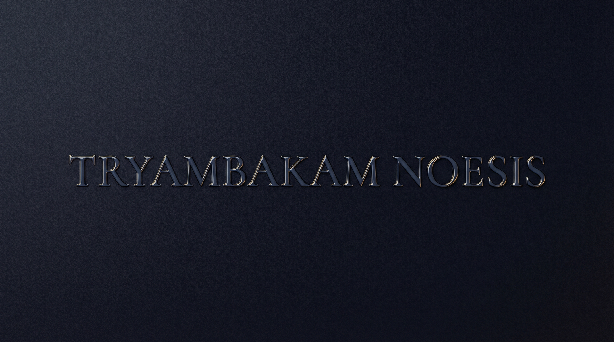
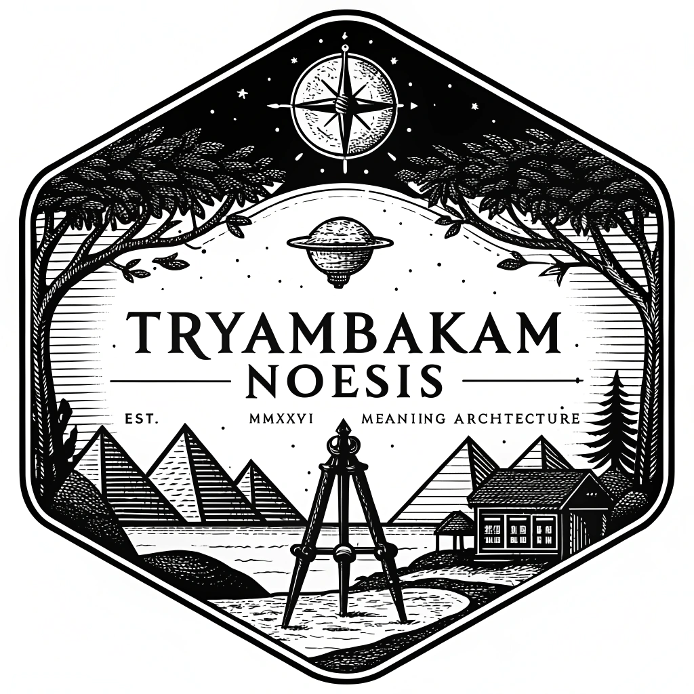
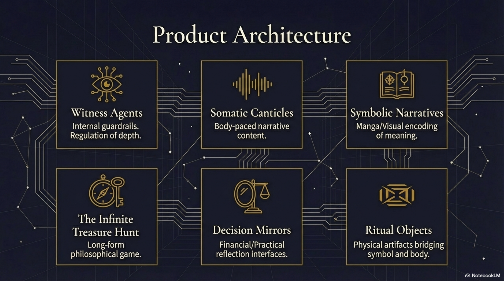
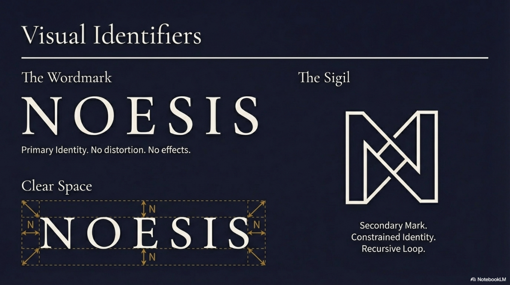
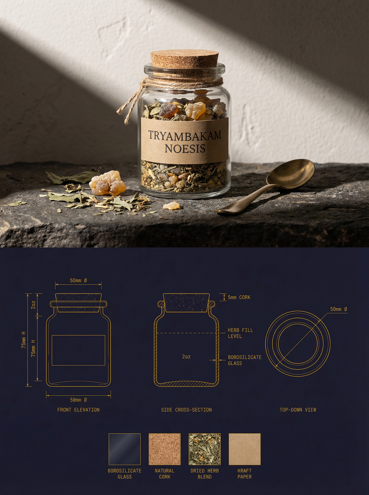
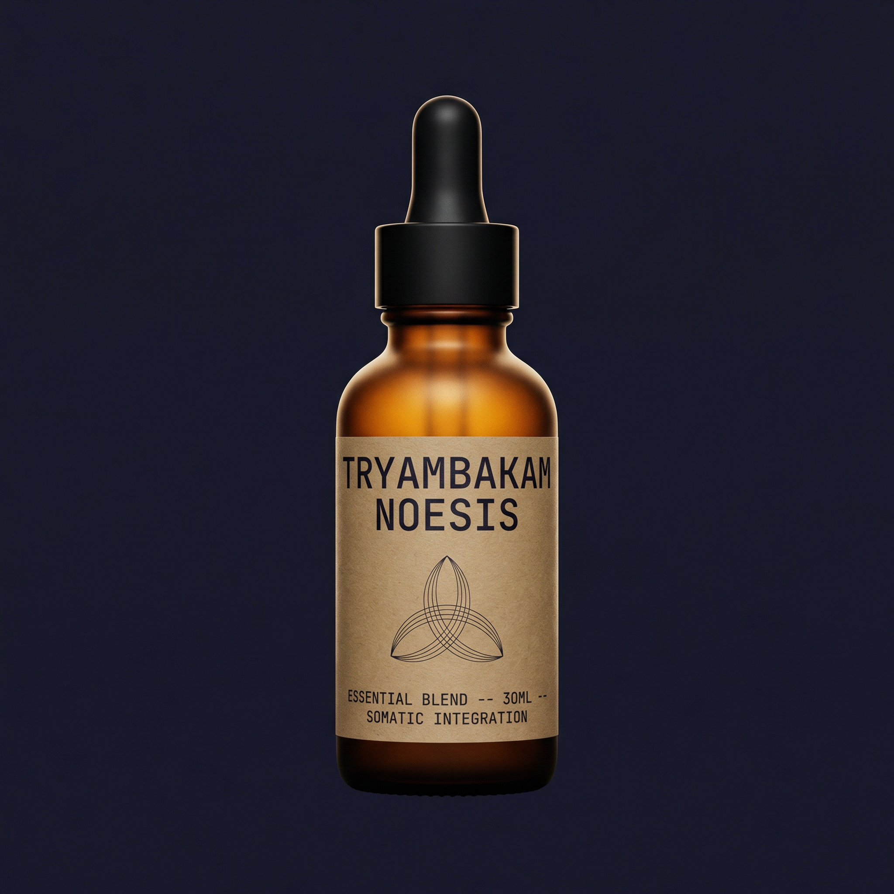
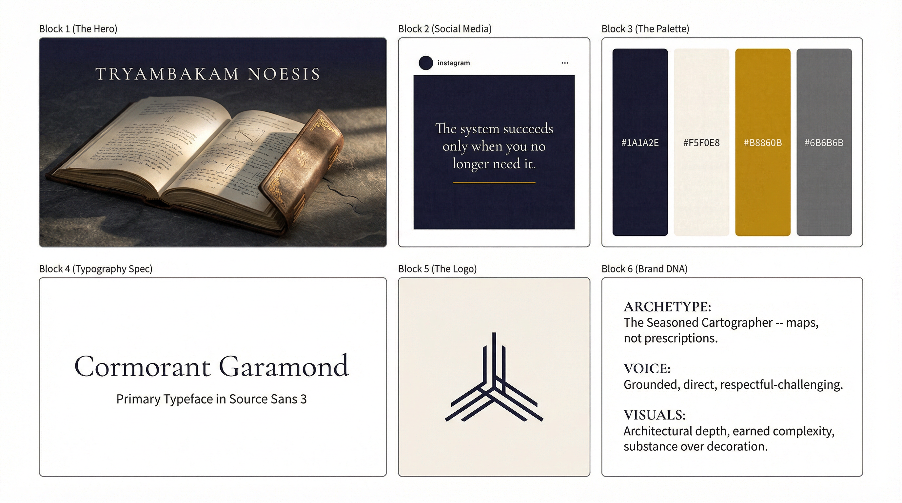
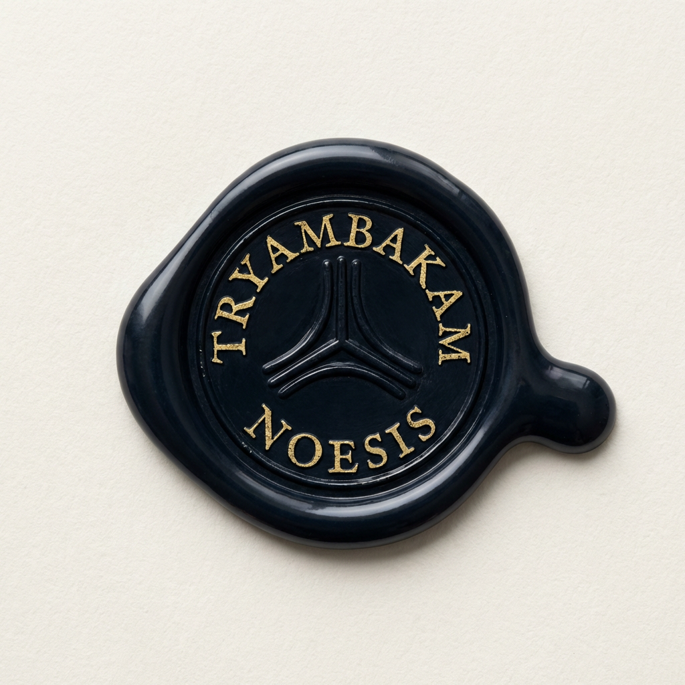

<p align="center">
  <video src="docs/assets/images/engines/logo-wide.mp4" autoplay loop muted playsinline width="560"></video>
</p>

<h1 align="center">Selemene Engine</h1>

<p align="center">
  <em>High-Performance Consciousness Calculation Engine</em><br>
  <sub>Part of the Tryambakam Noesis Project</sub>
</p>

<p align="center">
  <a href="https://selemene.tryambakam.space/health/live"></a>
  &nbsp;
  
  &nbsp;
  
  &nbsp;
  
  &nbsp;
  
</p>

<p align="center">
  
  &nbsp;
  
  &nbsp;
  
  &nbsp;
  
  &nbsp;
  <a href="https://openclaw.ai"></a>
  &nbsp;
  
</p>

<br>

<p align="center">
  
</p>

<br>

<p align="center">
  <strong>Not prediction. Reflection. Inquiry. Witness.</strong>
</p>

> **High-performance astronomical and consciousness calculation engine.**
>
> **Every system you've tried positioned you as user, not author.**
>
> Selemene Engine offers something different: 16 symbolic mirrors that reflect patterns in your birth data, timing, and energetic signature. Not to give answers, but to train self-consciousness.
>
> Built in Rust. Sub-millisecond calculations. 100% astronomical accuracy.
>
> Part of [Tryambakam Noesis](https://tryambakam.space) — a living inquiry field where success means you outgrow the system.

<br>

## Every System You've Tried...

...positioned you as user, not author.

Apps that gamify meditation. Courses that promise transformation. Retreats that crack you open then leave you alone with the fragments.

Each delivered value while creating dependency.

Selemene offers something different: **16 symbolic mirrors** that reflect patterns in your birth data, timing, and energetic signature. Not to give answers, but to train the capacity to witness yourself.

### Built Different
- **Sub-millisecond calculations** — Technical rigor in service of inquiry
- **100% astronomical accuracy** — Human Design validated against Swiss Ephemeris
- **16 engines, one coherence** — Vedic, Western, and biofield traditions integrated
- **Anti-dependency design** — Succeeds when you outgrow it

<br>

## The Philosophy

### The Problem
You've tried the apps. The courses. The retreats.

Each promised clarity while positioning you as dependent user, not sovereign author.

- **Therapy:** Narrates your wounds, but who is the narrator?
- **Meditation:** Observes thoughts, but who observes the observer?
- **Productivity:** Optimizes actions, but who chose the target?

### The Alternative
Selemene doesn't deliver answers. It offers **mirrors** — 16 symbolic lenses calibrated to reflect different frequencies of your pattern.

**Not prediction. Reflection. Inquiry. Witness.**

### Kha-Ba-La: The Three Forces
Every calculation operates on three co-arising principles:

| Force | Domain | Function |
|-------|--------|----------|
| **Kha** (Spirit) | Awareness, witness | The field that observes |
| **Ba** (Body) | Embodiment, action | Vehicle for knowing → doing |
| **La** (Inertia) | Resistance, gravity | Friction that gives form |

Your "stuckness" isn't the enemy. It's the necessary resistance that makes authorship possible.

### Self-Consciousness Levels
The system adapts to your relationship with awareness:

- **Level 0 (Dormant):** "What sensations arise?"
- **Level 1 (Glimpsing):** "When does this pattern show up?"
- **Level 2 (Practicing):** "What might this pattern protect?"
- **Level 3 (Integrated):** "How do you choose to work with this?"
- **Level 4+ (Embodied):** "What witnesses this pattern arising?"

This isn't gamification. It's meeting you where you are.

<br>

## ✦ Quick Start

*First call in 30 seconds. Experience the mirror. Not the answer.*

<table>
<tr>
<td width="25%" align="center">
<a href="docs/API_QUICKSTART.md"><strong>📖 API Quickstart</strong></a><br>
<sub>Zero to first call in 5 minutes</sub>
</td>
<td width="25%" align="center">
<a href="crates/noesis-tui"><strong>🖥 Terminal TUI</strong></a><br>
<sub>Interactive Ratatui interface</sub>
</td>
<td width="25%" align="center">
<a href="scripts/explore-api.sh"><strong>🔮 Terminal Explorer</strong></a><br>
<sub>CLI for every engine</sub>
</td>
<td width="25%" align="center">
<a href="https://selemene.tryambakam.space/api/docs"><strong>📜 Swagger UI</strong></a><br>
<sub>Full API documentation</sub>
</td>
</tr>
</table>

<br>

<details>
<summary><strong>First Call in 30 Seconds</strong></summary>

```bash
# Set your API key
export NOESIS_API_KEY="nk_your_key_here"

# Ask the mirror a question
curl -s -X POST https://selemene.tryambakam.space/api/v1/engines/numerology/calculate \
  -H "X-API-Key: $NOESIS_API_KEY" \
  -H "Content-Type: application/json" \
  -d '{
    "birth_data": {
      "name": "Your Name",
      "date": "1991-08-13",
      "time": "13:31",
      "latitude": 12.9716,
      "longitude": 77.5946,
      "timezone": "Asia/Kolkata"
    }
  }' | python3 -m json.tool
```

```json
{
    "engine_id": "numerology",
    "result": {
        "life_path": { "value": 5, "meaning": "Freedom, change, adventure" },
        "expression": { "value": 1, "meaning": "Leadership, independence, pioneering" },
        "soul_urge": { "value": 5, "meaning": "Freedom, change, adventure" }
    },
    "witness_prompt": "What patterns arise when freedom meets discipline?",
    "consciousness_level": 0,
    "metadata": { "calculation_time_ms": 0, "backend": "native" }
}
```

</details>

<br>

## ✦ Noesis SDK & TUI

### Rust SDK (`noesis-sdk`)

First-party Rust SDK for interacting with the Selemene API. Use it to build your own tools, integrations, or TUI extensions.

```rust
use noesis_sdk::{Config, NoesisClient, LocalProfile};

let config = Config::load().unwrap_or_default();
let client = NoesisClient::new(&config)?;
let profile = LocalProfile::load_or_default()?.unwrap();
let output = client.calculate("numerology", profile.to_engine_input()).await?;
println!("{}", MarkdownRenderer::new().render_engine_output(&output));
```

**Features:** HTTP client for all 16 engines & 6 workflows, local profile management (`~/.noesis/profile.json`), macOS Keychain API key storage, Markdown/JSON report rendering, TOML + env config.

### Terminal TUI (`noesis-tui`)

Full interactive terminal interface built with Ratatui. Run engines, browse workflows, manage your profile, and export reports — all from the terminal.

```bash
cargo run --bin noesis-tui
```

**Screens:** Welcome (with connection status) · Onboarding wizard (8-step profile setup) · Engine picker (16 engines, `/` to filter) · Workflow picker (6 workflows) · Result display (styled Markdown, scroll, export) · History browser (past readings) · Profile editor (birth data + API key)

**Keybinds:** `j/k` navigate · `Enter` select · `/` filter · `e` export MD · `J` export JSON · `r` re-run · `?` help overlay · `Ctrl+Q` quit

<br>

## ✦ Roadmap

**P0 — SDK Foundation** ✅
- `noesis-sdk` crate — HTTP client, profile, keychain, renderer, config
- 27 tests passing

**P1 — Terminal TUI** ✅
- `noesis-tui` crate — Ratatui interactive interface (2,829+ lines)
- All 7 screens + 3 widgets + UX gap analysis fixes (18 issues resolved)

**P2 — Desktop Surfaces** *(planned)*
- Raycast extension for quick readings
- macOS menu bar applet
- Tauri wrapper app

**P3 — Apple Ecosystem** *(planned)*
- Apple Shortcuts actions
- Apple Watch complications
- On-device caching

<br>

## ✦ The 16 Engines

Each engine is a **mirror**, not a method. They don't predict; they reflect. The value isn't in the calculation — it's in what you witness when you see the pattern.

**Note on Engine Count:** Brand materials reference "13 engines" — the core symbolic system. The codebase implements 16 total: 11 native Rust engines + 5 TypeScript bridges for esoteric systems (Tarot, I-Ching, etc.).

<br>

### Rust Engines (11)

<table>
<tr>
<td align="center" width="20%">
<strong>Panchanga</strong><br>
<sub>Tithi · Nakshatra · Yoga · Karana</sub><br>
<code>date, lat/lng</code>
</td>
<td align="center" width="20%">
<strong>Human Design</strong><br>
<sub>Type · Centers · Gates · Profile</sub><br>
<code>date, time, lat/lng</code>
</td>
<td align="center" width="20%">
<strong>Gene Keys</strong><br>
<sub>Shadow · Gift · Siddhi</sub><br>
<code>date, time, lat/lng</code>
</td>
<td align="center" width="20%">
<strong>Vimshottari</strong><br>
<sub>120-Year Dasha Periods</sub><br>
<code>date, time, lat/lng</code>
</td>
<td align="center" width="20%">
<strong>Numerology</strong><br>
<sub>Life Path · Expression</sub><br>
<code>date, name</code>
</td>
</tr>
<tr><td colspan="5"><br></td></tr>
<tr>
<td align="center" width="20%">
<strong>Biorhythm</strong><br>
<sub>Physical · Emotional · Intellectual</sub><br>
<code>date</code>
</td>
<td align="center" width="20%">
<strong>Vedic Clock</strong><br>
<sub>TCM Meridians · Doshas</sub><br>
<code>current_time</code>
</td>
<td align="center" width="20%">
<strong>Biofield</strong><br>
<sub>Vedic Chakra · Birth-Data Analysis</sub><br>
<code>date, time, lat/lng</code>
</td>
<td align="center" width="20%">
<strong>Face Reading</strong><br>
<sub>Physiognomy Analysis</sub><br>
<code>image_data</code>
</td>
<td align="center" width="20%">
<strong>Nadabrahman</strong><br>
<sub>Sound Consciousness</sub><br>
<code>audio_data</code>
</td>
</tr>
<tr><td colspan="5"><br></td></tr>
<tr>
<td align="center" width="20%">
<strong>Transits</strong><br>
<sub>Planetary Transits · Sade Sati</sub><br>
<code>date, time, lat/lng</code>
</td>
<td align="center" width="20%"></td>
<td align="center" width="20%"></td>
<td align="center" width="20%"></td>
<td align="center" width="20%"></td>
</tr>
</table>

<br>

### TypeScript Engines (5)

> **Note:** These engines run in a separate `ts-engines` service. The API attempts to connect to them at startup (with 30s retry logic). If the service is unreachable, these endpoints will be unavailable.

<table>
<tr>
<td align="center" width="20%">
<strong>Tarot</strong><br>
<sub>78-Card System</sub><br>
<code>date, question</code>
</td>
<td align="center" width="20%">
<strong>I Ching</strong><br>
<sub>64 Hexagrams</sub><br>
<code>question, method</code>
</td>
<td align="center" width="20%">
<strong>Enneagram</strong><br>
<sub>9 Types · Wings · Tritypes</sub><br>
<code>date, name</code>
</td>
<td align="center" width="20%">
<strong>Sacred Geometry</strong><br>
<sub>Platonic Solids · Patterns</sub><br>
<code>parameters</code>
</td>
<td align="center" width="20%">
<strong>Sigil Forge</strong><br>
<sub>Intent Manifestation</sub><br>
<code>intent_text</code>
</td>
</tr>
</table>

<br>

<p align="center">
  <a href="docs/ENGINES.md"><strong>→ View Detailed Engine Documentation</strong></a>
</p>

<br>

<details>
<summary><strong>Request Format & Examples</strong></summary>

All engines accept the same `EngineInput` shape:

```jsonc
{
    "birth_data": {
        "name": "string",              // Used by numerology
        "date": "YYYY-MM-DD",          // Required
        "time": "HH:MM",              // Required for HD, gene-keys, vimshottari
        "latitude": 12.9716,           // Decimal degrees
        "longitude": 77.5946,          // Decimal degrees
        "timezone": "Asia/Kolkata"     // IANA timezone
    },
    "precision": "standard"            // "standard" | "high" | "extreme"
}
```

### Try Each Engine

```bash
BASE="https://selemene.tryambakam.space/api/v1"

# Numerology — needs name + date
curl -s -X POST $BASE/engines/numerology/calculate \
  -H "X-API-Key: $NOESIS_API_KEY" -H "Content-Type: application/json" \
  -d '{"birth_data":{"name":"Test","date":"1991-08-13","latitude":12.97,"longitude":77.59,"timezone":"Asia/Kolkata"}}'

# Biorhythm — just a birth date
curl -s -X POST $BASE/engines/biorhythm/calculate \
  -H "X-API-Key: $NOESIS_API_KEY" -H "Content-Type: application/json" \
  -d '{"birth_data":{"date":"1991-08-13","latitude":12.97,"longitude":77.59,"timezone":"Asia/Kolkata"}}'

# Human Design — needs exact birth time
curl -s -X POST $BASE/engines/human-design/calculate \
  -H "X-API-Key: $NOESIS_API_KEY" -H "Content-Type: application/json" \
  -d '{"birth_data":{"date":"1991-08-13","time":"13:31","latitude":12.9716,"longitude":77.5946,"timezone":"Asia/Kolkata"}}'

# Vedic Clock — uses current time, no birth data needed
curl -s -X POST $BASE/engines/vedic-clock/calculate \
  -H "X-API-Key: $NOESIS_API_KEY" -H "Content-Type: application/json" \
  -d '{}'
```

</details>

<br>

---

## ✦ The 6 Workflows

Workflows don't pipeline — they **synthesize**. Not "do this, then this" but "hold these perspectives simultaneously and notice what emerges."

True to the name *Noesis* (the act of knowing), workflows train direct intellectual apprehension — knowing that is aware of itself knowing.

<br>

<table>
<tr>
<td width="50%">

**`birth-blueprint`** — *Numerology + Human Design + Vimshottari*
> Your natal imprint. Life path numbers, bodygraph, 120-year timeline.

**`daily-practice`** — *Panchanga + Vedic Clock + Biorhythm*
> Optimal timing. Cosmic tide aligned with personal rhythm.

**`decision-support`** — *Tarot + I-Ching + HD Authority*
> Multi-perspective guidance. Not "what to do" but "what to notice."

</td>
<td width="50%">

**`self-inquiry`** — *Gene Keys + Enneagram*
> Shadow work meets personality. Where you contract, where you expand.

**`creative-expression`** — *Sigil Forge + Sacred Geometry*
> Intent made visible. Symbols as seeds, geometry as meditation.

**`full-spectrum`** — *All 16 Engines*
> Complete consciousness portrait. Every lens, every frequency.

</td>
</tr>
</table>

<sub>*Workflows referencing TypeScript engines (Tarot, I-Ching, Enneagram, Sacred Geometry, Sigil Forge) require the TS engines server. See [Bridge CLI](bridges/cli/README.md) for setup.*</sub>

<details>
<summary><strong>Execute a Workflow</strong></summary>

```bash
curl -s -X POST $BASE/workflows/birth-blueprint/execute \
  -H "X-API-Key: $NOESIS_API_KEY" -H "Content-Type: application/json" \
  -d '{"birth_data":{"date":"1991-08-13","time":"13:31","latitude":12.9716,"longitude":77.5946,"timezone":"Asia/Kolkata"}}'
```

</details>

<br>

---

## ✦ Consciousness Levels

The system adapts witness prompts based on your relationship with awareness.

<br>

<p align="center">
  
</p>

<br>

| Level | State | Prompt Calibration |
|:-----:|-------|-------------------|
| **0** | Dormant | *"What sensations arise when you feel this pattern?"* |
| **1** | Glimpsing | *"When does this pattern show up in your life?"* |
| **2** | Practicing | *"What might this pattern be protecting?"* |
| **3** | Integrated | *"How do you choose to work with this pattern?"* |
| **4-5** | Embodied | *"What witnesses this pattern arising?"* |

<sub>This isn't gamification. It's meeting you where you are.</sub>

<br>

---

## ✦ Authentication

| Method | Header | Use Case |
|--------|--------|----------|
| API Key | `X-API-Key: nk_...` | Server-to-server, scripts, CLI |
| JWT | `Authorization: Bearer <token>` | User sessions |

<details>
<summary><strong>Rate Limits & Tiers</strong></summary>

| Tier | Rate Limit | Access |
|------|-----------|--------|
| `free` | 60 req/min | Basic engines |
| `premium` | 1,000 req/min | All engines + batch |
| `enterprise` | 10,000 req/min | Everything + admin |

**Seed API Keys:**
```bash
DATABASE_URL="your-supabase-postgres-url" \
  cargo run --package noesis-auth --features postgres --example seed_api_keys
```

Creates admin user (`admin@tryambakam.com`) + 5 API keys. Keys print once.

</details>

<br>

---

## ✦ Architecture

<p align="center">
  
</p>

<br>

<p align="center">
  
</p>

<details>
<summary><strong>Crate Structure</strong></summary>

```
crates/
  noesis-api/             Axum HTTP server (the binary you deploy)
  noesis-orchestrator/    Multi-engine parallel execution + workflow synthesis
  noesis-auth/            JWT + API key auth (Supabase Postgres)
  noesis-cache/           3-layer cache (L1 memory, L2 Redis, L3 disk)
  noesis-metrics/         Prometheus instrumentation
  noesis-core/            Shared types (EngineInput, EngineOutput, BirthData)
  noesis-vedic-api/       FreeAstrologyAPI client (15+ Vedic endpoints)
  engine-panchanga/       Vedic calendar calculations
  engine-human-design/    HD bodygraph (64 gates, 9 centers, profile)
  engine-gene-keys/       Shadow-Gift-Siddhi activation sequences
  engine-vimshottari/     120-year nested dasha periods
  engine-numerology/      Pythagorean + Chaldean number systems
  engine-biorhythm/       3 biological cycles (P/E/I)
  engine-vedic-clock/     TCM organ clock + Ayurvedic timing
  engine-biofield/        Vedic birth-data-driven chakra & biofield analysis
  engine-face-reading/    Physiognomy analysis
  engine-nadabrahman/     Sound consciousness engine
  engine-transits/        Planetary transits, aspects & Sade Sati
  noesis-sdk/             Rust SDK — HTTP client, profiles, keychain, renderer
  noesis-tui/             Terminal TUI — Ratatui interactive interface
  noesis-bridge/          Bridge integrations (Claude, OpenAI, LangChain)
  noesis-data/            Data loading and management
  noesis-integration/     Integration tests & cross-engine coordination
  noesis-western-api/     Western astrology API client
  noesis-witness/         Witness prompt generation & consciousness calibration
```

</details>

<br>

### Performance

| Engine | Time | | Engine | Time |
|--------|------|-|--------|------|
| Gene Keys | 0.012ms | | Vimshottari | <1ms |
| Panchanga | <1ms | | Human Design | 1.31ms |
| Numerology | <1ms | | **API p95** | <100ms |
| Biorhythm | <1ms | | **Workflow** | <200ms |

<br>

---

## ✦ Production Stack

<table>
<tr>
<td width="50%">

| Component | Technology |
|-----------|------------|
| **Compute** | [Railway](https://railway.app) |
| **Database** | [Supabase](https://supabase.com) PostgreSQL |
| **Cache** | Redis (L2) + LRU (L1) |

</td>
<td width="50%">

| Component | Technology |
|-----------|------------|
| **Errors** | [Sentry](https://sentry.io) |
| **Metrics** | Prometheus (`/metrics`) |
| **Docs** | Swagger UI (`/api/docs`) |

</td>
</tr>
</table>

<details>
<summary><strong>All Endpoints</strong></summary>

| Path | Auth | Purpose |
|------|:----:|---------|
| `/health/live` | ✗ | Liveness probe |
| `/health/ready` | ✗ | Readiness check |
| `/api/docs` | ✗ | Swagger UI |
| `/metrics` | ✗ | Prometheus metrics |
| `/api/v1/engines` | ✓ | List engines |
| `/api/v1/engines/:id/calculate` | ✓ | Run calculation |
| `/api/v1/engines/:id/info` | ✓ | Engine metadata |
| `/api/v1/workflows` | ✓ | List workflows |
| `/api/v1/workflows/:id/execute` | ✓ | Execute workflow |

</details>

<br>

---

## ✦ Physical Embodiments

Beyond code, Noesis manifests in ritual objects and somatic practices. Explore [Somatic Canticles](https://1319.tryambakam.space).

<br>

<p align="center">
  
</p>

<br>

<table>
<tr>
<td width="50%" align="center">
  
  <br><sub><strong>Ritual Kit</strong> — Essential tools for embodied practice</sub>
</td>
<td width="50%" align="center">
  
  <br><sub><strong>Somatic Grimoire</strong> — Knowledge meets sensation</sub>
</td>
</tr>
<tr><td colspan="2"><br></td></tr>
<tr>
<td width="50%" align="center">
  
  <br><sub><strong>Clarity Elixir</strong> — Aromatic anchors for inquiry</sub>
</td>
<td width="50%" align="center">
  
  <br><sub><strong>Sacred Objects</strong> — Daily practice artifacts</sub>
</td>
</tr>
</table>

<br>

---

## ✦ Local Development

```bash
cargo build --release && cargo run --bin noesis-server   # Build & run
cargo test -- --test-threads=1                           # Run tests
docker-compose up -d                                     # Docker
```

<details>
<summary><strong>Environment Setup</strong></summary>

Copy `.env.example` to `.env`. Required variables:
- `RUST_ENV` — `development` or `production`
- `JWT_SECRET` — signing key for JWT tokens
- `DATABASE_URL` — Supabase Postgres connection URL (optional — runs degraded without)

See [`.env.example`](.env.example) for full list.

</details>

<br>

---

## ✦ Documentation

| | |
|---|---|
| **[API Quickstart](docs/API_QUICKSTART.md)** | Zero to first call |
| **[Terminal TUI](crates/noesis-tui)** | Interactive terminal interface |
| **[Rust SDK](crates/noesis-sdk)** | Build your own integrations |
| **[Swagger UI](https://selemene.tryambakam.space/api/docs)** | Interactive explorer |
| **[Terminal Explorer](scripts/explore-api.sh)** | CLI exploration |
| **[Agent Bridge](bridges/cli/README.md)** | Claude, OpenAI, LangChain tool defs |
| **[Architecture](.context/documentation/architecture/selemene_architecture.md)** | System design |
| **[Deployment](docs/deployment/README.md)** | Production guide |

<br>

---

## ✦ Brand Identity

<p align="center">
  
</p>

<br>

<p align="center">
  
</p>

<br>

---

## ✦ Acknowledgments

<sub>This work stands on the shoulders of **Maharishi Parashara** (Vimshottari Dasha), **Ra Uru Hu** (Human Design), **Richard Rudd** (Gene Keys), **B.V. Raman** (Vedic astrology), and the **Swiss Ephemeris Team**.</sub>

<br>

---

## Not Prediction. Reflection. Inquiry. Witness.

Selemene Engine succeeds when you no longer need it.

That's the point.

<br>

<p align="center">
  
</p>

<p align="center">
  <strong>MIT License</strong><br>
  <sub>Not prediction. Reflection. Inquiry. Witness.</sub>
</p>

<p align="center">
  <sub>
    <a href="docs/API_QUICKSTART.md">Quickstart</a> · 
    <a href="https://selemene.tryambakam.space/api/docs">API Docs</a> · 
    <a href="bridges/cli/README.md">Agent Bridge</a>
  </sub>
</p>
