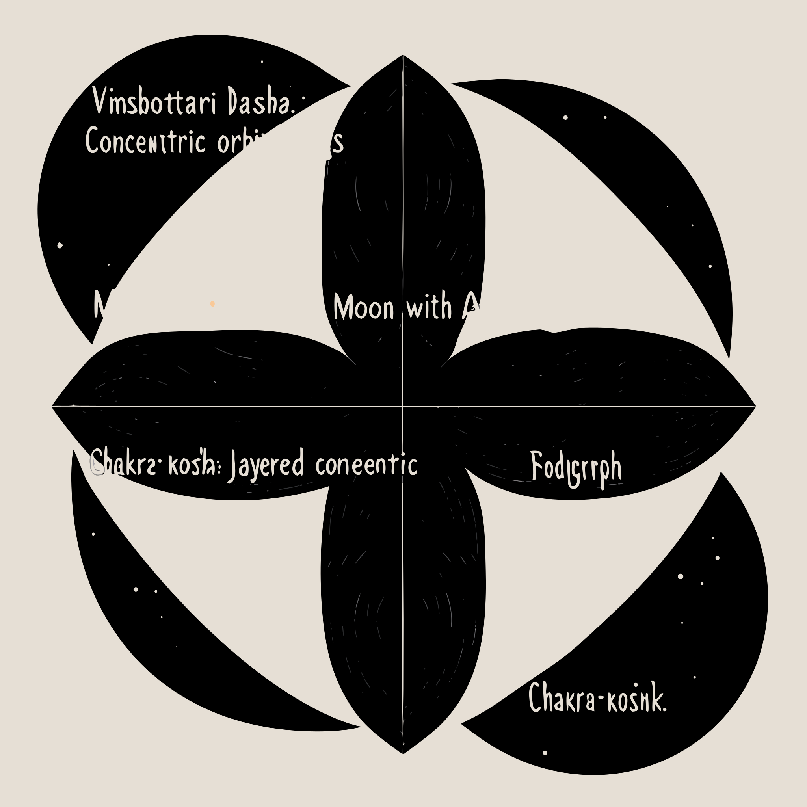

# Noesis API — Quickstart Guide

> Not prediction. Reflection. Inquiry. Witness.
>
> Zero to first API call in 5 minutes. Terminal-first.

## Base URL

```
https://selemene.tryambakam.space
```

## Step 1: Get an API Key

API keys are prefixed with `nk_` and authenticate via the `X-API-Key` header.
Each API key is treated as a unique user identity.

**For development/testing**, run the seed script against your database:

```bash
DATABASE_URL="your-postgres-url" \
  cargo run --package noesis-auth --features postgres --example seed_api_keys
```

This creates an admin user and 5 API keys across tiers (enterprise, premium, free). Save the output — keys cannot be recovered.

**Set your key as an environment variable** for convenience:

```bash
export NOESIS_API_KEY="nk_your_key_here"
```

## Step 2: Verify Connection

```bash
# Health check (no auth required)
curl -s https://selemene.tryambakam.space/health/live | python3 -m json.tool
```

```json
{
    "status": "ok",
    "version": "3.0.0",
    "engines_loaded": 16,
    "workflows_loaded": 6
}
```

## Step 3: List Available Engines

```bash
curl -s https://selemene.tryambakam.space/api/v1/engines \
  -H "X-API-Key: $NOESIS_API_KEY" | python3 -m json.tool
```

```json
{
    "engines": [
        "biofield", "biorhythm", "enneagram", "face-reading",
        "gene-keys", "human-design", "i-ching", "nadabrahman",
        "numerology", "panchanga", "sacred-geometry", "sigil-forge",
        "tarot", "transits", "vedic-clock", "vimshottari"
    ]
}
```

## Step 4: Make Your First Calculation

Every engine accepts the same request shape: `EngineInput`.
If `birth_data` is provided, the API auto-populates the user profile tied to that API key.

```bash
curl -s -X POST https://selemene.tryambakam.space/api/v1/engines/numerology/calculate \
  -H "X-API-Key: $NOESIS_API_KEY" \
  -H "Content-Type: application/json" \
  -d '{
    "birth_data": {
      "name": "Test User",
      "date": "1991-08-13",
      "time": "13:31",
      "latitude": 12.9716,
      "longitude": 77.5946,
      "timezone": "Asia/Kolkata"
    }
  }' | python3 -m json.tool
```

Response (truncated):
```json
{
    "engine_id": "numerology",
    "result": {
        "life_path": { "value": 5, "meaning": "Freedom, change, adventure" },
        "expression": { "value": 1, "meaning": "Leadership, independence, pioneering" },
        "soul_urge": { "value": 5, "meaning": "Freedom, change, adventure" },
        "personality": { "value": 5, "meaning": "Freedom, change, adventure" },
        "birthday": { "value": 4, "meaning": "Structure, discipline, foundation" }
    },
    "witness_prompt": "...",
    "consciousness_level": 0,
    "metadata": { "calculation_time_ms": 0, "backend": "native" }
}
```

## Request Format: `EngineInput`

All engine `/calculate` endpoints accept the same JSON body:

```jsonc
{
    // Required for birth-chart engines (numerology, human-design, gene-keys, etc.)
    "birth_data": {
        "name": "string (optional)",       // Used by numerology
        "date": "YYYY-MM-DD",             // Required
        "time": "HH:MM (optional)",        // Required for HD, vimshottari
        "latitude": 12.9716,              // Decimal degrees
        "longitude": 77.5946,             // Decimal degrees
        "timezone": "Asia/Kolkata"         // IANA timezone
    },

    // Auto-set to now if omitted
    "current_time": "2026-02-09T00:00:00Z",

    // Optional geographic override
    "location": { "latitude": 12.9716, "longitude": 77.5946 },

    // Calculation precision: "Standard" (default), "High", "Extreme"
    "precision": "Standard",

    // Engine-specific options (varies by engine)
    "options": {}
}
```

## Engine Reference



| Engine | Required Fields | What It Returns |
|--------|----------------|-----------------|
| **biofield** | `birth_data.date` | Chakra readings, energy field analysis |
| **biorhythm** | `birth_data.date` | Physical/emotional/intellectual cycles, forecast, critical days |
| **enneagram** | `birth_data.date`, `birth_data.name` | Enneagram type, wing, instinctual variant, integration/disintegration |
| **face-reading** | `birth_data.date`, image data | Facial feature analysis, physiognomy insights |
| **gene-keys** | `birth_data.date`, `time`, lat/lng, tz | 4 activation sequences (Shadow/Gift/Siddhi) |
| **human-design** | `birth_data.date`, `time`, lat/lng, tz | Type, strategy, authority, profile, centers, gates |
| **i-ching** | `birth_data.date` | Hexagram casting, changing lines, interpretation |
| **nadabrahman** | `birth_data.date`, `time` | Sound/vibration analysis, nada yoga frequencies |
| **numerology** | `birth_data.date`, `birth_data.name` | Life path, expression, soul urge, personality numbers |
| **panchanga** | `birth_data.date`, lat/lng, tz | Tithi, nakshatra, yoga, karana, vara |
| **sacred-geometry** | `birth_data.date` | Geometric patterns, sacred number mappings |
| **sigil-forge** | `options.intent` | Sigil generation from intent statements |
| **tarot** | `birth_data.date` | Card spreads, birth card, yearly forecast |
| **transits** | `birth_data.date`, `time`, lat/lng, tz | Current planetary transits relative to natal chart |
| **vedic-clock** | `current_time` + timezone basis (`options.timezone_offset` or `birth_data.timezone`) | TCM organ clock, Ayurvedic dosha timing |
| **vimshottari** | `birth_data.date`, `time`, lat/lng, tz | Current dasha periods (Maha/Antar/Pratyantar) |

## Try Each Engine

```bash
# Biorhythm — just needs a birth date
curl -s -X POST .../api/v1/engines/biorhythm/calculate \
  -H "X-API-Key: $NOESIS_API_KEY" \
  -H "Content-Type: application/json" \
  -d '{"birth_data":{"date":"1991-08-13","latitude":12.97,"longitude":77.59,"timezone":"Asia/Kolkata"}}' \
  | python3 -m json.tool

# Human Design — needs exact birth time
curl -s -X POST .../api/v1/engines/human-design/calculate \
  -H "X-API-Key: $NOESIS_API_KEY" \
  -H "Content-Type: application/json" \
  -d '{"birth_data":{"date":"1991-08-13","time":"13:31","latitude":12.9716,"longitude":77.5946,"timezone":"Asia/Kolkata"}}' \
  | python3 -m json.tool

# Vedic Clock — uses current time plus a timezone basis
curl -s -X POST .../api/v1/engines/vedic-clock/calculate \
  -H "X-API-Key: $NOESIS_API_KEY" \
  -H "Content-Type: application/json" \
  -d '{"current_time":"2026-03-08T06:43:16Z","birth_data":{"date":"1991-08-13","latitude":12.9716,"longitude":77.5946,"timezone":"Asia/Kolkata"}}' \
  | python3 -m json.tool
```

Replace `...` with the base URL.

For `vedic-clock`, timezone resolution priority is:
1. `options.timezone_offset`
2. `birth_data.timezone`
3. UTC fallback

The response includes `result.timezone.offset_minutes`, `result.timezone.source`, and `result.timezone.local_hour` so clients can verify the local clock basis used for organ-hour calculations.

## Workflows (Multi-Engine Synthesis)

Workflows combine multiple engines into a single response.

For a body-paced companion surface, see [Somatic Canticles](https://1319.tryambakam.space).

```bash
# List available workflows
curl -s .../api/v1/workflows \
  -H "X-API-Key: $NOESIS_API_KEY" | python3 -m json.tool
```

| Workflow | Engines | Purpose |
|----------|---------|---------|
| **birth-blueprint** | numerology + human-design + gene-keys | Core identity mapping |
| **daily-practice** | panchanga + vedic-clock + biorhythm | Daily rhythm & timing |
| **decision-support** | tarot + i-ching + HD authority | Multi-perspective guidance |
| **self-inquiry** | gene-keys + enneagram | Shadow work + patterns |
| **creative-expression** | sigil-forge + sacred-geometry | Intent visualization |
| **full-spectrum** | all 16 engines | Complete consciousness portrait |

```bash
# Execute a workflow
curl -s -X POST .../api/v1/workflows/birth-blueprint/execute \
  -H "X-API-Key: $NOESIS_API_KEY" \
  -H "Content-Type: application/json" \
  -d '{
    "birth_data": {
      "date": "1991-08-13",
      "time": "13:31",
      "latitude": 12.9716,
      "longitude": 77.5946,
      "timezone": "Asia/Kolkata"
    }
  }' | python3 -m json.tool
```

## Authentication

Two methods:

| Method | Header | Use Case |
|--------|--------|----------|
| **API Key** | `X-API-Key: nk_...` | Server-to-server, scripts, CLI |
| **JWT Token** | `Authorization: Bearer <token>` | User sessions (login flow) |

### API Key Tiers

Tiers are enforced server-side and may vary by deployment.

| Tier | Notes |
|------|------|
| **free** | Basic access |
| **premium** | Full engine access |
| **enterprise** | Full access + support |

### Error Responses

```json
// 401 — Missing or invalid auth
{
    "error": "Invalid or expired API key",
    "error_code": "UNAUTHORIZED",
    "details": { "auth_method": "api_key" }
}

// 429 — Rate limited
{
    "error": "Rate limit exceeded",
  "error_code": "RATE_LIMIT_EXCEEDED"
}

// 500 — Calculation error
{
  "error": "An internal calculation error occurred",
    "error_code": "CALCULATION_ERROR"
}
```

## Interactive API Docs (Swagger)

Full OpenAPI documentation with try-it-out:

```
https://selemene.tryambakam.space/api/docs
```

Open this in a browser to explore all endpoints interactively.

## Terminal Explorer Script

For a richer terminal experience, use the included explorer:

```bash
./scripts/explore-api.sh
```

This gives you a menu-driven interface to explore engines, run calculations, and see formatted responses — all from the terminal.

## Quick Reference

```bash
# Set your key once
export NOESIS_API_KEY="nk_your_key_here"
export NOESIS_URL="https://selemene.tryambakam.space"

# Health
curl -s $NOESIS_URL/health/live | python3 -m json.tool

# List engines
curl -s $NOESIS_URL/api/v1/engines -H "X-API-Key: $NOESIS_API_KEY"

# Calculate (any engine)
curl -s -X POST $NOESIS_URL/api/v1/engines/{engine_id}/calculate \
  -H "X-API-Key: $NOESIS_API_KEY" \
  -H "Content-Type: application/json" \
  -d '{"birth_data":{...}}'

# Engine info
curl -s $NOESIS_URL/api/v1/engines/{engine_id}/info -H "X-API-Key: $NOESIS_API_KEY"

# List workflows
curl -s $NOESIS_URL/api/v1/workflows -H "X-API-Key: $NOESIS_API_KEY"

# Execute workflow
curl -s -X POST $NOESIS_URL/api/v1/workflows/{workflow_id}/execute \
  -H "X-API-Key: $NOESIS_API_KEY" \
  -H "Content-Type: application/json" \
  -d '{"birth_data":{...}}'

# Swagger UI
open $NOESIS_URL/api/docs

# Prometheus metrics
curl -s $NOESIS_URL/metrics
```
