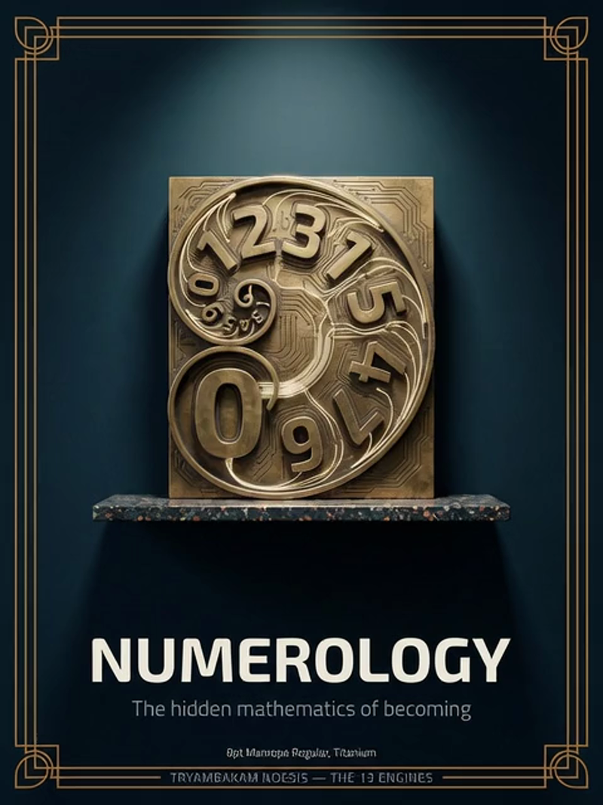
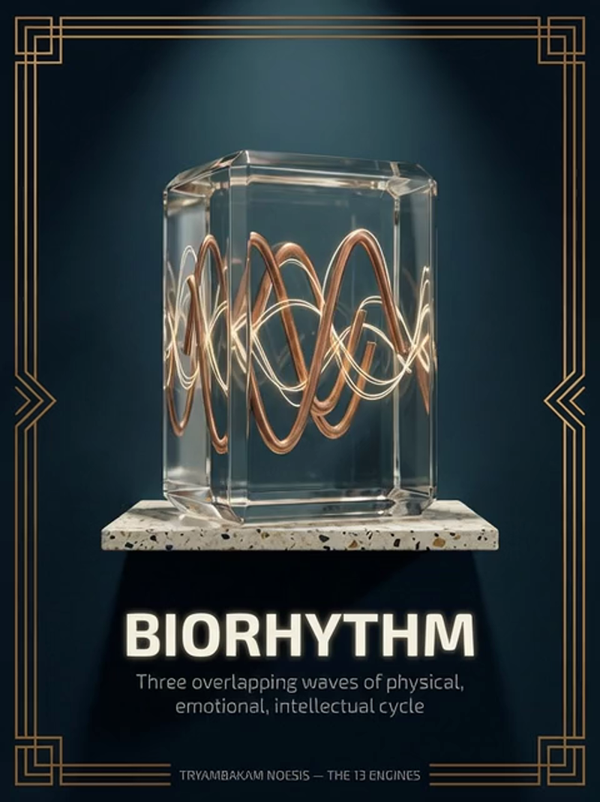
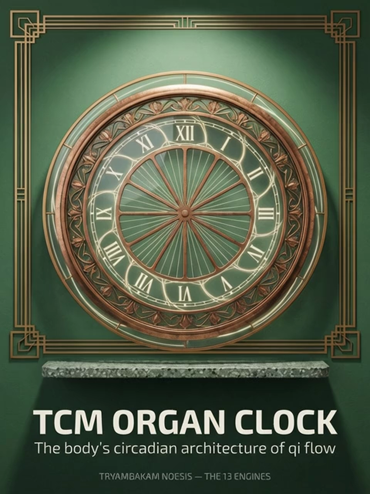
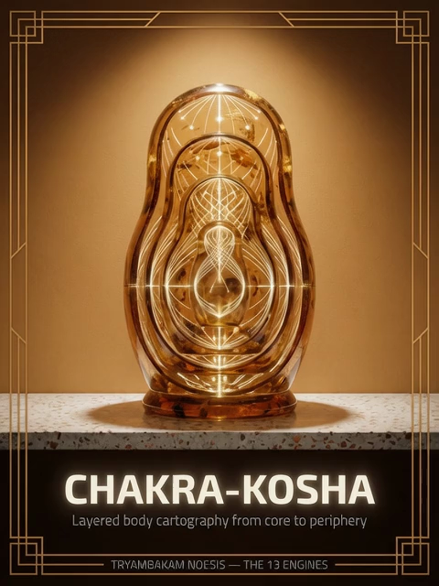
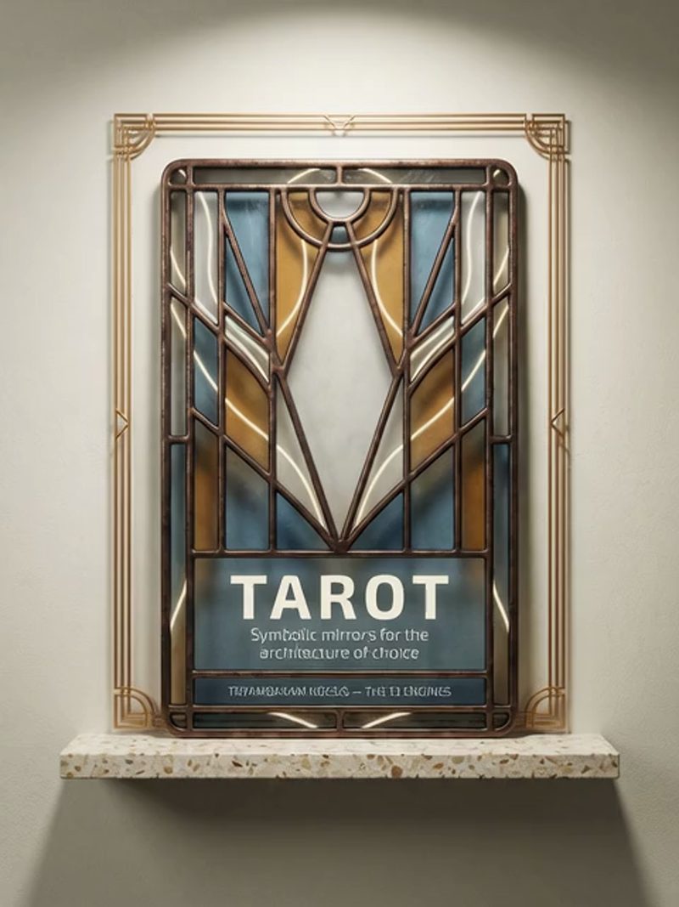
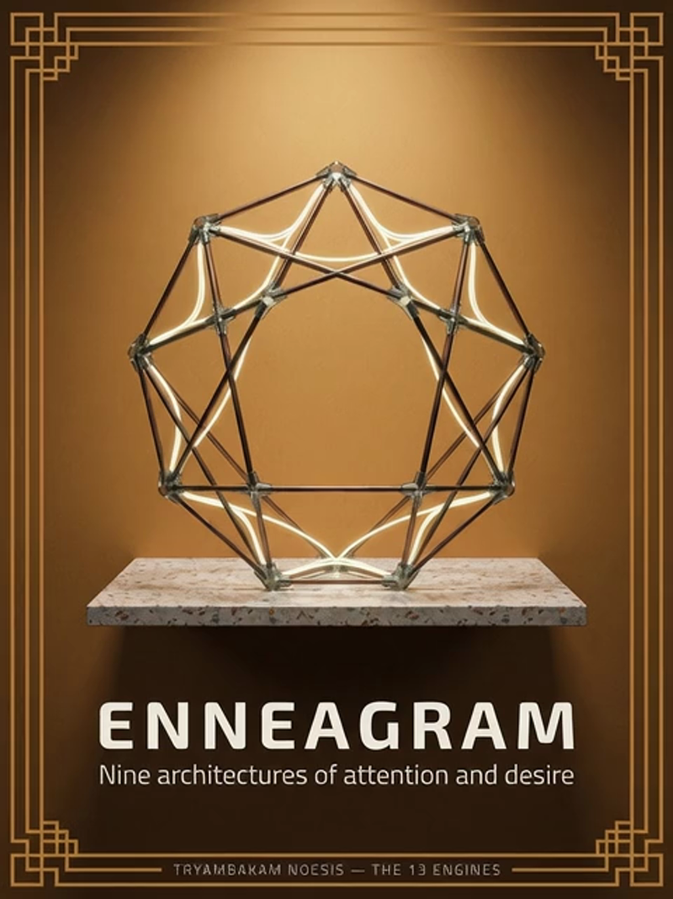
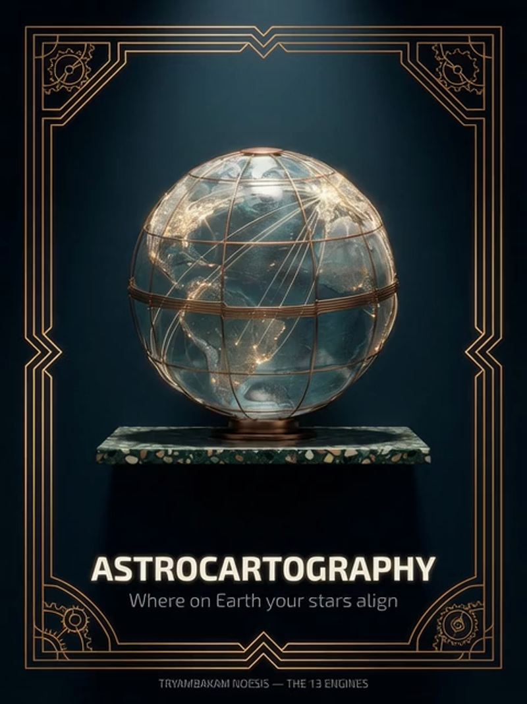
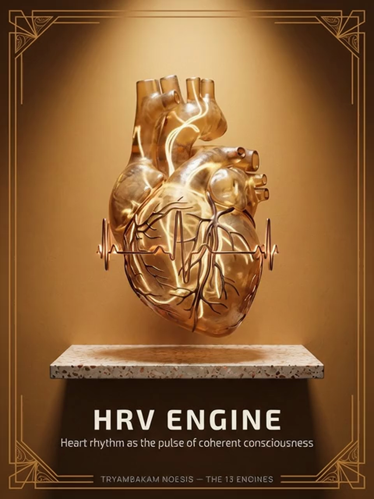
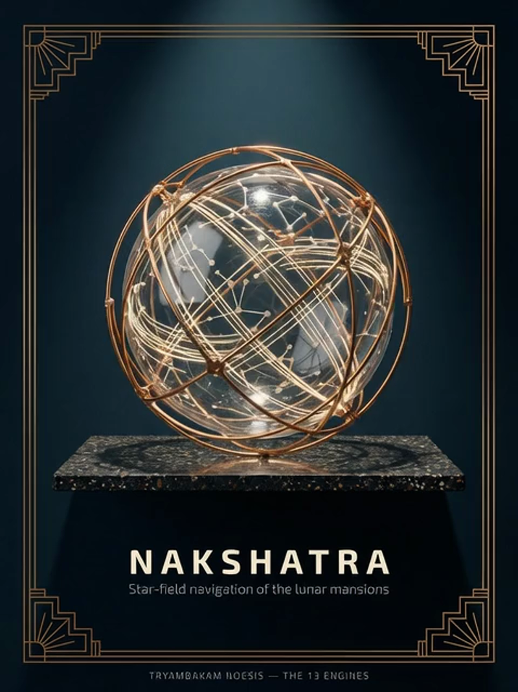

<p align="center">
  
</p>

<h1 align="center">The 15 Engines</h1>

<p align="center">
  <em>Fifteen calculation systems. Sub-millisecond precision.</em><br>
  <sub>10 Rust engines + 5 TypeScript engines</sub>
</p>

<br>

---

<br>

# Rust Engines (10)

High-performance native calculation engines built in Rust with sub-millisecond performance.

<br>

## 1. Panchanga Engine

**Vedic calendar system** — Calculates the five limbs of time: Tithi, Nakshatra, Yoga, Karana, Vara.

**Input:** `date, lat/lng, timezone`  
**Endpoint:** `POST /api/v1/panchanga/calculate`

Foundation for all Vedic timing calculations.

<br>

## 2. Human Design Engine

**Complete bodygraph** — Type, Strategy, Authority, 9 Centers, 26 Gates, Profile, Definition.

**Input:** `date, time, lat/lng`  
**Endpoint:** `POST /api/v1/human-design/calculate`

Synthesizes I Ching, Kabbalah, Chakras, and Astrology.

<br>

## 3. Gene Keys Engine

**64 Keys** — Shadow → Gift → Siddhi progression across 4 sequences (Activation, Venus, Pearl, Life's Work).

**Input:** `date, time, lat/lng`  
**Endpoint:** `POST /api/v1/gene-keys/calculate`

Maps consciousness evolution through 64 genetic pathways.

<br>

## 4. Vimshottari Dasha Engine

**120-year timeline** — Nested planetary periods (Mahadasha → Antardasha → 729 total periods).

**Input:** `date, time, lat/lng`  
**Endpoint:** `POST /api/v1/vimshottari/calculate`

Foundation for Vedic predictive timing.

<br>

## 5. Numerology Engine

**Pythagorean & Chaldean systems** — Life Path, Expression, Soul Urge, Birthday, Personality, Master Numbers.

**Input:** `date, name`  
**Endpoint:** `POST /api/v1/numerology/calculate`

<table>
<tr>
<td width="50%" align="center">
  
</td>
<td width="50%">

### Key Calculations
- Life Path Number (birth date reduction)
- Expression Number (full name)
- Soul Urge (vowels)
- Personality (consonants)
- Birthday Number
- Master Numbers (11, 22, 33)

</td>
</tr>
</table>

<br>

## 6. Biorhythm Engine

**3 biological cycles** — Physical (23-day), Emotional (28-day), Intellectual (33-day).

**Input:** `date`  
**Endpoint:** `POST /api/v1/biorhythm/calculate`

<table>
<tr>
<td width="50%" align="center">
  
</td>
<td width="50%">

### Calculations
- Current phase for all 3 cycles
- Critical day detection (zero crossings)
- Peak and valley predictions
- Cycle intersection points
- Energy trend forecasting

</td>
</tr>
</table>

<br>

## 7. Vedic Clock Engine

**TCM Organ Clock + Ayurvedic Doshas** — Maps 24-hour cycle to organ energy peaks and dosha dominance.

**Input:** `current_time`  
**Endpoint:** `POST /api/v1/vedic-clock/calculate`

<table>
<tr>
<td width="50%" align="center">
  
</td>
<td width="50%">

### Returns
- Current organ energy peak (12 meridians)
- Dominant dosha (Vata/Pitta/Kapha)
- Optimal activity recommendations
- Energy quality of current hour

</td>
</tr>
</table>

<br>

## 8. Biofield Engine

**Chakra & Subtle Body Mapping** — 7 chakras, 5 koshas, energy distribution patterns.

**Input:** `date, time`  
**Endpoint:** `POST /api/v1/biofield/calculate`

<table>
<tr>
<td width="50%" align="center">
  
</td>
<td width="50%">

### Mappings
- Primary chakra activation
- Kosha layer emphasis (Annamaya → Anandamaya)
- Energy distribution across 7 centers
- Developmental sequence
- Blockage patterns

</td>
</tr>
</table>

<br>

## 9. Face Reading Engine

**Physiognomy analysis** — Extracts facial features and maps to personality traits, health indicators, and life patterns.

**Input:** `image_data`  
**Endpoint:** `POST /api/v1/face-reading/analyze`

Combines Chinese Mian Xiang with Western physiognomy traditions.

<br>

## 10. Nadabrahman Engine

**Sound consciousness** — Analyzes vocal patterns, frequency signatures, and maps to Vedic sound cosmology (Nada Brahma).

**Input:** `audio_data`  
**Endpoint:** `POST /api/v1/nadabrahman/analyze`

Maps voice characteristics to raaga resonance and chakra activations.

<br>

---

<br>

# TypeScript Engines (5)

Esoteric calculation engines built in TypeScript, bridged to main Rust API.

<br>

## 11. Tarot Engine

**78-card system** — Birth cards, yearly cycles, archetypal progression through Major Arcana.

**Input:** `date, question`  
**Endpoint:** `POST /api/v1/tarot/calculate`

<table>
<tr>
<td width="50%" align="center">
  
</td>
<td width="50%">

### Calculations
- Birth card(s) from numerology
- Current year card
- Life path card sequence
- Archetypal themes
- Symbolic inquiry prompts

</td>
</tr>
</table>

<br>

## 12. I Ching Engine

**64 hexagrams** — Oracle casting via yarrow stalk, coin, or digital methods. Interprets changing lines and transformations.

**Input:** `question, casting_method`  
**Endpoint:** `POST /api/v1/i-ching/cast`

Traditional Book of Changes divination system.

<br>

## 13. Enneagram Engine

**9 personality types** — Core type, wing, tritype, integration/disintegration arrows, instinctual variants.

**Input:** `date, name`  
**Endpoint:** `POST /api/v1/enneagram/calculate`

<table>
<tr>
<td width="50%" align="center">
  
</td>
<td width="50%">

### Returns
- Core type (1-9)
- Wing tendency
- Tritype combination
- Integration/disintegration paths
- Instinctual stacking (sp/sx/so)
- Centers of intelligence

</td>
</tr>
</table>

<br>

## 14. Sacred Geometry Engine

**Platonic solids & geometric patterns** — Generates sacred geometry constructions, calculates proportions (phi, pi, √2), and maps to energetic resonances.

**Input:** `parameters (shape, size, proportions)`  
**Endpoint:** `POST /api/v1/sacred-geometry/generate`

Includes Flower of Life, Metatron's Cube, Sri Yantra, Golden Spiral.

<br>

## 15. Sigil Forge Engine

**Intent manifestation** — Transforms text intentions into visual sigils using letter reduction, geometric encoding, and symbolic transformation methods.

**Input:** `intent_text, method (chaos/planetary/angelic)`  
**Endpoint:** `POST /api/v1/sigil-forge/create`

Combines Austin Osman Spare's method with planetary and angelic signatures.

<br>

---

<br>

# Additional Engines (In Development)

## Astrocartography Engine

**Planetary line mapping** — Projects birth chart onto world map, identifies power spots and relocation themes.

**Status:** Partially implemented  
**Input:** `date, time, birth_location`

<table>
<tr>
<td width="50%" align="center">
  
</td>
<td width="50%">

### Calculations
- Planetary line crossings (ASC/MC/DSC/IC)
- Power spot coordinates
- Relocation chart analysis
- Travel timing recommendations

</td>
</tr>
</table>

<br>

## HRV (Heart Rate Variability) Engine

**Autonomic nervous system mapping** — Predicts sympathetic/parasympathetic balance patterns and recovery windows from birth data.

**Status:** Experimental  
**Input:** `date, optional_hrv_data`

<table>
<tr>
<td width="50%" align="center">
  
</td>
<td width="50%">

### Returns
- Baseline ANS tendency
- Optimal recovery times
- Stress resilience patterns
- Circadian HRV rhythm

</td>
</tr>
</table>

<br>

## Nakshatra Engine

**27 lunar mansions** — Deep dive into Vedic lunar mansion system. Each nakshatra's deity, qualities, and karmic themes.

**Status:** Integrated with Panchanga  
**Input:** `date, lat/lng`

<table>
<tr>
<td width="50%" align="center">
  
</td>
<td width="50%">

### Returns
- Birth nakshatra
- Pada (quarter within nakshatra)
- Ruling deity and planet
- Karmic themes
- Compatible nakshatras

</td>
</tr>
</table>

<br>

## Biofield-Raaga Engine

**Sound frequency + energy field integration** — Maps birth patterns to Hindustani raaga resonance and biofield layer activations.

**Status:** In development  
**Input:** `date, time`

<table>
<tr>
<td width="50%" align="center">
  
</td>
<td width="50%">

### Calculations
- Dominant raaga resonance
- Biofield layer activations (7 layers)
- Frequency signatures
- Time-of-day raaga cycles
- Sound healing recommendations

</td>
</tr>
</table>

<br>

---

<br>

## Common Response Format

All engines return this unified structure:

```json
{
  "engine": "engine_name",
  "result": { /* engine-specific data */ },
  "witness_prompt": "Calibrated question for self-inquiry",
  "consciousness_level": 0,
  "metadata": {
    "calculation_time_ms": 0.042,
    "backend": "native",
    "version": "0.1.0"
  }
}
```

<br>

---

<br>

<p align="center">
  <a href="../README.md">← Back to Main README</a>
  &nbsp;&nbsp;|&nbsp;&nbsp;
  <a href="api/README.md">API Documentation →</a>
</p>

<br>

<p align="center">
  
</p>
