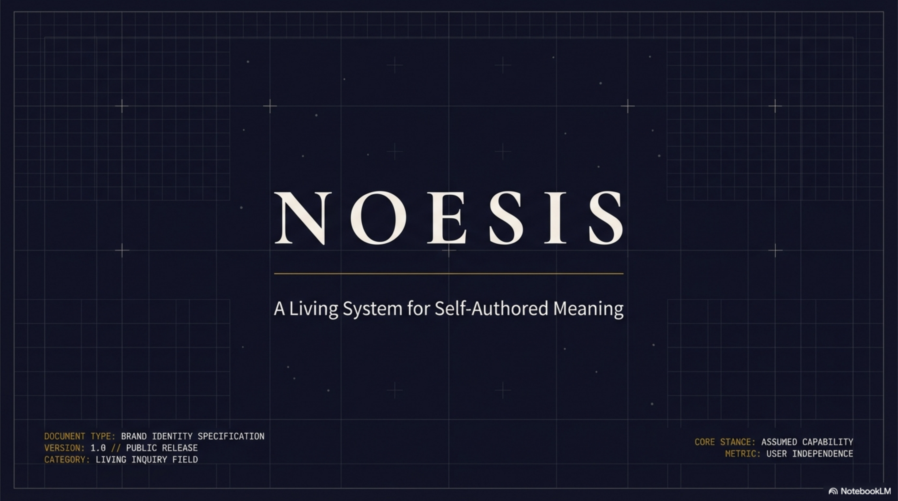

# Selemene Engine — Project Overview & Audit

> Technical rigor in service of reflection, inquiry, and self-authorship.

**Date**: 2026-02-09
**Codebase**: ~54,000 LOC across 18 workspace crates
**Status**: Production-live on Railway with Railway Postgres and Cloudflare Zero Trust for human/admin auth
**Overall Maturity**: 78% production-ready

> March 10, 2026 correction: the active Vedic runtime path is native Rust for `panchanga`, `vimshottari`, and `transits`. `noesis-vedic-api` remains in-repo as an optional provider client, but it is not the current production calculation path for those engines.

> **Witness Dyad and Premium Assets (2026-07 retirement note):** Selemene is the single canonical service for rich Aletheios + Pichet voice interpretation (dyad synthesis) and premium multi-pass integrated reading / asset generation. Lightweight per-engine `witness_prompt` remains the rule-based mirror entry point. Additive surfaces (e.g. `/api/v1/assets/generate`, SDK `generatePremiumAsset`) expose premium assets. witness-agents is now reference + asset source only (personas, mode docs, historical batches). All live rich dyad and premium asset traffic uses Selemene endpoints and SDK. Non-prescriptive "mirror" philosophy preserved.

---

## 1. What Is Working

### Production Infrastructure

The deployment pipeline is solid. The Axum HTTP server (`noesis-server`) runs on Railway with a multi-stage Docker build that caches dependency layers — initial builds take ~15 minutes, but source-only changes rebuild in 2-3 minutes. The production binary is optimized (`opt-level = 3`, LTO, single codegen unit, stripped symbols) producing a <100MB runtime container.

The health check system works correctly: `/health/live` always returns 200 for liveness probes, `/health/ready` checks database, Redis, and orchestrator state before returning 200. This separation prevents Railway from killing the container during transient dependency outages.

Railway Postgres is live with 4 migrations applied (users, password_reset, user_progression, api_keys). The api_keys table uses SHA-256 hashing with monthly-partitioned usage_logs (2026-01 through 2026-12 pre-created). The auth flow is fully operational: API keys validate against Postgres via `validate_from_postgres()`, the seed script creates an admin user with FK-linked keys across three tiers (enterprise, premium, free), and the `add_api_key()` method dual-writes to Postgres and in-memory HashMap for persistence plus fast fallback.

Redis is deployed on Railway as an L2 cache add-on. In-memory LRU (L1) handles sub-millisecond lookups. The 3-layer cache architecture is structurally sound, though L2 Redis operations have 8 TODO markers indicating the Redis cache layer needs re-enabling after a refactor.

Sentry error tracking is integrated (`sentry 0.34`, `sentry-tower`), configured for 10% trace sampling. It initializes in `main.rs` and no-ops gracefully if `SENTRY_DSN` is unset.

### Engines That Calculate Real Values

All 17 engines (11 Rust + 6 TypeScript) produce genuine calculations:

**Panchanga** (native Rust): Computes Julian Day conversion, solar/lunar longitudes, tithi, nakshatra, yoga, karana, and vara. The current engine prefers Swiss-Ephemeris-backed solar/lunar positions and falls back to local approximations only when needed. Recent hygiene fixes validated the canonical `1991-08-13 13:31 Asia/Kolkata` birth chart and the `2026-03-10` Bengaluru day Panchang karana sequence against trusted references.

**Numerology** (703 LOC, 18 tests): Implements both Pythagorean and Chaldean systems. Life path, expression, soul urge, personality, birthday number, and Chaldean name number with master number preservation (11, 22, 33). Pure math. Production-ready.

**Biorhythm** (668 LOC, 14 tests): Classic sine-wave model — physical (23-day), emotional (28-day), intellectual (33-day), plus extended cycles (intuitive 38-day, composite cycles). Includes critical day detection and configurable forecast windows. Pure math. Production-ready.

**Human Design** (5,679 LOC across 16 files, 5 test files): The crown jewel. Full HD chart synthesis using Swiss Ephemeris for astronomical precision. Calculates 88-degree solar arc for Design time, 13 planetary activations, 64 gates mapped from ecliptic longitude, 9 centers with defined/undefined analysis, 36 channels, 5 types, 12 profiles, 4 authorities, and definition types. Requires ephemeris data files (`sepl_18.se1`, `semo_18.se1`, `seas_18.se1` — all present in `data/ephemeris/`). Rich wisdom data included for interpretations.

**Gene Keys** (2,901 LOC across 9 files, 2 test files): Maps HD gates to the Gene Keys shadow-gift-siddhi framework. Computes 4 activation sequences (Life's Work, Evolution, Radiance, Purpose) from Sun/Earth/Venus personality and design positions. Inherits Swiss Ephemeris from HD engine. Rich wisdom data included.

**Vimshottari** (native Rust): Full 120-year Dasha timeline based on Moon's nakshatra at birth. Computes Mahadashas, Antardashas, and Pratyantardashas (729 nested periods). Binary search finds the current moment in the grand cycle. The active runtime uses timezone-correct birth parsing plus sidereal Moon longitude derived from Swiss Ephemeris-backed positions.

**Vedic Clock** (3,543 LOC across 15 files): Unique synthesis of TCM organ meridian clock with Vedic panchanga, hora, and choghadiya timing systems. Maps 12-organ TCM clock to 3 Ayurvedic doshas with organ-dosha affinity scoring. The current runtime uses the native timing path and now honors birth timezone inputs explicitly.

**Transits** (native Rust): Calculates natal and transit planetary positions, transit-to-natal aspects, retrogrades, and Sade Sati status. Recent hygiene fixes corrected timezone-aware natal parsing and switched sidereal sign assignment from a fixed Lahiri approximation to date-correct Lahiri ayanamsha from Swiss Ephemeris, with validation across three trusted natal charts.

### Supporting Infrastructure

**Orchestrator** (~3,000 LOC, 20 files): Production-grade parallel engine execution using `futures::join_all`. Registry of 6 workflows (birth-blueprint, daily-practice, decision-support, self-inquiry, creative-expression, full-spectrum). Phase-gated access control (levels 0-5) and workflow caching.

**Vedic API Client** (`noesis-vedic-api`): Full FreeAstrologyAPI.com client covering 15+ endpoints (Panchang, Dasha, Birth Chart, Vargas, Transits, Yogas, Shadbala, Ashtakavarga, Muhurta, and more). It remains useful as an integration/client crate, but it is not the active production runtime path for the current Vedic engine calculations after the March 2026 hygiene corrections.

**Bridge** (552 LOC): HTTP adapter connecting to 6 TypeScript engines (Tarot, I-Ching, Enneagram, Sacred Geometry, Sigil Forge, Raaga) via Bun/Elysia. Health check, configurable timeout, connection retry. Production-ready but depends on external TS server availability.

**Auth** (~400 LOC + password module): JWT + API key authentication. Argon2id password hashing. Postgres-backed key validation with SHA-256 hashing. Tiered rate limiting (60/1,000/10,000 req/min). Dual-write for API key persistence.

### Test Coverage

The test suite is extensive: 1,321+ test functions across 41 test files. Distribution is weighted toward the engines that do real work — HD has 5 test files, Vedic API has 13 test files including reference validation suites, Panchanga has 16 unit tests, Numerology has 18. The orchestrator has 2 test files plus a benchmark.

### Documentation

The `.context/` directory contains 164 markdown files organized by the Substrate Methodology — architecture decisions (ADRs), implementation reports, feature documentation, testing standards, and operational guides. This is unusually thorough and serves both human developers and AI coding assistants.

---

## 2. What Can Improve

### Security: Hardcoded JWT Secret

`scripts/railway-setup.sh:89` contains a hardcoded JWT secret that's committed to version control. This is the most urgent fix — anyone with repo access can forge JWT tokens. The fix is straightforward: generate a new secret (`openssl rand -base64 48`), set it via Railway dashboard, remove the hardcoded value from the script, and rotate all existing JWTs.

### Build System: OpenTelemetry Version Mismatch

`noesis-api/Cargo.toml` declares `tracing-opentelemetry = "0.22"` alongside `opentelemetry = "0.21"`. These versions are incompatible — `tracing-opentelemetry 0.22` requires `opentelemetry 0.22+`. This causes a compilation failure in `noesis-api/src/logging.rs` when the `otel` feature is enabled. The fix: align versions (upgrade `opentelemetry` to 0.22 or downgrade `tracing-opentelemetry` to 0.21).

### Release Pipeline: Binary Name Mismatch

`.github/workflows/release.yml:135` tries to package a binary named `selemene-engine`, but `Cargo.toml` builds `noesis-server`. Release builds will fail when packaging binaries for GitHub Releases. Quick fix: update the workflow to use the correct binary name.

### Redis L2 Cache: Disabled

The L2 cache layer has 8 TODO markers indicating Redis cache operations were disabled during a refactor and need re-enabling. The architecture supports it, but the wiring is incomplete. This means cache misses that should hit Redis (10ms) instead fall through to recalculation.

### Metrics: Incomplete

`noesis-metrics` has CPU and memory monitoring functions that return `0.0` (lines 399-400, 432-434). Prometheus instrumentation is structurally in place, but system resource metrics aren't being collected.

### Orchestrator Synthesis: Partially Implemented

The workflow execution framework works, but synthesis logic (the part that combines multiple engine outputs into a meaningful composite) is fully implemented only for `birth-blueprint` and `daily-practice`. The remaining 4 workflows (`decision-support`, `self-inquiry`, `creative-expression`, `full-spectrum`) have TODO markers in their synthesizers. Engine execution works for all workflows — it's the synthesis layer that's sparse.

### Compilation Warnings

`noesis-vedic-api` produces 67 warnings (mostly unused imports/variables), `engine-vedic-clock` produces 12, and `engine-vimshottari` produces 4. These are non-blocking but noisy. A `cargo fix` pass would clean most of them.

### CI Pipeline Gaps

The test workflow uses `continue-on-error: true` for integration tests due to a known SIGTRAP on cleanup. This masks real failures. The CI also lacks a PostgreSQL service, so auth-related integration tests can't run. Adding Postgres (like Redis is already configured) would close this gap.

### Docker Inconsistency

`docker-compose.yml` references `Dockerfile` (development) while production uses `Dockerfile.prod`. The development Dockerfile uses Rust 1.75 vs. production's 1.89, and health check endpoints differ (`/health` vs. `/health/live`). This inconsistency can confuse local development.

---

## 3. What Needs To Be Done

### Critical (This Week)

1. **Rotate JWT secret** — Generate new secret, update Railway, remove from `railway-setup.sh`
2. **Fix release binary name** — Update `release.yml` to package `noesis-server`
3. **Fix OpenTelemetry versions** — Align `tracing-opentelemetry` and `opentelemetry` crate versions

### High Priority (Next 2 Weeks)

4. **Re-enable Redis L2 cache** — Complete the 8 TODO items in `noesis-cache` to wire up Redis operations
5. **Add PostgreSQL to CI** — Add a Postgres service to `test.yml` so auth tests run in CI
6. **Complete workflow synthesizers** — Implement synthesis logic for `decision-support`, `self-inquiry`, `creative-expression`, `full-spectrum`
7. **Implement CPU/memory metrics** — Replace the `0.0` stubs in `noesis-metrics` with real system monitoring

### Medium Priority (Next Month)

8. **Clean up 83 compilation warnings** — Run `cargo fix` on `noesis-vedic-api`, `engine-vedic-clock`, `engine-vimshottari`
9. **Fix integration test SIGTRAP** — Investigate and fix cleanup crash, remove `continue-on-error` from CI
10. **Database partition maintenance** — Create `usage_logs_2027_*` partitions and document the maintenance procedure
11. **Docker alignment** — Update `docker-compose.yml` to use `Dockerfile.prod` or document the dev vs. prod distinction clearly
12. **Vedic API parsing** — Complete the 2 `todo!()` calls in `noesis-vedic-api/src/panchang/mod.rs` (lines 308, 313) for Tithi/Nakshatra parsing from certain API response formats
13. **Admin API endpoints** — Build the `/api/v1/admin/*` endpoints for user management and API key creation (the `add_api_key()` dual-write was done specifically to enable this)

### Future (Backlog)

14. **Biofield engine** — Replace mock data with real calculations (requires PIP hardware integration, 3-4 weeks)
15. **Face Reading engine** — Replace mock data with MediaPipe face mesh integration (4-6 weeks)
16. **TypeScript engines** — Consider migrating TS engines to Rust for single-binary deployment
17. **SDK generation** — Auto-generate client SDKs (Python, JavaScript, Go) from OpenAPI spec
18. **Rate limiting per-endpoint** — Current rate limiting is global per-user; some endpoints (like `full-spectrum`) should count more
19. **Webhook/event system** — Notify external systems when calculations complete or dashboards update
20. **User dashboard** — Self-service API key management, usage analytics, billing

---

## 4. What Can Be Removed

### Definitely Remove

**`scripts/railway-setup.sh` hardcoded JWT secret** — Remove the hardcoded value on line 89 after rotating to a new secret. Replace with a prompt or comment instructing users to set via Railway dashboard.

### Consider Removing

**`ts-engines/` directory** — The TypeScript engines (Tarot, I-Ching, Enneagram, Sacred Geometry, Sigil Forge) are deployed in production on Railway as a separate Bun/Elysia service. The Rust-side bridge (`noesis-bridge`) connects to them at runtime. Options for future consideration: (a) keep the current hybrid architecture, or (b) rewrite these engines in Rust for a single-binary deployment.

**`Dockerfile` (development)** — Uses Rust 1.75, different health check, less secure setup. If everyone uses `docker-compose up` with `Dockerfile.prod`, the dev Dockerfile is dead weight.

**`archive/root-binary-prototype/`** (33 files) — The original monolithic server before the workspace refactor. Useful as historical reference but adds nothing to the active codebase. Consider moving to a separate branch or tagging the pre-refactor commit for reference.

**`engine-face-reading`** — Currently returns seeded random data with no path to real implementation without ML model training + MediaPipe integration. If face reading isn't on the near-term roadmap, consider clearly marking it as experimental.

**Redundant Redis cleanup documentation** — `scripts/` contains 4 separate markdown files about Redis cleanup/setup. Consolidate into one operational runbook.

### Trim But Keep

**`.context/` documentation** — 164 files across 131 MB is comprehensive but may contain stale agent reports and phase completion docs from earlier development. A targeted cleanup pass (removing obsolete reports while keeping architecture, decisions, and feature docs) would reduce noise without losing value.

**`noesis-data` crate** — Minimal scaffold (500 LOC) with just a User model and repository. If all data access is going through `sqlx` queries directly (as in auth), this crate may be unnecessary indirection. Evaluate whether to build it out or fold its minimal content into `noesis-auth`.

---

## 5. Data Dependencies & External Services

### Swiss Ephemeris

The Human Design and Gene Keys engines depend on Swiss Ephemeris data files stored in `data/ephemeris/`. Three files are present and required: `sepl_18.se1` (473KB, planetary data), `semo_18.se1` (1.2MB, Moon data), and `seas_18.se1` (218KB, asteroid data). These are compiled astronomical tables, not something you can regenerate — they come from the Swiss Ephemeris distribution and cover the period relevant to modern birth chart calculations. If these files are missing, Human Design and Gene Keys calculations will fail. The Dockerfile copies them explicitly into the container.

### FreeAstrologyAPI.com

The `noesis-vedic-api` crate is a full HTTP client for FreeAstrologyAPI.com, providing access to Panchang, Dasha, Birth Chart, Vargas, Transits, Yogas, Shadbala, Ashtakavarga, Muhurta, and more. As of March 10, 2026, the primary Selemene Vedic runtime no longer depends on this provider for `panchanga`, `vimshottari`, or `transits`; the crate remains in the repo for optional integrations, provider experiments, and future non-runtime use.

### Wisdom Data Files

Each engine carries its own wisdom data in `data/`:
- `data/human-design/` — 13 JSON files (gates, channels, centers, authorities, incarnation crosses, profiles, types, etc.)
- `data/gene-keys/archetypes.json` — 64 Gene Key descriptions with shadow/gift/siddhi
- `data/vimshottari/` — 4 JSON files (dasha periods, nakshatras, planets, period mappings)
- `data/vedic-clock/` — 5 JSON files (TCM organ clock, consciousness practices, five elements, panchanga qualities)
- `data/tarot/` — 2 JSON files (major arcana, Rider-Waite deck)
- `data/i-ching/` — 2 JSON files (hexagrams basic + complete)
- `data/enneagram/types.json`
- `data/sacred-geometry/` — 2 JSON files (symbols, templates)

This data represents significant domain knowledge encoded as structured JSON. It's one of the project's most valuable non-code assets. The wisdom data is what transforms raw calculations into meaningful witness prompts.

### Railway Postgres

The database runs on Railway Postgres with connection pooling handled by Railway. Four migrations are applied: users (with profiles), password reset tokens, user progression tracking, and API keys with partitioned usage logs. The schema uses UUIDs as primary keys, TIMESTAMPTZ for all timestamps, JSONB for permissions and preferences. Human/admin authentication is enforced by Cloudflare Zero Trust; the API validates CF identity headers and maps CF groups into local `user_roles`.

### Railway Redis

Redis serves as the L2 cache layer, deployed as a Railway add-on. The URL is automatically injected by Railway. When Redis is unavailable, the system falls back to L1 (in-memory LRU) only. The L2 cache layer has incomplete wiring from a refactor — 8 TODO markers indicate Redis operations that need re-enabling.

---

## 6. Development Workflow & CI/CD

### Local Development

The local development flow is straightforward: `cargo build --release && cargo run --bin noesis-server`. Environment configuration is loaded from `.env` (copy from `.env.example`). The server runs on port 8080 with `SERVER_HOST=0.0.0.0`. For tests, `cargo test -- --test-threads=1` runs the full suite (single-threaded due to Swiss Ephemeris thread safety requirements).

Docker Compose provides a full local stack (Rust server + Redis + Postgres) with `docker-compose up -d`. However, the compose file references the development `Dockerfile` (Rust 1.75) rather than the production `Dockerfile.prod` (Rust 1.89), which can lead to subtle differences.

### CI/CD Pipelines

Three GitHub Actions workflows exist:

**test.yml**: Runs on every push. Jobs: lint (fmt + clippy), unit tests, integration tests (with Redis service), security audit (RustSec), release build verification, and TypeScript engine tests. Integration tests run with `continue-on-error: true` due to a known SIGTRAP on cleanup — this masks real failures and should be fixed.

**release.yml**: Triggers on version tags (`v*.*.*`). Creates GitHub Release, builds Docker image for `ghcr.io`, cross-compiles binaries for Linux x86_64, macOS x86_64, and macOS ARM64. Has a bug: expects binary named `selemene-engine` but Cargo builds `noesis-server`.

**deploy.yaml**: CD pipeline with Docker builds, Kubernetes deployment, and release creation. Less actively used since Railway deployment is the primary path.

### Deployment

Railway deployment is push-to-deploy: push to `main`, Railway picks up the `Dockerfile.prod`, builds, and deploys. The setup is automated via `scripts/railway-setup.sh` (sets 25 environment variables) and verified with `scripts/railway-verify.sh`. Health probes at `/health/live` and `/health/ready` ensure proper container lifecycle management.

---

## 7. Documentation Landscape

The project has two layers of documentation:

**User-facing** (`docs/`): API Quickstart guide, project overview (this document), performance reports, migration guides, troubleshooting, and deployment docs.

**Developer-facing** (`.context/`): 164 files following the Substrate Methodology — a documentation-as-code-as-context approach designed to serve both human developers and AI coding assistants. Key components:

- **Architecture** (`.context/architecture/`): Layered architecture overview, implementation patterns, dependency management
- **Auth** (`.context/auth/`): JWT + refresh token strategy, RBAC model, security measures, integration patterns
- **API** (`.context/api/`): Endpoint reference, headers/CORS, client examples
- **Database** (`.context/database/`): Schema, models, migration strategy
- **Decisions** (`.context/decisions/`): 3 ADRs documenting JWT choice, repository pattern, PostgreSQL selection
- **Reports** (`.context/reports/`): 6 agent completion reports, 3 phase/wave reports, 15+ implementation summaries
- **Features** (`.context/documentation/features/`): Deep dives on Ghati system, Gene Keys, Human Design time gates, Swiss Ephemeris verification

This documentation is one of the project's strengths. It reduces onboarding friction, prevents AI assistants from hallucinating about the architecture, and captures decision rationale that would otherwise be lost. The tradeoff is maintenance burden — some agent reports and phase completion docs may be stale and could be pruned.

---

## 8. Architecture Assessment

### What's Right

The workspace crate structure is well-organized. Each engine is an independent crate with its own tests, the orchestrator composes them through a trait (`ConsciousnessEngine`), and the API layer is cleanly separated. The dependency graph flows in one direction: `noesis-api` → `noesis-orchestrator` → `engine-*` → `noesis-core`. This makes individual engines testable in isolation and the system composable.

The auth system is genuinely well-built. The Postgres-backed validation path, the SHA-256 key hashing, the tiered rate limiting, and the graceful degradation (server runs without DB, just without auth endpoints) reflect production thinking.

The native Vedic engines now carry the primary production responsibility for Panchanga, Vimshottari, and Transits. The provider integration remains available as a supporting client crate, but the runtime path is intentionally simpler and less ambiguous after the March 2026 hygiene pass.

### What Could Be Better

The consciousness level system (0-5) is a powerful differentiator but it's not consistently applied. Some engines use it to calibrate witness prompts, others ignore it. Making this consistent across all engines would strengthen the product's unique value proposition.

The workflow synthesis layer is the thinnest part of the architecture. Parallel engine execution works, but the "so what?" — the emergent understanding from combining engines — is only implemented for 2 of 6 workflows. This is where the product's value lives, and it needs the most attention.

### Performance Reality

The engine calculation times are genuinely fast — Gene Keys at 0.012ms, most others under 1ms, Human Design at 1.31ms. The API p95 is under 100ms, and parallel workflow execution completes under 200ms. These numbers are real, measured, and a legitimate competitive advantage.

---

## 9. Summary

The Selemene Engine is a serious piece of infrastructure. 17 engines (11 Rust + 6 TypeScript) produce real calculations, the auth system works end-to-end against Railway Postgres with Cloudflare Zero Trust for human/admin access, the deployment pipeline is solid, and the test coverage is strong. The codebase is honest about what's stubbed (biofield, face reading) and the architecture supports clean extension.

The most impactful improvements are: rotating the exposed JWT secret (security), completing the workflow synthesizers (product value), and re-enabling Redis L2 cache (performance). Everything else is polish, cleanup, or future roadmap.

**Total LOC**: ~54,000 Rust + ~2,000 TypeScript scaffolding
**Tests**: 1,321+ functions across 41 files
**Engines**: 17 (11 Rust + 6 TypeScript)
**Live**: https://selemene.tryambakam.space
**Auth**: Working end-to-end with Railway Postgres and Cloudflare Zero Trust
