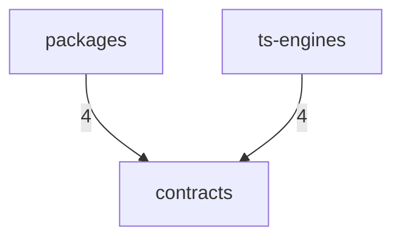

# Dependency Graph

> Auto-generated by `ArchitectureAssetsSync.hook.ts`. Last refreshed: 2026-09-08T18:24:20.437Z
> Scanned 274 source files. Edges aggregate to top-level directories (or `src/<name>`).

## Module graph

## Edge counts

| From | To | Imports |
|---|---|---|
| `packages` | `contracts` | 4 |
| `ts-engines` | `contracts` | 4 |