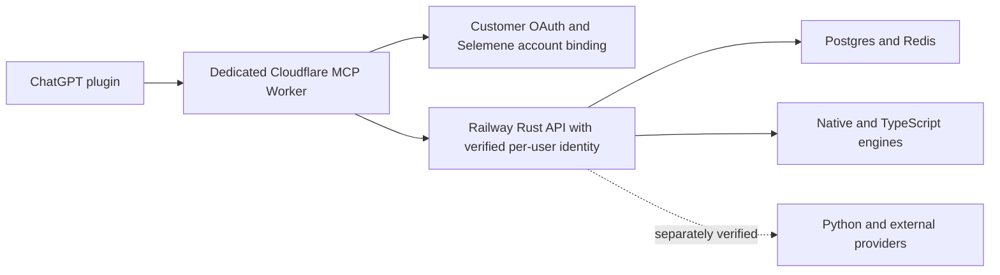

# Selemene customer plugin — code and infrastructure reconciliation

Audit date: 2026-09-30 Europe/Paris. Scope: user-authorized parallel read-only investigation of current code, scoped Cloudflare 9d9d, and Railway. Changes made by the audit are documentation only.

## Outcome

The existing infrastructure is usable. Sites installation is not a prerequisite: a dedicated MCP Worker on the verified Cloudflare account can integrate with the established Railway application. The hard work is customer identity, truthful tool contracts, and source/deployment reconciliation. No plugin has been built or connected by this audit.

## Verified source states

| State | Evidence |
| --- | --- |
| Local checkout | `codex/selemene-capability-consumer-surface` at `3e9ecb61e3f4a4b40ac624a5ecefa5753876b26f` |
| Current remote main | `ebd97fe940a3454b0425ff60d56003b07337564e`, read with `git ls-remote` and GitHub commit API |
| Current remote feature branch | `eba705dfdb43d27e2e533e945193757088d6fe75` |
| Divergence | `git rev-list --left-right --count ebd97fe940a3454b0425ff60d56003b07337564e...HEAD` returns `2 18` |
| Main-only work | `561c3e47` Dodo-free release changes and `ebd97fe9` release reconciliation; 561c3e47 also contains capability-related changes |
| Local changes | README and witness mode/orchestrator/asset changes plus untracked modes/report tooling remain intact |
| Latest recorded CD | Run `34264769135` at main passed CI, Railway job, API smoke and admin smoke; Kubernetes intentionally skipped |

The 18 commits are ancestry evidence, not 18 entirely absent features: main includes overlapping capability work. Do not reset or deploy the dirty feature checkout to reconcile. Start isolated implementation from current main and deliberately port the needed differences.

## Infrastructure interpretation

Cloudflare operator authentication succeeded with Wrangler profile `9d9d`, scoped to account `9d9d23b27f32e70ae3afb6a1aa2c0f10`. The Selemene gateway deployment is July 27 version `fc97ef70-02e8-4ede-95fc-23a0f88b1752`, 100% traffic. Its source is an owner-token to shared-key proxy. Successful operator authentication does not supply customer OAuth, delegated identity or MCP protocol support.

Railway CLI authentication succeeded. The repository directory is unlinked; reads explicitly target `robust-adventure` project `11eedde4-41e6-4f51-b86b-cf77111cf592` and production environment `702b945e-2c66-4d5a-bae1-4c67ea14c3bb`. Seven services were reported running. No local project link was changed.

The active Rust deployment is `ee9cb602-d3d3-4db3-a8d6-d06fc75090a8`, uploaded September 8. Current provider metadata lacks a commit hash. Main's release receipts tie that exact deployment ID to `561c3e47` and workflow `34258440332`; this corroborates historical source linkage but does not replace an immutable provider commit/image/schema attestation. The recorded Railway image and GHCR image are distinct builds and must not be called equal.

Readiness returned healthy Postgres, Redis, orchestrator and six TypeScript bridges. TypeScript capability discovery returned six entries. Rust `/api/v1/engines/capabilities` returned 404, while catalog routes require authentication. Thus infrastructure health does not demonstrate the newer local customer-capability endpoint is deployed.

The custom `selemene.tryambakam.space` domain returned 200 to normal curl, despite a 403 observed with Python urllib. This is a client-dependent access difference; the audit did not prove its root cause. Real server-to-server MCP traffic must be tested against the chosen origin.

Cloudflare deployment drift is also verified: the live LLM proxy retains `nvidia/llama-3.3-nemotron-super-49b-v1.5`, while current source selects `nvidia/nemotron-3-nano-omni-30b-a3b-reasoning`. No inference call or provider-lifecycle claim was tested. Pattern-memory Worker is absent under the correct account; its source has placeholder binding IDs. Administrator proxy and static atlas are separate verified surfaces, not customer MCP endpoints. DNS-record reads alone returned 403 despite successful Workers/Pages/account reads.

Further provider gaps: Biofield has old deployment provenance and no configured healthcheck in live metadata; no MediaPipe service appeared in the seven-service inventory; declared resource/watch settings are not all reflected in resolved Railway metadata. See the detailed Railway receipt before planning deployment changes.

## Material customer-plugin findings

| Priority | Finding | Consequence |
| --- | --- | --- |
| Before exposure | Universal bridge has no customer auth, uses one global key, and sends API keys in the JWT Bearer header | Reusing it as-is would fail auth or collapse users into an owner identity |
| Before report tools | Two report handlers use max(request phase, authenticated phase) | Source call-path permits raising effective phase; repair and regression-test before exposure |
| Contract correction | `/validate` validates EngineOutput; `/info` contains only ID/name/phase | Implement genuine input preflight and reviewed schemas |
| Privacy/tool semantics | Calculations persist inputs/results, may populate profiles, update XP/phase and usage | Disclose behavior; tools are side-effecting and not automatically retry-safe |
| Truthful results | Workflows can omit failed engines while returning success | Compare expected/returned IDs, label partial results, do not invent omission reasons |
| Report readiness | Rust assets endpoint renders seeds; full TS multi-pass pipeline is separate | Do not advertise local rich-report modes as a live HTTP product |
| Account linking | No matching customer OAuth implementation found in audited source | Add verified OAuth identity binding, scoped delegation, refresh/revocation |

Auth, middleware, bridge and report handlers were compared with exact main and are identical across those source lineages. The phase issue is a source-confirmed authorization risk, not an exercised live exploit. Existing saved-reading queries bind reading ID to authenticated user ID; two-account live isolation remains untested.

## Recommended architecture

Use stateless Streamable HTTP and maintained MCP SDK support. A token issued for the MCP resource cannot simply be forwarded as a Selemene JWT: verify an appropriate issuer/audience in the backend or use a bounded user-specific token exchange. The owner gateway stays a separate operational surface.

This recommendation follows current [OpenAI authentication requirements](https://developers.openai.com/plugins/build/auth) and [Cloudflare remote MCP guidance](https://developers.cloudflare.com/agents/model-context-protocol/guides/remote-mcp-server/). Actual package versions and signatures must be pinned during implementation.

## Verification and limits

- Three independent source/provider audit agents completed the assigned evidence domains; source review compared local and main.
- Four targeted witness test files passed, 12 tests total, on the existing dirty tree. They verify local formatting/factory/mode behavior, not production reading generation.
- Cloudflare and Railway authentication were independently verified, with scoped resource and health reads.
- No secrets were included in receipts. No data rows or personal reading content were queried.
- No merge, deployment, credential/config mutation, migration, paid generation, or personal reading was performed.
- Independent advisor helper was attempted and rejected by its provider's usage-credit limit. No advisor approval is claimed.
- Native collaboration agents were used; no resolved OmniRoute combo execution receipt was produced, and configured rail names are not execution evidence.

## Next implementation boundary

The corrected [plugin specification](PLUGIN-SPEC.md) defines seven initial tools and the implementation order. First reconcile a clean source base, establish per-user account delegation and accurate persistence semantics, then implement the isolated MCP adapter and its two-user/protocol tests. A connected customer release still needs endpoint deployment, exact-version verification, plugin packaging, ChatGPT connection, and an authorized end-to-end reading.
