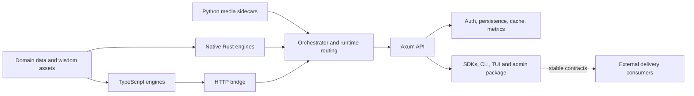

# Selemene Engine — Planning Authority

**Status:** Active repository planning source of truth  
**Evidence cut:** 2026-08-25  
**Scope:** Only the `Selemene-engine` repository and infrastructure directly declared by it

This directory is the current planning authority for Selemene Engine. It replaces project-wide completion narratives with repository-local evidence. Historical ISAs, execution ledgers, release notes, and ecosystem maps remain useful evidence for the bounded work they recorded; they are not current proof that a capability is deployed or operational.

Sankalpa, Urania 137, FalseEarth, Raycast, and other products are **delivery-context consumers**. They help define compatibility and acceptance boundaries, but this roadmap does not assign work to those repositories.

## Product boundary

Selemene owns the reusable reflection platform:

It owns deterministic/domain computation, orchestration, stable contracts, API transport, auth and persistence boundaries, media/provider adapters, client libraries, deployable services, operational evidence, and repository-held assets. It does not own the product UX roadmaps or release plans of its consumers.

## What “done” means

A capability must be described across separate evidence states:

| State | Required evidence |
|---|---|
| Declared | Present in a canonical registry, manifest, schema, or configuration |
| Implemented | Substantive code exists; it is not a stub, placeholder, or silent mock |
| Executable | Focused tests or a local probe exercise the real path |
| Integrated | The repository's actual API/orchestrator/service boundary reaches it |
| Deployed | A named deployment artifact and target include it |
| Operational | A fresh production probe proves the intended path and identifies the deployed revision |

No earlier state implies a later one. A registered engine can be unavailable. A passing unit test can cover a fallback. A built image can be undeployed. A liveness response can be green while optional providers or sidecars are absent.

## Current repository shape

| Plane | Current contents | Planning significance |
|---|---|---|
| Rust workspace | Core contracts, auth, cache, data, metrics, witness, orchestrator, API, bridge, SDK, CLI/TUI, and native engines | Primary deterministic runtime and public HTTP surface |
| TypeScript workspace | Tarot, I Ching, Enneagram, Sacred Geometry, Sigil Forge, Raaga | Six bridge-served engines with different provider/fallback realities |
| Python services | MediaPipe face analysis and Biofield CV | Optional media sidecars; deployment coverage differs by service |
| Packages and apps | TS SDKs, engine SDK, verification, witness pipeline, admin web | Distribution surfaces must be versioned and gated independently |
| Infrastructure | Docker, Compose, Railway, Kubernetes, Cloudflare workers, migrations, monitoring | Declared topology is broader than the currently proven deployment |
| Assets | Ephemeris, engine wisdom, media, diagrams, fixtures, brand assets | Runtime-critical and editorial assets need provenance and ownership |

The orchestrator supports 19 runtime IDs: 12 unconditionally registered native Rust engines, one database-conditional native engine (`biofield-capture`), and six TypeScript bridge engines. Public communication may describe 17 mirrors only when it explicitly excludes the composed `financial-biosensor` surface and the operational `biofield-capture` ID.

## External delivery context

| Consumer | Boundary relevant to Selemene | Not planned here |
|---|---|---|
| Sankalpa | Packable SDK, authenticated transport, media consent, result/provenance contracts | Desktop UX, Electron/Tauri direction, product release |
| Urania 137 | Web-safe API contracts, catalogue discovery, CORS/auth, stable result schemas | Graph UI and web product roadmap |
| FalseEarth | Exportable reading/witness artifacts and provenance | Memory-palace UX and product architecture |
| Raycast | Low-latency API/SDK compatibility and intentional subset discovery | Extension commands, Store release, UI |

## Authority order

When sources disagree, use this order:

1. Current source, schema, registry, manifest, and migration files.
2. Reproducible tests, build results, and local probes.
3. Fresh deployment probes tied to a revision or artifact digest.
4. This capability ledger and roadmap.
5. Historical ISA criteria, execution status, release notes, and snapshots.

The active evidence table is [`CAPABILITY-LEDGER.md`](./CAPABILITY-LEDGER.md). The internal dependency sequence is [`ROADMAP.md`](./ROADMAP.md). The earlier ecosystem documents are retained as a [delivery-context map](../ecosystem/README.md), not as an active multi-repository plan.

## Continuation overlay — 2026-09-05

The original 2026-08-25 baseline above is preserved. Current recovery evidence is [RECOVERY-2026-09-05.md](./RECOVERY-2026-09-05.md), with the [infrastructure map](./INFRASTRUCTURE-MAP.json), [dependency audit](./DEPENDENCY-AUDIT-2026-09-05.md), [CodeGraph receipt](./CODEGRAPH-2026-09-05.md), and [570-issue index](./ENGINE-ISSUE-INDEX.json). `ISA.md` remains the acceptance ledger; `.planning/ROADMAP.md` maps GSD phases to these original waves. Recovery and local passing checks do not close a wave or establish deployment.
