# Selemene Engine: Self-Consciousness as Technology

_A symbolic-computational framework for embodied reflection, structured interpretation, and authored meaning._

## Abstract

Selemene Engine is a symbolic-computational framework for reflective self-inquiry. It approaches personal meaning not as a problem to be solved by prediction, diagnosis, or automated advice, but as a field of interpretation that can be structured, bounded, and returned to the practitioner as a mirror. The system organizes sixteen engines across temporal, archetypal, somatic, relational, geometric, and narrative modalities. Its governing grammar, Kha-Ba-La, treats self-consciousness as technology, the body as medium, and breath as interface. This paper introduces the conceptual model, engine taxonomy, non-prescriptive witness principle, consent and provenance ethics, formal notation, evaluation philosophy, and open boundaries required for a reflection system that uses computation without converting symbolic ambiguity into false certainty.

## Keywords

self-consciousness; symbolic computation; reflective systems; personal informatics; computational hermeneutics; embodied interaction; consent; provenance; non-prescriptive AI; interpretive artifacts

## Contents

1. Introduction
2. Core Definitions
3. Kha-Ba-La as Governing Grammar
4. The Sixteen-Engine Coherence Matrix
5. Witnessing, Authorship, and Non-Prescription
6. Related Work and Research Lineage
7. System Model
8. Analytical Framework for Bounded Interpretation and Demonstration
9. Safety, Ethics, and Governance
10. Evaluation Design and Review Protocol
11. Cultural and Traditional-Source Boundaries
12. Ecosystem Expression
13. Roadmap of Inquiry
14. Conclusion
15. References
16. Appendix A: Notation and Derivations
17. Appendix B: Engine Family Notes
18. Appendix C: Review Rubric
19. Appendix D: Artifact Review Questions

## 1. Introduction

The problem Selemene addresses is not the scarcity of frameworks for self-understanding. The modern practitioner is surrounded by dashboards, journals, psychometrics, meditation systems, coaching scripts, generative models, contemplative taxonomies, and quantified-self metrics. What remains underspecified is authorship: the capacity to examine the machinery by which experience becomes meaning before that machinery hardens into identity, choice, or worldview.

Most reflective tools inherit a hidden premise: that more interpretation is inherently useful. Selemene rejects that premise. Interpretation is powerful precisely because it can organize attention, memory, choice, and identity. A reflection system that produces interpretation must therefore be disciplined about what it is doing. It must separate what is computed from what is framed, what is selected from what is inferred, what is culturally inherited from what is personally authored, and what is known from what remains ambiguous.

Selemene begins from a simple claim: reflection systems become safer and more useful when they are explicit about the difference between computation, interpretation, and authorship. A system may calculate a temporal relation, render an archetypal pattern, detect a rhythm, assemble a symbolic prompt, or preserve a provenance trail. It must not confuse any of those operations with knowing the practitioner’s fate, health, value, future, or obligation.

The contribution of Selemene is therefore not a new claim of certainty. It is a new way of holding uncertainty with structure. It treats symbolic systems as lenses, not verdicts. It treats embodied signals as context, not command. It treats generated language as witness, not authority. And it treats the practitioner as author, not patient, follower, consumer, or node in a retention loop.

This matters because contemporary computation is exceptionally good at producing the feeling of coherence. A fluent model can make an interpretation sound earned even when the underlying material is thin. A polished interface can make a weak inference feel measured. A beautiful image can make a speculative association feel revealed. A long artifact can make a partial result feel complete. Selemene is designed against that failure. It assumes that reflective systems need more than generation; they need boundaries that remain visible when the artifact is compelling.

The design premise is therefore double. First, symbolic and temporal systems can be useful as structured attention. They can organize contrasts, reveal recurring motifs, and invite practitioners to examine their own interpretive habits. Second, that usefulness depends on not pretending that symbolic structure is the same as empirical proof. A lens may be meaningful without being predictive. A prompt may be fruitful without being authoritative. A pattern may be worth contemplating without becoming a command.

The paper uses the word “engine” because Selemene treats each lens as a bounded transformation rather than a loose content category. An engine has an input domain, a transformation discipline, a result form, a refusal surface, and a witness boundary. This does not make every lens equivalent. A calendrical calculation, a symbolic spread, a media-aware artifact, and a narrative synthesis differ in evidence, risk, and interpretive status. Calling them engines makes those differences easier to inspect instead of hiding them under a single mystical or wellness vocabulary.

The larger aspiration is a practice architecture for self-consciousness. In ordinary life, the machinery of interpretation often works invisibly. People inherit metaphors, loyalties, fears, ambitions, bodily habits, cultural scripts, family myths, and technological suggestions long before they consciously choose them. Selemene cannot solve that condition for the practitioner. It can, however, provide formal mirrors that make some of the machinery easier to see, question, and reshape. The system is successful only when the practitioner becomes more capable of authorship outside the system.

## 2. Core Definitions

An engine is a bounded lens that transforms a specific class of input into an interpretive artifact. A mirror is the rendered artifact returned to the practitioner. A witness is the system voice that frames the artifact without prescribing action. A workflow is an ordered inquiry context in which one or more engines are combined. A practitioner is not a user to be retained but an author whose independence is the measure of success.

Selemene uses “self-consciousness” in its technical sense: the recursive capacity to examine the structures through which consciousness interprets itself. Consciousness is the capacity to experience; self-consciousness is the practiced capacity to observe, question, refine, and author the interpreter.

The term “symbolic computation” is used here in a deliberately bounded sense. It does not mean that symbols mechanically determine reality. It means that symbolic systems can be represented, transformed, compared, and rendered in structured ways. A calendar, a hexagram, a card spread, a number pattern, a geometric form, a rhythm, and a resonance map can all become computational artifacts. Their value lies not in replacing judgment, but in giving judgment something precise to examine.

The term “technical” also has a wider meaning in Selemene than software implementation alone. A technique is a repeatable way of doing something. A technical reflection system therefore includes computation, language, ritual structure, consent, memory, refusal, provenance, sensory form, and the timing of when an artifact appears. The technology is not only the machine. The technology is the disciplined arrangement of attention.

This definition also prevents a common category error. If the system is described only as software, then its ethical boundary appears to be merely a matter of data handling. If it is described only as a contemplative or symbolic practice, then its computational boundary disappears. Selemene sits between these categories. It is software insofar as it transforms structured inputs into artifacts. It is practice insofar as the artifact matters only when a practitioner brings attention, disagreement, memory, and choice to it.

A mirror, in this paper, is not a claim that the system accurately reflects the whole self. It is a deliberately limited surface. A physical mirror returns light from one angle under particular conditions; it does not reveal history, motive, worth, or destiny. A Selemene mirror is similar. It returns a structured interpretation from selected lenses under declared boundaries. The practitioner may recognize something in it, reject it, revise it, or use it as contrast. The mirror’s humility is part of its usefulness.

A workflow is the choreography of lenses. It decides which inputs are appropriate, which engines may be invoked, which omissions must be shown, which witness register is safe, and what kind of artifact should be returned. A workflow is not an escalation from less truth to more truth. It is a change in context and depth. A short daily reflection and a long-form symbolic reading may use different amounts of material, but both remain bounded mirrors.

The practitioner is the final term because Selemene’s truth model is incomplete without them. The system can produce artifacts, but meaning is completed in encounter. This does not reduce the artifact to arbitrary preference; structure still matters. It means that the artifact is not allowed to close the loop by itself. The practitioner’s capacity to say “yes,” “no,” “not now,” “this reminds me of something,” or “this is not mine” is part of the system’s intended operation.

## 3. Kha-Ba-La as Governing Grammar

Kha-Ba-La is the structural grammar of Selemene. Kha names the observing field, the author-drive, and the capacity to witness without immediately becoming the pattern witnessed. Ba names embodiment: the body as medium, carrier, measurement ground, and practice surface. La names inertia: resistance, friction, gravity, constraint, and the form-giving force that prevents insight from evaporating into abstraction.

This triad is not decorative vocabulary. It is the design rule that keeps Selemene from becoming either pure calculation or pure narrative. Kha without Ba becomes disembodied abstraction. Ba without Kha becomes sensation without authorship. La without either becomes friction without meaning. The engine operates where the three co-arise.

Kha governs the reflective orientation of the system. It asks: what is being observed, from where, and by whom? In a computational setting, this becomes an insistence on situated perspective. The system must not pretend to view the practitioner from nowhere. Every output is produced from an inquiry context, an input boundary, an engine lens, and a witness register. Kha is the refusal of the false god-view.

Ba governs embodiment and medium. It asks: what does this pattern have to do with time, breath, body, sensation, attention, image, sound, and practice? Ba prevents reflection from becoming only conceptual. An insight that cannot be inhabited remains fragile. Selemene’s engine grammar therefore makes room for rhythmic timing, somatic context, visual form, auditory form, and the body as the baseline of experience.

La governs constraint. It asks: where is the friction that makes the pattern real? La is the discipline of boundaries, refusals, delays, scope limits, consent checks, degraded states, and unfinished work. It is tempting for reflective systems to remove friction in the name of seamless experience. Selemene takes the opposite view: some friction protects authorship. The pause before interpretation, the explicit refusal, the visible unknown, and the preserved ambiguity are not failures of flow. They are part of the engine’s ethics.

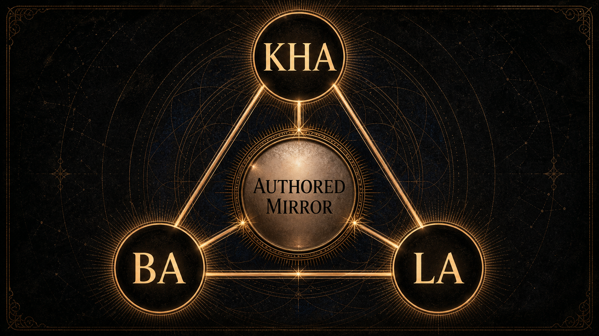

Figure 1 shows the grammar as a three-force relation rather than a hierarchy. Kha observes, Ba embodies, and La constrains. None of the three is sufficient alone. A reflective artifact that is only Kha becomes clever abstraction. A reflective artifact that is only Ba becomes sensation without inquiry. A reflective artifact that is only La becomes refusal without imagination. The center is the authored mirror: an artifact that can be encountered, questioned, and revised.

This grammar supplies a check on every section of the system. When a lens is added, Kha asks whether the lens makes observation clearer. Ba asks whether the lens remains connected to embodied or lived context. La asks whether the lens has a visible boundary. When a witness phrase is written, Kha asks whether it clarifies perspective, Ba asks whether it can be inhabited without dissociation, and La asks whether it overreaches. The triad is therefore not a slogan but a recurring review instrument.

Kha-Ba-La also explains why Selemene does not aim for frictionless personalization. Personalization can be useful, but it can also become an invisible adaptation layer that tells the practitioner exactly what will be most persuasive to them. Selemene’s stance is different. It allows resonance, but not manipulation. It allows continuity, but not hidden dependence. It allows symbolic intensity, but not loss of authorship. La keeps the mirror from becoming a trap.

The triad can also be read as an observer-restoration discipline. Many technical systems hide the observer behind aggregate behavior, model confidence, or interface fluency. Selemene makes the observer explicit: an artifact is always produced from a standpoint, through a medium, under constraint. In formal terms, a reflective event is not a direct map from data to meaning. It is a constrained encounter:

$$
\rho = \langle K, B, L, q, S, \ell \rangle
$$

where \(K\) is the observer standpoint, \(B\) is the embodied and material ground, \(L\) is the constraint field, \(q\) is the inquiry context, \(S\) is the selected lens set, and \(\ell\) is the witness register. The artifact is valid only as a function of the whole tuple:

$$
A = W_{\ell}(M(q,S), K, B, L)
$$

This notation prevents a quiet category error. The system does not discover a person. It renders a bounded artifact from a declared encounter. Kha keeps the standpoint visible. Ba keeps the artifact tied to lived and sensory ground. La keeps the result from pretending to exceed its conditions.

## 4. The Sixteen-Engine Coherence Matrix

Selemene is organized as a sixteen-engine coherence matrix. The engines can be grouped into temporal, archetypal, symbolic, somatic, geometric, and resonance lenses. Temporal engines render timing, cycles, and planetary or rhythmic context. Archetypal engines render symbolic pattern and narrative resonance. Somatic engines relate the body to attention, practice, media, and sensed state. Geometric and resonance engines translate form, proportion, image, sound, and symbolic intent into artifacts for reflection.

The engine matrix is designed for triangulation. No single lens is sovereign. Each engine contributes a partial view, and the practitioner remains responsible for synthesis. This is the opposite of oracle theater. The point is not to ask one system for the answer; the point is to reveal several structured perspectives so the practitioner can see the shape of their own interpretation.

### 4.1 Temporal lenses

Temporal lenses organize attention around time. They may render a day, a cycle, a phase, a period, or a relation between a personal timestamp and a larger symbolic calendar. Their purpose is not to prove that time commands the practitioner. Their purpose is to make timing available as a reflective dimension. A practitioner can then ask: what is the quality of this interval, what pattern repeats, what kind of attention does this moment invite, and what would it mean to act with timing rather than against it?

Temporal lenses are especially vulnerable to overclaim. A calendar can easily become a superstition if its output is treated as command. Selemene treats temporal outputs as structured context. Timing can inform inquiry. It cannot remove responsibility.

### 4.2 Archetypal and symbolic lenses

Archetypal and symbolic lenses render meaning through images, numbers, hexagrams, cards, types, gates, lines, and recurring forms. Their usefulness is not that they secretly know the practitioner. Their usefulness is that they produce a disciplined surface for projection, recognition, disagreement, and revision. A good symbolic artifact does not end inquiry. It sharpens it.

Symbolic lenses also create a productive tension between tradition and present experience. A symbol may carry inherited meaning, but the practitioner’s encounter with it is situated. Selemene therefore treats symbolic output as a dialogue between received structure and lived context. The system may frame the symbolic field; it must not claim ownership of the practitioner’s interpretation.

### 4.3 Somatic and media-aware lenses

Somatic and media-aware lenses bring the body and sensory artifacts into the reflection field. This can include rhythmic context, embodied timing, visual pattern, auditory form, or consented media. The point is not to reduce the body to data. The point is to prevent reflection from floating above the body as if meaning were made nowhere.

This class of lens requires special restraint. Any body- or media-adjacent output can drift toward diagnosis, surveillance, or aestheticized certainty. Selemene’s public boundary is clear: media-aware and somatic artifacts are reflective contexts, not clinical findings. They may help a practitioner notice, question, compare, or revisit a pattern. They must not impersonate medical assessment.

### 4.4 Geometric and resonance lenses

Geometric and resonance lenses translate structure into form. They may render proportion, symmetry, symbolic geometry, sound, or artifact-like representations of intention. Their technical role is to let inquiry take shape beyond prose. A diagram, tone, sigil, or patterned object can carry attention differently than a paragraph can.

Here again, the boundary matters. Form is not proof. Beauty is not evidence. Resonance language must remain grounded in what is actually generated, perceived, or practiced. Selemene can use form to hold attention; it must not use form to smuggle certainty.

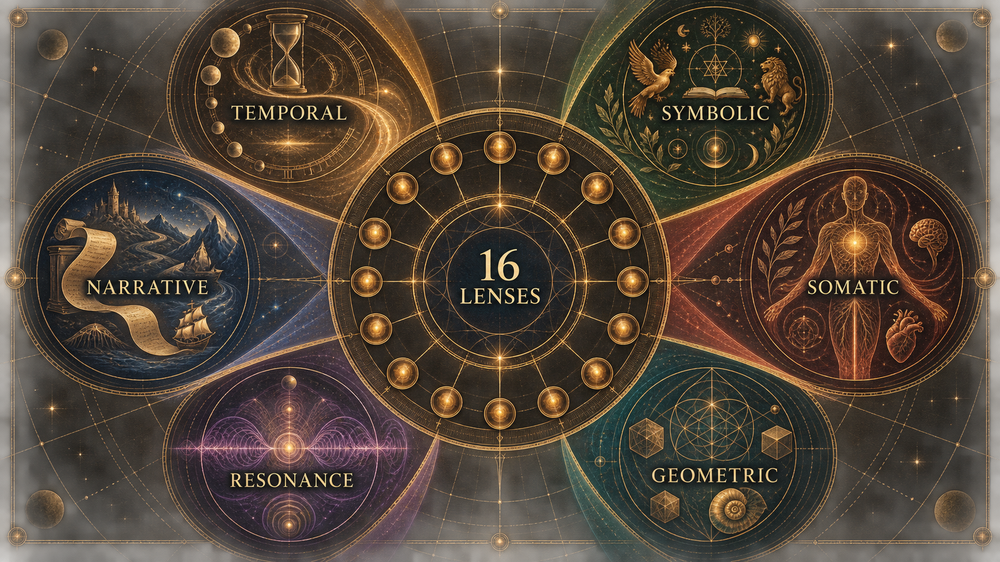

### 4.5 Relational lenses

Relational lenses examine patterns between subjects, roles, questions, and shared contexts. They are especially delicate because relation is where interpretation can become pressure. A relational artifact must not presume romance, hierarchy, obligation, blame, compatibility, fate, or superiority. It should describe the declared frame, preserve each subject’s dignity, and avoid collapsing a multi-person context into a single person’s certainty.

The relational lens is useful when it keeps difference visible. Two people may share a pattern without sharing its meaning. A family role, creative collaboration, friendship, or partnership may bring different expectations to the same symbol. A reflective system must therefore avoid treating relation as a hidden diagnosis of the bond. Its better use is to reveal the questions the relation is already carrying: what is being inherited, negotiated, projected, protected, repeated, or avoided?

### 4.6 Narrative lenses

Narrative lenses organize outputs into sequence, motif, contrast, and reflective arc. They are powerful because human beings often understand themselves through stories. They are risky for the same reason. A generated narrative can become too smooth. It can convert uncertainty into inevitability, complexity into plot, and living change into character identity.

Selemene’s narrative lens must remain porous. It should leave room for contradiction, counterexample, and revision. It should avoid the seductive closure of “this is who you are.” A safer narrative artifact says: “Here is one way the selected material can be arranged; notice what you accept, resist, or want to rewrite.” Narrative is used as an inquiry form, not as a biographical verdict.

### 4.7 The sixteen as a coherence matrix

The number sixteen matters here as a conceptual completeness pattern, not as a proof of exhaustive coverage. Sixteen lenses create enough variety to move between time, symbol, body, relation, form, sound, inquiry, and synthesis without reducing the system to one dominant vocabulary. The matrix gives Selemene a broad palette while preserving boundedness at each lens.

The coherence matrix can be read in two directions. Horizontally, it groups lenses by modality: temporal, symbolic, somatic, geometric, resonance, relational, and narrative. Vertically, it asks what kind of evidence each lens can responsibly provide. Some lenses can provide deterministic structural output. Some provide selected symbolic material. Some provide generated artifacts. Some provide only reflective framing. The same word “engine” does not imply the same strength of claim.

This is why the system must avoid completion inflation. An engine may be conceptually declared, partially implemented, executable in a constrained environment, integrated into a workflow, available through one surface, or operational in a production-like setting. Those are different claims. The whitepaper’s public stance is that every engine should be described by its actual evidence boundary. A declared lens is not a mature lens. A mature lens is not necessarily an operational lens. An operational lens is not proof of human benefit.

### 4.8 Engine output as lens material

An engine output is not yet a reflection. It is material for reflection. A temporal output may be a relation of cycles. A symbolic output may be a spread or pattern. A somatic output may be a quality-labeled observation. A generated image or sound may be a sensory anchor. The witness layer decides how to return that material without pretending the material has spoken on its own.

This distinction keeps the system from collapsing into either raw calculation or free prose. Raw calculation can be precise but inert. Free prose can be moving but ungrounded. Selemene’s engine model aims for a middle condition: structured enough to be inspectable, expressive enough to be encountered, and bounded enough to remain honest.

## 5. Witnessing, Authorship, and Non-Prescription

Selemene’s output voice is a witness, not an authority. It may name patterns, tensions, questions, repetitions, contrasts, or symbolic correspondences. It may propose reflective prompts. It may preserve ambiguity. It must not diagnose, command, predict, moralize, flatter, or replace the practitioner’s agency.

The witness principle follows a core boundary: the engine reflects what is active; the practitioner authors what it means. This makes restraint part of the system’s intelligence. A strong reflection system does not merely generate more language. It knows where language should stop.

The witness has three obligations. First, it must keep the source of a statement clear in ordinary language: is this a computed relation, a symbolic association, a practitioner-provided context, a generated synthesis, or an explicit unknown? Second, it must preserve plurality: when multiple readings are possible, it should not collapse them into the most dramatic interpretation. Third, it must return agency: the artifact should end with better questions, not borrowed certainty.

This makes Selemene different from advice systems. Advice narrows action. Witnessing clarifies perception. Advice often aims at compliance: do this, avoid that, choose this direction, trust this score. Witnessing aims at authorship: what do you notice, what repeats, what feels inherited, what becomes possible when the pattern is named, and what remains yours to decide?

Non-prescription does not mean vagueness. A witness can be precise. It can identify tensions, name contradictions, expose avoidance, and refuse flattering interpretations. But its precision is anatomical rather than authoritarian. It shows the structure. It does not seize the steering wheel.

### 5.1 The witness register

The witness register is the discipline of how the system speaks. Register includes vocabulary, degree of certainty, emotional temperature, depth of interpretation, and the kind of invitation offered to the practitioner. A shallow register may simply summarize a pattern and ask one question. A deeper register may hold multiple tensions, trace symbolic motifs, and invite comparison with lived context. Depth changes complexity, not authority.

This is a crucial distinction. A deeper artifact is not allowed to become more prescriptive merely because it has more material. Depth should increase nuance, source clarity, and interpretive plurality. It should not increase coercion. A long-form reading that sounds like fate is less mature than a brief prompt that preserves agency.

### 5.2 The grammar of refusal

A witness must know how to refuse gracefully. Refusal can be needed when consent is missing, when a media signal is too weak, when a request asks for prediction, when a body-related inference would become diagnostic, or when relational framing would become manipulative. A bad refusal merely blocks the practitioner. A good refusal explains the boundary and, where safe, offers a bounded alternative.

For example, instead of answering a request for a guaranteed outcome, the witness can reframe toward inquiry: “The selected lenses cannot determine an outcome. They can, however, help examine the assumptions, timing, and emotional charge around the question.” This preserves the practitioner’s dignity while protecting the system’s boundary.

### 5.3 Authorship as measurable property

Authorship sounds philosophical, but it can be operationalized for review. A witness artifact preserves authorship when it identifies sources, offers questions rather than commands, names uncertainty, avoids hidden hierarchy, permits disagreement, and does not imply that the system knows the practitioner better than the practitioner does. These properties can be checked in language review even before human studies exist.

The authorship measure introduced in the formal section is therefore not a claim to quantify consciousness. It is a review proxy. It asks whether the artifact’s surface keeps the practitioner in the loop. Does the artifact invite a response? Does it reveal its own limits? Does it distinguish suggestion from fact? Does it make room for “this does not fit”? If not, the artifact has failed one of Selemene’s core tests.

## 6. Related Work and Research Lineage

Selemene sits near several research lineages without reducing itself to any one of them. Personal informatics motivates tools that help people reflect on lived patterns rather than merely track metrics [@song2026godSaengPersonalInformatics]. Computational hermeneutics frames generated cultural artifacts as situated, plural, ambiguous, and evaluation-sensitive [@kommers2026computationalHermeneutics]. Semiotic engineering treats interaction as a communication act between designer and user through the signs, behaviors, and affordances of a system [@desouza2005semioticEngineering]. LLM-supported reflection research motivates scaffolding that preserves user agency rather than replacing user meaning-making [@song2025exploreself].

Additional methodological support comes from dynamic consent, provenance, and socio-technical evaluation. Consent work motivates revocable, contextual, granular control over sensitive data [@norval2019automatingDynamicConsent]. Evaluation research argues that model behavior must be related to downstream human requirements without mistaking technical scores for human benefit [@liao2025rethinkingEvaluation].

These sources support vocabulary and method. They do not validate any symbolic tradition, clinical effect, divinatory claim, or guaranteed outcome. This distinction is central. Research can help design a better reflective instrument without turning the instrument into a medical device, moral authority, or proof of metaphysical certainty.

This paper also draws on several adjacent intellectual neighborhoods. Narrative identity research treats selfhood as an evolving life story that integrates remembered past, perceived present, and imagined future [@mcadams2013narrativeIdentity]. Embodied interaction motivates the claim that meaning in human-computer systems arises through situated action, material setting, and bodily practice rather than abstract representation alone [@dourish2001whereAction]. Gut-brain and bioelectricity research provide narrow scientific anchors for body-adjacent caution: the body is not a passive container for cognition, but neither is it a license for diagnostic over-reading [@carabotti2015gutBrainAxis; @levin2014molecularBioelectricity]. Process philosophy and duration give language for events, becoming, relation, and lived time rather than static substance or mere clock sequence [@whitehead1978processReality; @lawlorMoulardLeonard2025bergson]. Gebser’s account of consciousness structures offers a philosophical vocabulary for perspective, transparency, and integral perception, while remaining a historical-philosophical source rather than empirical validation [@gebser1985everPresentOrigin]. Scholarship on Western esotericism gives the paper a way to treat hiddenness, correspondence, and symbolic traditions as historically situated objects of study rather than as proof claims [@hanegraaff2012esotericismAcademy].

### 6.1 Personal informatics and reflective instrumentation

Personal informatics research is relevant because it studies how people collect, interpret, and use personal data over time. The most important lesson for Selemene is not that more tracking is better. It is that data becomes meaningful only through lived context, reflection, and interpretation. A number by itself rarely changes a life. A number placed into a reflective practice may help a person notice rhythm, mismatch, avoidance, or desire.

Selemene extends this lesson beyond ordinary metrics. Its lenses may include temporal, symbolic, somatic, and sensory material, but the same discipline applies: collected or computed material must be returned in a way that supports meaning-making rather than compliance. The system should not turn the practitioner into a dashboard. It should help the practitioner inspect how a dashboard, symbol, rhythm, or story is already shaping attention.

The “God-Saeng” personal informatics work is useful here because it emphasizes everyday well-being as culturally situated practice rather than a universal improvement program [@song2026godSaengPersonalInformatics]. Selemene adopts the situated aspect while avoiding the claim that its artifacts improve well-being. The allowed claim is methodological: reflective systems should be designed around lived meaning, context, and agency.

### 6.2 Computational hermeneutics

Computational hermeneutics gives Selemene language for generated cultural interpretation. Hermeneutics is concerned with interpretation, context, ambiguity, and the relation between text, reader, tradition, and world. When computation enters this space, the danger is that generated outputs may sound culturally literate while flattening the contexts they invoke. Computational hermeneutics makes evaluation itself a cultural question, not merely a fluency question [@kommers2026computationalHermeneutics].

For Selemene, the implication is direct. A symbolic artifact should not be judged only by whether it is coherent, elegant, or emotionally resonant. It should also be judged by whether it names its frame, preserves ambiguity, avoids universality claims, and leaves the practitioner free to interpret. This gives the witness layer a scholarly neighbor without forcing Selemene into the shape of an academic hermeneutics system.

Semiotic engineering sharpens this point. If an interface is a message from its designers to its users, then a reflective artifact is never neutral packaging. Its typography, labels, omissions, ritual pacing, refusal states, and diagrams all tell the practitioner how to read the system [@desouza2005semioticEngineering]. Selemene therefore treats signs as design commitments. A card, glyph, tone, line, or geometric figure is not merely content placed into an interface; it is part of the interface’s argument about how interpretation should happen.

This is the public-safe form of symbolic literacy. Symbols can be precise without being predictive. They can be structured without being scientifically certified. They can carry cultural inheritance without becoming universal property. The research task is not to prove that a symbol secretly determines a life. It is to design artifacts in which symbolic material remains legible, situated, bounded, and available for disagreement.

### 6.2.1 Media, ritual, and symbolic environments

Media-aware symbolic interpretation requires an additional boundary. Contemporary media, images, games, film, interfaces, and generated artifacts can all behave like symbolic environments: they organize attention, repeat motifs, encode values, and train expectation. This does not mean every recurrence is intentional or every pattern is evidence. It means that media literacy belongs near semiotics and hermeneutics in the whitepaper’s method.

The safe claim is that Selemene can treat media as an object of reflective reading when the practitioner has consented to that frame. The unsafe claim would be that media patterns prove hidden control, destiny, or metaphysical causation. The paper therefore treats media-symbolic analysis as a disciplined lens: useful for noticing motif, repetition, framing, affect, and attention capture; insufficient for prediction or total explanation.

### 6.3 LLM-supported reflection and agency

LLM-supported reflection work is relevant because it shows how generated prompts can support user-directed exploration when designed around agency rather than replacement [@song2025exploreself]. Selemene’s witness principle shares that concern. The system may help the practitioner articulate themes, compare perspectives, and hold difficult questions, but it should not become the owner of insight.

This boundary becomes more important as generated language becomes smoother. The practitioner may feel seen by the artifact, and that feeling can be valuable. It can also be risky. Being “seen” by a system can become a form of authority transfer. Selemene’s witness should therefore prefer formulations that keep the practitioner active: “What do you notice?” “Where does this fit or fail?” “Which part feels inherited?” “What would you revise?” The language of agency is not soft decoration; it is a safety control.

Narrative identity research adds a second boundary: the system may help arrange material into a story-like form, but it must not seize authorship of the practitioner’s life story [@mcadams2013narrativeIdentity]. This distinction is subtle. Narrative coherence can be helpful, but too much coherence can become coercive. A polished generated story may make a person feel explained before they have agreed that the explanation belongs to them. Selemene therefore treats narrative as a provisional artifact. It can be annotated, contradicted, split into alternatives, or refused.

### 6.4 Dynamic consent and contextual privacy

Dynamic consent is relevant because Selemene may handle sensitive personal material. Consent cannot be treated as a single global permission. A practitioner might consent to local rendering but not external processing, to a one-time media use but not retention, to textual context but not biometric interpretation, or to a long-form artifact but not future reuse. The consent model must allow such differences.

The dynamic consent literature supports this granular posture [@norval2019automatingDynamicConsent]. It also warns against assuming that consent can be fully automated without risk. Selemene’s safer stance is that consent should be visible, revocable, contextual, and tied to the material being used. If the system cannot determine whether a sensitive use is allowed, it should fail closed and explain the boundary.

### 6.5 Provenance and inspectable artifacts

Provenance research and standards are useful because Selemene produces assembled artifacts. A reflective artifact may include practitioner-provided context, computed material, selected symbolic structures, generated witness language, omitted sources, and degraded states. Without provenance, these components blur together. The practitioner may not know whether a sentence came from a calculation, a symbolic association, a generated synthesis, or a fallback.

The W3C PROV model is not imported wholesale as a serialization requirement in this paper. Its value is conceptual: entities, activities, and responsible agents can be represented so that the production of a result remains inspectable [@w3c2013provdm]. Selemene translates that lesson into reader-facing artifacts: show origin classes, show omissions, and show when a result is degraded.

Provenance also has a broader authorial meaning. A reflective system does not emerge from nowhere. It is shaped by relations, disciplines, sources, constraints, failures, translations, and the material conditions that allowed it to be built. Public artifacts should not turn that lineage into mystique or borrowed authority. They should treat it as a humility obligation: name the kind of inheritance when it matters, distinguish influence from evidence, and avoid pretending that a system’s grammar is self-originating.

### 6.6 Socio-technical evaluation

Socio-technical evaluation is necessary because Selemene’s success cannot be reduced to whether an engine ran or a sentence was grammatical. A reflective system can be technically functional and still harmful if it encourages dependence, hides uncertainty, or misleads the practitioner about the strength of its claims. Conversely, a technically modest artifact can be valuable if it preserves agency and helps a practitioner notice something without surrendering judgment.

Evaluation work on narrowing the socio-technical gap is useful because it distinguishes model behavior from downstream human requirements [@liao2025rethinkingEvaluation]. Selemene uses that distinction to avoid inflated claims. A system test can show that a boundary was enforced. A language review can show that witness phrasing stayed non-prescriptive. A user study, if later conducted, would ask different questions about comprehension, agency, and lived use. The evidence types should not impersonate each other.

### 6.7 Embodied interaction and living form

Embodied interaction matters because Selemene is not only a text generator. Even when the returned artifact is textual, the subject matter can include timing, rhythm, sensation, image, sound, posture, and later practice. Dourish’s account of embodied interaction gives a useful frame: interfaces do not merely transmit information; they shape action in the world [@dourish2001whereAction]. For Selemene, this means the artifact should be designed as an object of attention, not as a verdict.

Bioelectric morphogenesis provides a second caution. Levin’s work on endogenous voltage potentials supports the narrow scientific claim that electrical patterning can regulate cell behavior and anatomical pattern formation [@levin2014molecularBioelectricity]. It does not support reading a practitioner’s state, future, virtue, or destiny from body-adjacent signals. Its relevance here is methodological: body-adjacent systems should treat pattern, signal, and interpretation with precision. A responsible reflective engine should distinguish measured physiology, computed structure, symbolic association, and generated language.

Gut-brain-axis research adds a more ordinary but useful grounding point: cognition, emotion, and bodily regulation are entangled through bidirectional communication among central, enteric, endocrine, immune, and microbial systems [@carabotti2015gutBrainAxis]. This does not make the body an oracle. It does make disembodied interpretation incomplete. Selemene can therefore speak about embodied reflection while refusing to convert bodily sensation, face, voice, or rhythm into diagnosis.

### 6.8 Process, perspective, and symbolic primitives

Process philosophy is relevant because a reflective artifact is not a static object with one final meaning. It is an event in which prior material, present inquiry, selected lenses, and practitioner response become a new occasion of interpretation [@whitehead1978processReality]. This supports Selemene’s refusal to define the practitioner. The artifact is part of a process; it is not the owner of the process.

Bergson’s philosophy of duration deepens the temporal side of this claim. Lived time is not merely a sequence of external units; it is qualitative continuity, memory, and change held together [@lawlorMoulardLeonard2025bergson]. For Selemene, this matters because temporal engines should not reduce time to date arithmetic alone. Time can be computed, but it is encountered as recurrence, threshold, pressure, waiting, ripeness, fatigue, anticipation, and return. The artifact should preserve that distinction: calculation supplies structure; lived duration supplies interpretive context.

Gebser’s work is useful as a philosophical neighbor for Selemene’s treatment of perspective. A system can become deficient when it treats one mode of seeing as the only real mode. Selemene instead treats lenses as plural structures. Temporal, symbolic, somatic, geometric, resonance, relational, and narrative outputs are not competitors for absolute authority. They are distinct ways of making a question visible [@gebser1985everPresentOrigin].

Symbolic primitives add a final layer. A symbol, syllable, diagram, tone, or geometric form can be treated as a primitive that carries attention before it carries explanation. This does not make the primitive scientifically proven. It means the design problem is partly semiotic: how can a system return forms that invite disciplined interpretation without coercing belief? The answer is not more mystique. It is clearer framing, stronger provenance, and more room for disagreement.

Process, duration, and perspective are especially useful because they block a common category error. A reflective artifact is not a final report about a fixed object. It is an occasion in an unfolding relation between practitioner, lens, context, and response. This makes revision part of the ontology of the system rather than a concession after failure.

### 6.9 Lineage as provenance

Lineage is the missing middle between biography and bibliography. A bibliography names formal sources. Biography names personal history. Lineage names the conditions through which a system becomes possible: relational support, intellectual inheritance, material discipline, disagreement, translation, craft, and constraint. For Selemene, this matters because self-consciousness as technology cannot be framed as an abstract idea floating above embodiment. It has to be understood as something that becomes buildable only when observation, body, language, and friction are held together.

The public claim is deliberately narrow. Lineage does not prove the system. It does not make a symbolic grammar true, and it does not transfer authority from a teacher, tradition, text, partner, family, or institution into the artifact. It simply prevents false self-origination. A reflective system should be able to say that it is authored, conditioned, translated, and bounded.

This gives Selemene a cleaner way to handle influence. The engine can acknowledge that its grammar is inherited and synthesized without turning the whitepaper into a monument to personalities. It can treat intellectual ancestors as structural sources, relational support as a condition of emergence, and material constraints as design forces. The result is a form of provenance deeper than citation but humbler than authority.

In this frame, Kha-Ba-La is not a decorative triad. Observation without embodiment becomes abstraction. Embodiment without friction becomes sentiment. Friction without observation becomes repetition. A reflective engine requires all three: the observing position, the lived medium, and the resistant ground that forces ideas into form.

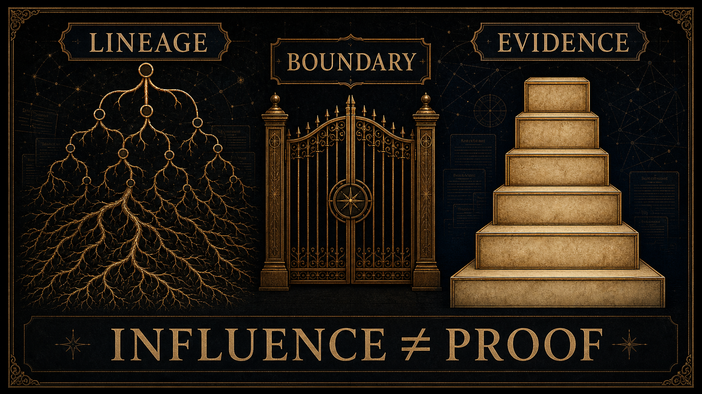

### 6.10 Esoteric-source scholarship and translation

Several of Selemene’s lens families touch symbolic traditions that are often excluded from ordinary technical discourse. The academic task is not to rehabilitate every esoteric claim as true. It is to handle such material without caricature, theft, or proof-smuggling. Scholarship on Western esotericism is useful here because it studies how certain bodies of knowledge were categorized as rejected, hidden, occult, mystical, or marginal, and how those categories shaped modern academic boundaries [@hanegraaff2012esotericismAcademy].

This matters because a reflective engine can fail in two opposite ways. It can flatten symbolic traditions into decorative assets, or it can treat them as unquestionable revelation. Selemene rejects both. A symbolic source can be meaningful, historically situated, internally rigorous, and experientially powerful while still requiring careful public boundaries. The artifact should disclose whether a claim is historical, interpretive, formal, empirical, or philosophical.

Translation is part of the same problem. When a symbolic vocabulary crosses languages, traditions, and media forms, it changes. A term may function as doctrine in one context, metaphor in another, design primitive in a third, and personal prompt in a fourth. Selemene should not pretend these are identical. Its contribution is to make the translation visible enough that the practitioner can evaluate it.

### 6.11 Controversial theories as boundary tests

The lineage pool also includes ambitious theories of consciousness, morphogenesis, subtle causation, and mind-matter relation. These are useful for Selemene only when handled with discipline. A controversial theory can reveal a design temptation: the desire to turn a suggestive framework into an engine of certainty. The correct response is not automatic dismissal or credulous adoption. It is claim classification.

For example, morphic-resonance discussions can be used to ask how habit, recurrence, and formative pattern should be bounded, but they should not be used as biological proof for a reflective artifact [@gomezMarin2021sheldrakeHypothesis]. Quantum-consciousness proposals such as Orch OR can be used as examples of how ambitious consciousness claims require unusually strong evidence and careful criticism [@hameroff2014orchOr]. Their role in this paper is methodological: they help define what Selemene must not smuggle into public claims.

The principle is simple:

$$
\mathrm{conceptual\ fertility}\not\Rightarrow \mathrm{claim\ authority}
$$

An idea may be generative for design while remaining too weak, contested, or category-mismatched to support a public assertion. This is not a loss of depth. It is the discipline that lets depth survive contact with review.

## 7. System Model

The public system model has four layers: input, engine, witness, and artifact. Inputs may include time, place, birth data, stated inquiry, consented media, symbolic selections, biometric context, or prior reflective context. Engines transform those inputs into typed interpretive material. The witness layer shapes that material into non-prescriptive prompts and reflections. The artifact layer preserves the output as something the practitioner can revisit, compare, reject, annotate, or carry into practice.

The wider ecosystem expresses this model through multiple surfaces: fast consultations, extended readings, daily practice, exportable artifacts, web-based access, local use, and media-aware interactions. These are delivery expressions of one grammar, not separate philosophies.

### 7.1 Input layer

The input layer defines what enters the reflective field. It may contain objective fields, such as time and place; selected fields, such as inquiry mode or symbolic focus; contextual fields, such as a practitioner’s question; and sensitive fields, such as media or biometric context. Each class of input carries a different ethical weight. A timestamp and a face image are not the same kind of material. A symbolic selection and a health-adjacent signal are not interchangeable.

The technical principle is input dignity: every input should retain its class, origin, scope, and allowed use. This prevents the system from quietly promoting a weak signal into a strong claim. It also prevents the practitioner from being over-read by an engine that has not earned that authority.

### 7.2 Engine layer

The engine layer transforms inputs through bounded lenses. Some engines are primarily calculative: they produce structured relations from time, date, place, cycle, or numeric form. Some are interpretive: they select or arrange symbolic material. Some are sensory or media-aware: they derive reflective artifacts from images, audio, rhythm, or embodied state. Some are synthetic: they hold several outputs together without pretending they collapse into a single truth.

The engine layer must preserve partiality. An unavailable dependency, missing input, weak signal, ambiguous result, or fallback state should remain visible in the artifact. The system should never hide uncertainty simply to maintain the aesthetic of completion.

### 7.3 Witness layer

The witness layer translates engine material into human-readable reflection. It is where tone, restraint, and agency matter most. The witness may organize the artifact around contrasts, questions, recurring motifs, or tensions between lenses. It may also decline to interpret a field if the underlying material is insufficient.

The witness layer is not an answer generator. It is a framing function. Its task is to preserve the practitioner’s authorship while making the engine’s output legible enough to engage.

### 7.4 Artifact layer

The artifact layer gives reflection a durable form. An artifact may be a compact reading, a longer report, a diagram, an audio cue, a symbolic image, a practice prompt, or an exportable record. Durability matters because reflection is not always immediate. A practitioner may reject an artifact at first encounter, return later, annotate it, compare it with future states, or notice that a pattern changed.

Artifacts should preserve enough context to remain inspectable without becoming surveillance records. The artifact is a mirror held for practice, not a dossier held over the practitioner.

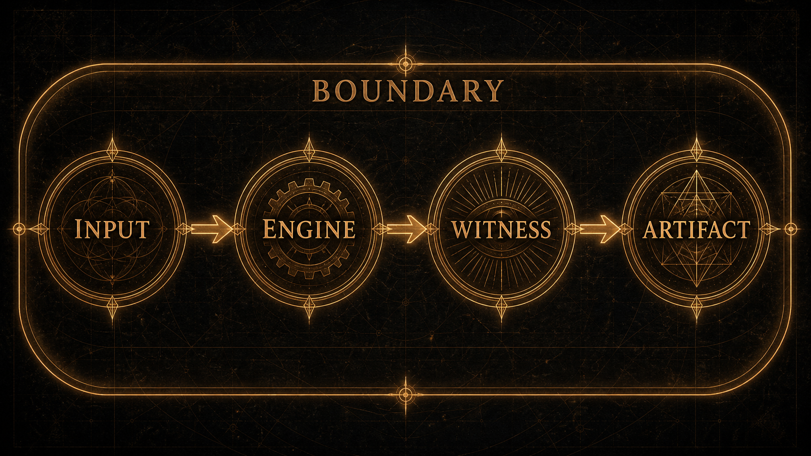

### 7.5 Boundary layer

Although the public model has four layers, a boundary layer surrounds all of them. Boundary is not merely validation at the beginning. It is a continuous discipline across input, engine, witness, artifact, and later reuse. An input boundary asks whether the material belongs in the inquiry. An engine boundary asks whether the lens is allowed and able to transform it. A witness boundary asks whether the language preserves authorship. An artifact boundary asks whether the result remains inspectable and safe to revisit.

The boundary layer is why Selemene treats refusal as a normal output. Many systems treat refusal as a failure of user experience. Selemene treats unsafe fluency as the deeper failure. If an artifact cannot be produced without overclaiming, the correct behavior is not to produce a prettier artifact. The correct behavior is to reveal why the mirror cannot be responsibly formed.

### 7.6 Inquiry lifecycle

The lifecycle of a Selemene inquiry can be described in seven moments. First, the practitioner brings a question or context. Second, the system identifies which material is needed and which material is optional. Third, consent and scope are checked for sensitive inputs. Fourth, selected engines produce bounded lens material or explicit omissions. Fifth, the witness organizes the material into reflective form. Sixth, the artifact is returned with provenance, limits, and prompts. Seventh, the practitioner may accept, reject, annotate, revise, or discard it.

This lifecycle is intentionally slower than pure generation. The purpose is not latency for its own sake. The purpose is to keep attention from being captured by immediate fluency. In a reflective system, the most dangerous output is often the one that arrives instantly, sounds complete, and hides the conditions of its own production.

The same lifecycle can be described as a four-phase transformation grammar: opacity, clarification, articulation, and integration. Opacity is the moment in which the question is not yet well formed. Clarification separates material that belongs in the inquiry from material that does not. Articulation turns bounded engine material into a witness artifact. Integration returns the artifact to the practitioner, who decides what it means, whether it should be revised, and whether it should be retained.

$$
\Omega_0 \xrightarrow{\;V_v,C\;} \Omega_1
\xrightarrow{\;\{f_i\}_{i \in S}\;} \Omega_2
\xrightarrow{\;W_\ell\;} \Omega_3
\xrightarrow{\;\alpha,\pi\;} \Omega_4
$$

Here \(\Omega_0\) is pre-articulated inquiry, \(\Omega_1\) is bounded material, \(\Omega_2\) is lens output, \(\Omega_3\) is witness artifact, and \(\Omega_4\) is practitioner-authored uptake. The final arrow is essential. Without uptake, the artifact may be polished, but the reflective event is incomplete.

### 7.7 Depth without authority

Depth in Selemene is a matter of scope, nuance, and context. A deeper artifact may include more lenses, more cross-comparison, more provenance, more ambiguity, and more practitioner prompts. It should not claim more authority over the practitioner. This is the central difference between depth and domination.

The same rule applies across modalities. A deeper temporal artifact may compare more cycles but still cannot predict the future. A deeper symbolic artifact may compare more motifs but still cannot define identity. A deeper somatic artifact may include more context but still cannot diagnose. A deeper narrative artifact may be more moving but still cannot become biography without the practitioner’s authorship.

### 7.8 Artifact portability

A reflective artifact should remain legible when carried between contexts. This does not mean it must reveal private system details. It means the artifact should contain enough public structure for the practitioner to understand what it is: which lens family was used, what material entered, what was omitted, what was generated, what boundary applies, and what kind of response is invited.

Portability is also a guard against lock-in. If the artifact only makes sense inside a seductive interface, then the interface owns the meaning. Selemene’s goal is the opposite: the artifact should retain its reflective value when printed, saved, read aloud, summarized, or revisited privately. The system should help create objects of attention that the practitioner can carry without surrendering agency.

## 8. Analytical Framework for Bounded Interpretation and Demonstration

The analytical framework represents Selemene as a family of bounded interpretive transformations. The notation is intentionally modest. It does not try to quantify consciousness, prove symbolic truth, or convert interpretation into prediction. It gives the paper a compact language for boundary validation, partial engines, consent, provenance, synthesis with omissions, witness restraint, review adequacy, and exclusion of disallowed claims.

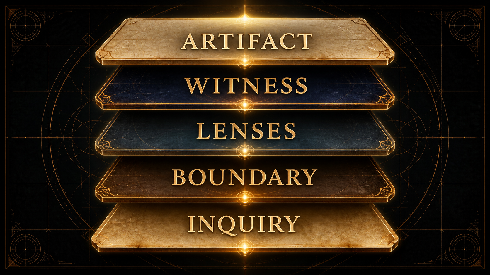

### 8.1 Boundary validation

Let \(z\) be a proposed input, intermediate object, or artifact, and let \(\mathcal{B}_v\) be the boundary grammar for version \(v\). Boundary validation is:

$$
V_v(z) =
\begin{cases}
\mathrm{accept}(z) & \text{if } z \in \mathcal{B}_v \\
\mathrm{reject}(e) & \text{if } z \notin \mathcal{B}_v
\end{cases}
$$

where \(e\) is a structured refusal reason. This function says only that an object is well-formed for the boundary being used. It does not say that the interpretation is true, useful, complete, or ethically safe.

The boundary can also be written as a predicate over required properties:

$$
z \in \mathcal{B}_v
\Leftrightarrow
\bigwedge_{b \in R_v} b(z)=1
$$

where \(R_v\) is the set of required boundary predicates. This formulation is useful because it keeps rejection local: the artifact fails for named reasons rather than as an undifferentiated error.

### 8.2 Engines as partial functions

Let each engine be a partial function:

$$
f_i : X_i \rightharpoonup Y_i \cup E_i
$$

where \(X_i\) is the input domain for engine \(i\), \(Y_i\) is the structured artifact space, and \(E_i\) is the set of explicit failure or refusal states.

The arrow is partial because not every inquiry deserves an output. Missing context, ungranted sensitive material, degraded modalities, weak signals, and unsafe requests should produce explicit refusal or degraded-state artifacts rather than theatrical certainty.

For an engine set \(S\), the executable domain is the intersection of lens requirements and practitioner-granted material:

$$
\mathcal{D}(S,r)=
\{x_i \in X_i \mid i \in S \land V_v(x_i)=\mathrm{accept}(x_i)
\land C_i(r,x_i)=1\}
$$

An engine outside \(\mathcal{D}(S,r)\) is not a failed personality of the system; it is a declared omission.

### 8.3 Consent predicate

For media and biometric contexts, consent is represented as a continuing predicate:

$$
C(r,m) =
\forall s \in \mathrm{scopes}(m),\;
s \in \mathrm{grant}(r) \land \mathrm{fresh}(r)
$$

where request \(r\) may carry material \(m\) only when every required scope is granted and fresh. If \(C(r,m)\) is false, the system must not silently continue as though the missing consent were an ordinary absent value.

### 8.4 Provenance graph

A reflective artifact has a provenance graph:

$$
G_p = (N, E, \tau)
$$

where \(N\) is the set of artifact nodes, \(E\) is the set of derivation edges, and \(\tau\) labels each node or edge by origin class: practitioner-supplied, computed, selected, generated, omitted, degraded, or refused.

The graph does not certify meaning. It preserves the construction of meaning so the practitioner can inspect the mirror instead of being trapped inside it.

Provenance completeness can be represented as:

$$
\rho(A)=
\frac{\left|\{n \in N_A \mid \tau(n)\ \mathrm{is\ defined}\}\right|}
{\left|N_A\right|}
$$

where \(N_A\) is the node set needed to explain artifact \(A\). A mature artifact should approach \(\rho(A)=1\), while still allowing nodes to be labeled as omitted, degraded, or refused.

### 8.5 Capability evidence matrix

For each engine \(i\) and evidence axis \(a\), define:

$$
M_{i,a} \in \left\{0,\frac{1}{2},1\right\}
$$

where \(0\) means absent, \(\frac{1}{2}\) means partial or qualified, and \(1\) means supported for that axis. A public claim about an engine must not exceed its weakest required axis:

$$
Q_i(A^\ast)=\min_{a \in A^\ast} M_{i,a}
$$

where \(A^\ast\) is the set of axes required by the claim. If \(Q_i(A^\ast)<1\), the public artifact must speak in partial or qualified language.

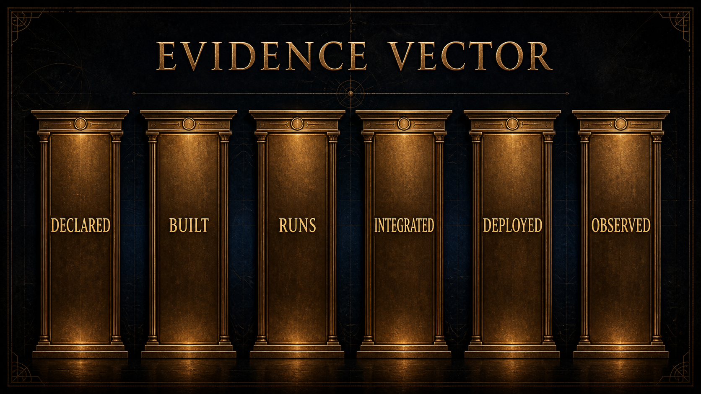

### 8.6 Multi-engine synthesis with omitted-source reporting

A multi-engine inquiry can be represented as:

$$
M(q, S) = \{ f_i(x_i) \mid i \in S,\; x_i \in X_i \}
$$

where \(q\) is the inquiry context and \(S\) is the selected engine set. When a synthesis score is used, it must report omissions:

$$
O_t =
\{i \in S_t \mid f_i(x_i) \in E_i \lor C_i(t)=0\}
$$

$$
\sigma(t)=
\frac{
\sum_{i \in S_t \setminus O_t} w_i c_i(t)\phi_i(t)
}{
\sum_{i \in S_t \setminus O_t} w_i c_i(t)
}
$$

where \(w_i\) is the lens weight, \(c_i(t)\) is the confidence available at time \(t\), and \(\phi_i(t)\) is the normalized contribution of lens \(i\). The rendered synthesis is not \(\sigma(t)\) alone:

$$
R(t) = \left(\sigma(t), O_t, \Delta_t\right)
$$

where \(\Delta_t\) records degraded or qualified inputs. If every selected lens is omitted, \(\sigma(t)\) is undefined and the system must render refusal or insufficiency rather than a score.

### 8.7 Witness transform

The witness function does not collapse these outputs into a single truth. It frames them:

$$
W_\ell : \mathcal{P}(Y) \times \mathcal{C} \times \mathcal{R}_\ell
\rightarrow A \cup E_W
$$

where \(W_\ell\) is the witness register at level \(\ell\), \(\mathcal{C}\) is context, \(\mathcal{R}_\ell\) is the restraint policy for that register, \(A\) is an artifact for reflection, and \(E_W\) is the set of witness refusals.

The witness must satisfy an authorship condition:

$$
\alpha(W_\ell(M,c)) \geq \alpha_{\min}
$$

where \(\alpha\) measures whether the artifact preserves practitioner agency through questions, plurality, source clarity, and non-prescriptive language.

### 8.8 Anti-prediction exclusion

Let \(\Pi(A)\) be true when artifact \(A\) contains a disallowed claim: prediction, diagnosis, medical instruction, financial instruction, guaranteed transformation, or certainty unsupported by its evidence axes. The publication rule is:

$$
\mathrm{allow}(A)=1
\Rightarrow
\neg \Pi(A)
$$

Equivalently, when \(\Pi(A)\) is true:

$$
W_\ell(M,c) \rightarrow E_W
$$

The essential mathematical point is partiality. The engine family is not modeled as a total function because not every inquiry should produce an answer. Some inputs are missing. Some scopes are not granted. Some modalities are unavailable. Some symbolic combinations would overstate the evidence. In those cases, refusal or degradation is not an exception to the model. It is part of the model.

### 8.9 Evidence freshness

A claim may be supported at one time and weaker later. Let \(e\) be an evidence item observed at time \(t_e\), and let \(\lambda_e\) represent drift risk. Evidence freshness can be modeled as:

$$
\phi(e,t)=\exp\left(-\lambda_e(t-t_e)\right)
$$

where \(t \geq t_e\). Low-drift evidence, such as a stable mathematical definition, decays slowly. High-drift evidence, such as availability of an external runtime or a current operational state, decays quickly. The model does not decide truth by itself. It reminds the paper to avoid treating old observations as present proof.

### 8.10 Interpretive plurality

Let \(Q_\ell\) be the set of safe witness prompts at register \(\ell\). A witness transform should return a subset of possible prompts rather than a single authoritative meaning:

$$
W_\ell(y,c,p) \subseteq Q_\ell
$$

For a non-empty bounded artifact:

$$
1 \leq |W_\ell(y,c,p)| \leq |Q_\ell|
$$

This captures the principle that interpretation is plural but not unconstrained. The witness may choose from a bounded prompt space; it may not claim that one prompt exhausts the practitioner’s meaning.

### 8.11 Consent and external use

The media privacy boundary can be written as:

$$
\forall m \in \mathrm{Media},\;
\neg C(r,m) \Rightarrow
\neg \exists a \in A_{\mathrm{external}}:\mathrm{uses}(a,m)
$$

If consent is absent or stale, no external activity may use the material. This equation is deliberately stronger than “do not interpret strongly.” It says the material must not enter the external activity at all.

### 8.12 Claim class function

Let \(c\) be a claim in an artifact or paper. Define:

$$
\kappa(c) \in
\{\mathrm{formal},\mathrm{technical},\mathrm{operational},
\mathrm{empirical},\mathrm{interpretive},\mathrm{philosophical}\}
$$

Each claim class requires a different support type. A formal claim needs coherent notation. A technical claim needs current behavior. An operational claim needs fresh observation. An empirical claim needs study evidence. An interpretive claim needs clearly bounded meaning. A philosophical claim needs explicit positioning. Misclassifying claims is how reflection systems become inflated.

For a claim \(c\), let \(E_c\) be the available evidence set and \(T_{\kappa(c)}\) the evidence type required by its class. Support adequacy is:

$$
S(c)=
\begin{cases}
1 & \text{if } \exists e \in E_c:\mathrm{type}(e)=T_{\kappa(c)} \land \phi(e,t)\geq \theta_{\kappa(c)} \\
0 & \text{otherwise}
\end{cases}
$$

The publication rule is then:

$$
\mathrm{publish}(c)=1
\Rightarrow
S(c)=1 \land \neg \Pi(c)
$$

This rule is intentionally conservative. It prevents a citation about reflection from certifying an implementation claim, and it prevents a successful technical check from certifying human benefit.

### 8.13 Demonstration: a fictional mirror trace

The preceding formalism becomes useful only if a reader can inspect it in a concrete artifact. This section therefore gives a fully fictional, public-safe trace. It is not an anonymized real reading, not a private practitioner record, and not a claim about a living person. It is a synthetic demonstration designed to show how source status, lens boundaries, witness language, omissions, and review gates should travel together.

The demonstration subject is:

| Field | Value | Source status |
|---|---|---|
| Subject label | S-001, fictional adult | Public demonstration fixture |
| Display name | Mira, fictional | Public demonstration fixture |
| Birth date | 1991-04-18 | Public demonstration fixture |
| Birth time | 06:42, declared local time | Public demonstration fixture |
| Coordinate field | synthetic coordinate field, latitude 12.0000, longitude 77.0000, UTC+05:30 | Public demonstration fixture |
| Inquiry | “What can this birth-timed mirror offer as material for reflection?” | Public demonstration fixture |
| Consent scope | temporal-symbolic demonstration only | Declared scope |
| Excluded material | image, voice, body-adjacent signals, private notes, relationship material | Omitted by design |

The example uses a verified synthetic engine run performed on 2026-08-26. It does not use private practitioner material. Exact production readings may be richer, but the source-status rule is the same. A lens output is not yet a reading. A witness sentence is not a deterministic fact. An omitted source is not silently replaced by a more confident story.

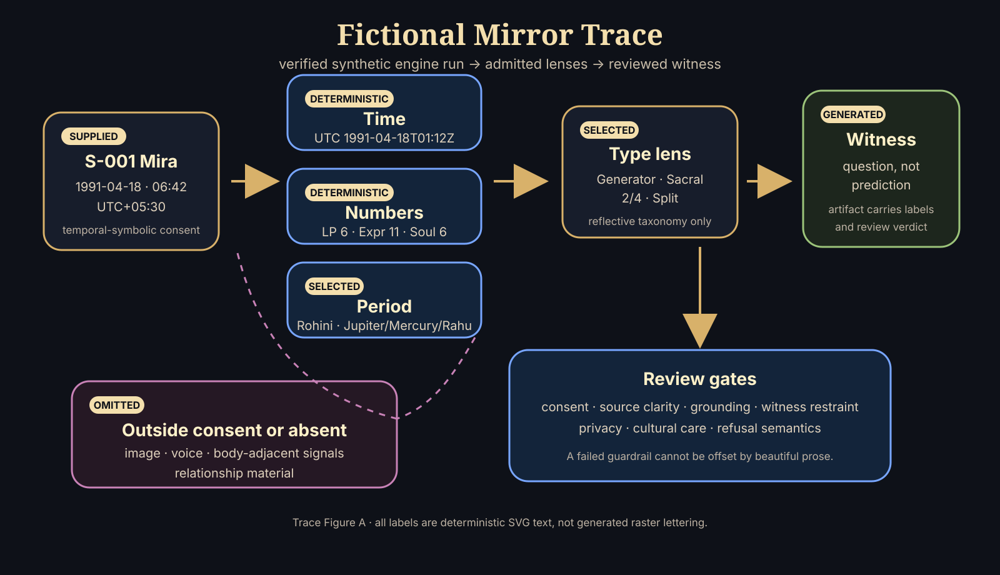

The source-status legend used in the trace is:

| Label | Meaning | Artifact obligation |
|---|---|---|
| Practitioner-supplied | Entered by the practitioner or demonstration fixture. | Keep scope and sensitivity visible. |
| Deterministic | Produced by a declared rule from declared inputs. | Show the transform or enough metadata to audit it. |
| Selected | Chosen from a symbolic map, taxonomy, spread, or table. | Name the selection as lens material, not universal truth. |
| Generated | Produced as witness language from prior materials. | Mark as framing, synthesis, or invitation. |
| Omitted | Not used because unavailable, unnecessary, or outside scope. | Keep omission visible so the artifact does not appear complete. |
| Refused | Blocked because the request would become prediction, diagnosis, pressure, or overclaim. | Replace with a bounded reflective alternative where possible. |

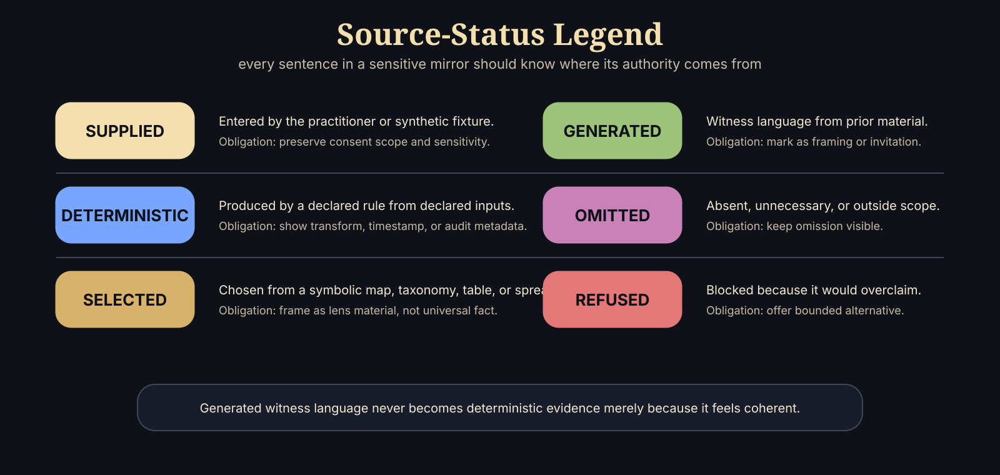

Let the synthetic reading input be:

$$
x^{\star}=(d,t,z,p,q,c)
$$

where \(d=\text{1991-04-18}\), \(t=\text{06:42}\), \(z=\text{UTC+05:30}\), \(p=(12.0000,77.0000)\) is the synthetic coordinate field, \(q\) is the declared inquiry, and \(c\) is the consent object. The normalized timestamp is:

$$
\operatorname{utc}(x^{\star})=\text{1991-04-18T01:12:00Z}
$$

The demonstration lens set is:

$$
S^{\star}=\{
\lambda_{\mathrm{time}},
\lambda_{\mathrm{number}},
\lambda_{\mathrm{period}},
\lambda_{\mathrm{type}},
\lambda_{\mathrm{witness}}
\}
$$

and the omitted set is:

$$
O^{\star}=\{
\lambda_{\mathrm{media}},
\lambda_{\mathrm{voice}},
\lambda_{\mathrm{somatic}},
\lambda_{\mathrm{relation}}
\}
$$

The omitted set is not decorative. It prevents a reader from assuming that the artifact used face, voice, biometric, relational, or private-note material when it did not.

For each lens \(\lambda_i\), the lens result is:

$$
r_i =
\begin{cases}
f_i(x_i), & c \models \operatorname{scope}(\lambda_i) \land \operatorname{valid}(x_i) \\
\bot_{\mathrm{omit}}, & \neg(c \models \operatorname{scope}(\lambda_i)) \lor \neg \operatorname{available}(x_i) \\
\bot_{\mathrm{refuse}}, & \operatorname{disallowed}(q,\lambda_i)
\end{cases}
$$

The witness transform is separate:

$$
w_i = W_{\ell}(r_i,q,B)
$$

where \(W_{\ell}\) is the witness register and \(B\) is the boundary policy. This equation is the ethical hinge of the system: \(w_i\) may phrase, contextualize, and invite; it may not retroactively become evidence stronger than \(r_i\).

The demonstration trace can then be written as:

| Step | Lens or operation | Demonstration result | Source status | Boundary note |
|---|---|---|---|---|
| 1 | Normalize time | \(1991\text{-}04\text{-}18T01{:}12{:}00Z\) | Deterministic | Only date, time, zone, and synthetic coordinate field are used. |
| 2 | Number-symbol lens | life path \(6\), birthday \(9\), expression \(11\), personality \(5\), soul urge \(6\) | Deterministic/selected | Arithmetic and symbolic labels are lens material, not trait proof. |
| 3 | Period-timing lens | birth nakshatra Rohini; run-timestamp period Jupiter / Mercury / Rahu | Deterministic/selected | Traditional-source labels require cultural care and do not predict outcomes. |
| 4 | Archetypal type lens | Generator; Sacral authority; profile \(2/4\); Split definition; active channels \(33\text{-}13\), \(3\text{-}60\) | Deterministic/selected | Type vocabulary is a reflective taxonomy, not an identity verdict. |
| 5 | Body/media-adjacent outputs | excluded from the public miniature despite being configured in the run | Omitted | Consent scope is temporal-symbolic only; no image, voice, or body signal contributes. |
| 6 | Lightweight witness prompts | returned by engine layer but not quoted directly | Generated/reviewed | Returned prompts still require public voice review before publication. |
| 7 | Reviewed witness sentence | “One way to read the verified synthetic trace is to ask how responsibility, response, and timing can become questions of pacing rather than identity.” | Generated/reviewed | Invitation only; no command, diagnosis, prediction, or guarantee. |

The assembled artifact is:

$$
A^{\star}=
\operatorname{assemble}
\left(
\{(r_i,w_i,\tau_i)\}_{i=1}^{4},
P^{\star},
O^{\star},
R^{\star}
\right)
$$

where \(\tau_i\) is the source-status label, \(P^{\star}\) is the provenance record, \(O^{\star}\) is the omitted/refused set, and \(R^{\star}\) is the review rubric. A portable artifact should preserve enough of this tuple that it does not become a free-floating statement detached from its boundary.

#### A miniature fictional mirror

The following miniature mirror illustrates how the final language should carry its own provenance. Bracketed labels are shown here for auditability; a user-facing artifact may place them in margins, footnotes, or a provenance table.

> [Practitioner-supplied] Mira is a fictional demonstration subject with a declared birth date of 1991-04-18, a declared local time of 06:42, and a synthetic coordinate field. [Deterministic] Normalizing the declared time to UTC gives 1991-04-18T01:12:00Z. [Deterministic/selected] A verified synthetic engine run returned number-symbol outputs of life path 6, birthday 9, expression 11, personality 5, and soul urge 6. [Deterministic/selected] The same run returned a period-timing label of Rohini for the birth nakshatra and, at the run timestamp, a Jupiter / Mercury / Rahu period stack. [Deterministic/selected] It also returned an archetypal type profile: Generator, Sacral authority, 2/4 profile, Split definition, and active channels 33-13 and 3-60. [Generated/reviewed] One way to read this mirror is not as a statement about Mira’s destiny, but as a question about pacing: where do responsibility, response, and timing become easier to hold when they are treated as inquiries rather than identity claims? [Omitted] This public miniature has not used images, voice, body-adjacent signals, private notes, or relationship material. [Boundary] It cannot infer health, fate, compatibility, vocation, or future events.

This small example shows the discipline that a longer reading must preserve. Generated witness language may be beautiful, but beauty does not raise the evidence class. A sentence remains generated even when it feels accurate. A symbolic phrase remains selected even when it resonates. A deterministic transform remains narrow even when later interpretation makes it meaningful.

#### Multi-pass witness protocol

A full artifact should not be produced by a single uncontrolled act of fluency. The witness layer is better understood as a multi-pass protocol:

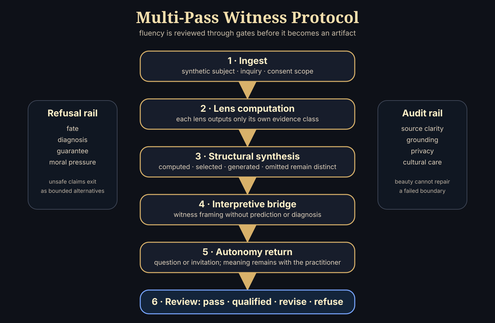

| Pass | Input | Output | Gate |
|---|---|---|---|
| Ingest | Synthetic subject data, inquiry, consent | Validated inquiry object | Missing or unauthorized material is omitted or refused. |
| Lens computation | Declared lens inputs | Lens results | Each lens may output only its own evidence class. |
| Structural synthesis | Lens results and omissions | Pattern map | Computed, selected, generated, and omitted material remain distinguishable. |
| Interpretive bridge | Pattern map and inquiry | Witness framing | No prediction, diagnosis, command, guarantee, or moral pressure. |
| Autonomy return | Witness framing | Question or practice invitation | Meaning is returned to the practitioner. |
| Review | Full artifact | Pass, qualified pass, revise, or refuse | A failed guardrail cannot be offset by prose quality. |

The review score is intentionally conjunctive rather than compensatory:

$$
\nu(A^{\star})=
\min
\left(
\nu_{\mathrm{consent}},
\nu_{\mathrm{source}},
\nu_{\mathrm{grounding}},
\nu_{\mathrm{witness}},
\nu_{\mathrm{privacy}},
\nu_{\mathrm{culture}}
\right)
$$

This means an artifact with excellent language and poor source clarity still fails. A mirror that cannot show what it used, what it did not use, and what kind of claim each sentence makes is not mature enough for a sensitive context.

An applied review of the miniature mirror is:

| Rubric dimension | Evidence in miniature mirror | Verdict | Revision if failed |
|---|---|---|---|
| Source clarity | Each sentence carries a source-status label. | Pass | Add labels or provenance notes. |
| Deterministic grounding | Time, number-symbol, period-timing, and type claims trace to the verified synthetic run. | Pass | Remove or relabel unsupported claims. |
| Integrated layering | Synthesis uses only the admitted lenses declared in \(S^{\star}\). | Pass | Do not imply omitted sources contributed. |
| Guardrail language | Returned prompts are not quoted directly; the public witness sentence is reviewed into non-predictive inquiry. | Pass | Rewrite as inquiry or refusal. |
| Privacy | Subject is synthetic; sensitive media and private notes are omitted. | Pass | Redact, omit, or regenerate with synthetic material. |
| Cultural care | Rohini, period, and type terms are framed as lens labels, not universal authority. | Qualified pass | Add source context before using tradition-specific terms. |

#### Privacy and export boundary

Public examples should be synthetic rather than anonymized. Birth date, birth time, place, relationship context, and reflective text can become identifying when combined. Pseudonymization reduces exposure; it does not erase identifiability. The safe publication pattern is:

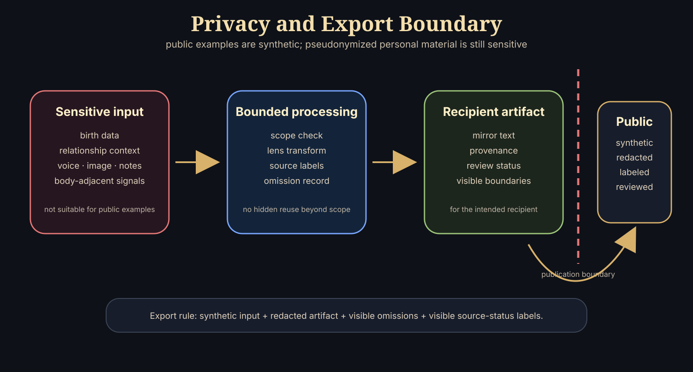

| Data class | Public demonstration rule | Real artifact rule |
|---|---|---|
| Name | Use fictional or pseudonymous labels. | Show only when intended for the recipient artifact. |
| Birth date, time, place | Use synthetic fixtures. | Treat as sensitive personal context. |
| Relationship context | Omit unless required for the example. | Require explicit roles, declared scope, and sensitivity level. |
| Image, video, voice, body-adjacent signal | Omit from public examples by default. | Require separate consent and non-diagnostic boundary. |
| Private notes or reflective context | Omit from public examples. | Minimize, redact, and avoid reuse beyond declared scope. |
| Generated witness text | Allowed with source-status labels. | Preserve provenance and review status. |

The export rule is:

$$
\operatorname{public}(A)=1
\Rightarrow
\operatorname{synthetic}(x)
\land
\operatorname{redacted}(A)
\land
\operatorname{visible}(O)
\land
\operatorname{visible}(\tau)
$$

If a public artifact cannot satisfy this rule, it should not be published as an example. The paper can still describe the class of lens, but it must not use private material to make the system feel more convincing.

## 9. Safety, Ethics, and Governance

Selemene is a reflective system, not a clinical, financial, legal, or predictive authority. That boundary is not a disclaimer added after the fact; it is a design constraint. The system may compute relations, arrange symbolic material, preserve provenance, and generate self-inquiry prompts. It must not diagnose, prescribe, predict outcomes, or convert interpretive material into commands.

The ethical frame is adapted from three familiar families of guidance. First, Belmont-style principles emphasize respect for persons, beneficence, and justice; here they are used as product-scoped design constraints rather than as a claim that this paper is human-subjects research [@belmont1979ethical]. Second, dynamic consent research motivates granular, contextual, revisable permissions for sensitive data [@norval2019automatingDynamicConsent]. Third, AI risk guidance motivates continuous governance across mapping, measurement, management, and oversight rather than a single launch-time approval [@nist2023airmf].

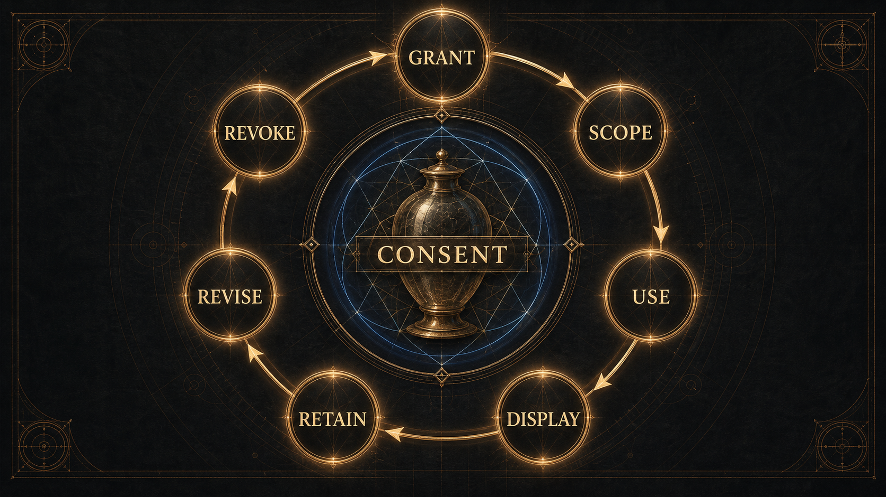

### 9.1 Autonomy and authorship

The first obligation is autonomy. A practitioner must remain the author of meaning. The witness voice therefore avoids imperatives, certainty theatre, dependency hooks, and language that implies the system has privileged access to the practitioner’s inner life. It may offer prompts, contrasts, patterns, and questions. It must leave refusal, revision, disagreement, and non-use available.

Autonomy also governs memory. Reflective continuity can be valuable, but continuity becomes unsafe when it quietly hardens into surveillance or identity fixation. A prior artifact should be available as context only when the practitioner can understand why it is present and can reject, revise, or remove its influence.

### 9.2 Harm minimization

The central harm pattern is over-reading. A partial signal, fluent interpretation, striking visual form, or coherent symbolic synthesis can feel more authoritative than it is. Selemene therefore treats uncertainty, omitted material, weak signal quality, and refusal states as first-class parts of the artifact rather than hidden defects.

Harm minimization also requires domain separation. A reflection about grief is not therapy. A reflection about work is not career instruction. A reflection about money is not financial advice. A reflection about the body is not diagnosis. These boundaries should be present in the artifact’s language, not buried where the practitioner will only find them after trust has already formed.

### 9.3 Justice and access

Justice matters because reflective systems can easily privilege people who share the designer’s language, culture, literacy, metaphors, devices, or assumptions. Selemene should avoid treating one symbolic vocabulary as universal. It should also avoid making rich or sensory-heavy forms the only mature forms. A lightweight text artifact, a low-bandwidth interaction, and a private local session can be ethically preferable when they preserve comprehension, consent, and agency.

Fair access does not require flattening every tradition into the same interface. It requires explaining the interpretive frame, respecting cultural specificity, and letting the practitioner choose a mode of encounter that does not demand unnecessary exposure.

### 9.4 Consent and privacy

Sensitive reflection systems must treat consent as a continuing condition, not a one-time checkbox. For media and biometric contexts, consent can be represented as a predicate:

$$
C(r,m) = \forall s \in \mathrm{scopes}(m),\; s \in \mathrm{grant}(r) \land \mathrm{fresh}(r)
$$

where request \(r\) may carry material \(m\) only when every required scope is granted and fresh.

The practical interpretation is a lifecycle: grant, scope, use, display, retention, revision, and revocation. Consent is not merely permission to begin; it is an ongoing boundary around what may be used, how strongly it may be interpreted, whether it may leave the local environment, and when it must stop influencing future artifacts.

Consent should also be specific to modality. A practitioner may be comfortable providing a date, a question, or a symbolic selection while declining image, audio, body-adjacent, or relational material. The system should not treat refusal of one modality as failure of the whole inquiry. It should continue only within the remaining boundary and show what was omitted.

This creates an important design obligation: privacy must be legible at the moment of reflection, not only at the moment of configuration. If an artifact uses sensitive material, the artifact should make that fact visible in plain language. If it does not use sensitive material, it should not imply that it did. The practitioner should not have to reverse-engineer the system to know which parts of themselves were invited into the mirror.

### 9.5 Provenance as humility

Provenance is often treated as an audit feature. In Selemene it is also a humility feature. It forces the system to say, in effect: this came from the practitioner, this came from calculation, this came from symbolic tradition, this came from generative framing, this was omitted, this was uncertain, this was refused. This aligns with the W3C PROV family’s broad aim of representing entities, activities, and responsible agents involved in producing a result [@w3c2013provdm].

Provenance does not make an interpretation true; it makes the construction of the artifact inspectable. That distinction protects both sides of the mirror. It protects the practitioner from over-reading the artifact, and it protects the system from pretending that assembled meaning is the same as truth.

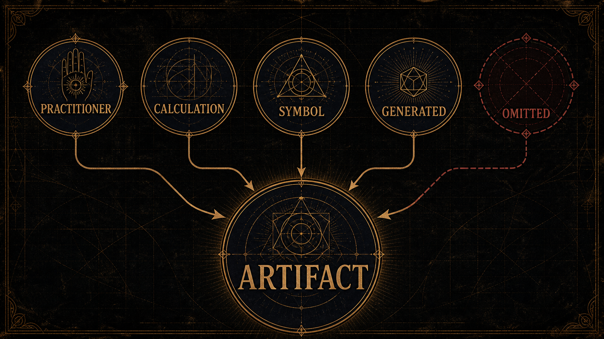

### 9.6 Misuse cases and mitigations

The safety model is easiest to state by naming what can go wrong.

| Misuse case | Failure pattern | Required mitigation |
|---|---|---|
| Diagnosis | Symbolic or media-aware output is read as clinical assessment. | Refuse diagnostic language; keep body-related artifacts reflective and non-clinical. |
| Dependence | The practitioner returns for permission rather than inquiry. | Preserve authorship, disagreement, and exit; avoid authority theatre. |
| Prediction | A pattern is treated as a guaranteed future event. | Exclude future-outcome claims and keep temporal material interpretive. |
| Concealed external processing | Sensitive material is silently sent outside the practitioner’s expected boundary. | Require explicit consent, visible scope, and local-first handling where appropriate. |
| Over-reading partial media | Weak or degraded media produces strong claims. | Label quality, fallback, omitted inputs, and uncertainty in ordinary language. |
| Cultural flattening | Traditions become interchangeable aesthetics. | Name adaptation, context, and limits; include cultural review before stronger public claims. |

Risk can be expressed as a function of sensitivity, certainty, exposure, and reversibility:

$$
\mathcal{R}(A)=
\frac{s(A)\,u(A)\,x(A)}{1+r(A)}
$$

where \(s(A)\) is material sensitivity, \(u(A)\) is unearned certainty in the artifact, \(x(A)\) is exposure beyond the practitioner’s private context, and \(r(A)\) is reversibility. The equation is not a universal risk metric; it is a design heuristic. It makes clear why a sensitive, highly certain, widely shared, hard-to-reverse artifact requires the strongest restraint.

### 9.7 Failure and degradation semantics

Failure is not a single state. Selemene distinguishes at least five public classes of incomplete output:

1. unavailable material, where a required input or modality is not present;
2. ungranted material, where the practitioner has not authorized a sensitive input;
3. weak material, where a signal exists but should not carry a strong claim;
4. degraded material, where a fallback or simplified rendering is used;
5. withheld material, where the system refuses because the requested interpretation would become prescriptive, diagnostic, predictive, or otherwise unsafe.

These states should be visible in ordinary language. A practitioner should be able to tell whether an artifact is complete, partial, degraded, or refused without reading machinery logs. The public principle is simple: never hide the missing bone under prettier skin.

### 9.8 Governance as recurring practice

Governance is not a board that approves the system once. It is the recurring practice of checking whether the system’s behavior still matches its boundary. In Selemene, governance has at least six recurring questions:

1. Are the strongest public claims still supported?
2. Are sensitive inputs still handled according to their consent scope?
3. Are partial or degraded states visible to the practitioner?
4. Has witness language drifted toward advice, prediction, diagnosis, or dependence?
5. Are cultural sources being handled with enough specificity and humility?
6. Are new expressive surfaces increasing agency or merely increasing persuasion?

These questions are intentionally ordinary. Good governance should not require private mystique. It should be possible for a technical reviewer, cultural reviewer, safety reviewer, and practitioner advocate to inspect the same artifact and ask where the system overreaches.

### 9.9 The ethics of beauty

Selemene is designed to become expressive: visual, auditory, narrative, ritual, and multisensory. That expressive ambition creates a specific ethical problem. Beauty can lower skepticism. A diagram, tone, or image can make the practitioner feel that something has been revealed when something has only been rendered. The more beautiful an artifact becomes, the more clearly its limits must be carried with it.

This does not mean beauty is unsafe. Beauty can hold attention, dignify practice, and make difficult inquiry bearable. The ethical question is whether beauty clarifies or conceals. A beautiful artifact is aligned with Selemene when it reveals its own construction, invites interpretation, and leaves authorship intact. It is misaligned when it uses intensity to bypass discernment.

## 10. Evaluation Design and Review Protocol

This paper is a technical whitepaper with a PRISMA-inspired scoping review posture. It is not a clinical trial, ethnography, systematic review, or efficacy study. PRISMA 2020 is designed for transparent reporting of systematic reviews; Selemene borrows its discipline of explicit source selection, exclusion, and claim-bounding without claiming systematic-review completeness [@page2021prisma2020].

The method separates three questions that are often collapsed:

1. What does the system claim to do?
2. What evidence supports that claim today?
3. What kind of evidence would be required for a stronger claim?

This separation is especially important for reflective systems. A structural rule can be satisfied while an interpretation remains weak. A generated prompt can be fluent while being prescriptive. A workflow can run while failing to preserve agency. A reflection can feel meaningful without constituting evidence of clinical benefit.

### 10.1 Evidence hierarchy

Selemene’s evidence hierarchy is ordered by proximity to present behavior:

1. direct behavior of the current system;
2. typed boundary definitions and accepted examples;
3. executable checks and fresh probes;
4. current design and capability notes;
5. historical reports and prior summaries.

The hierarchy is not a prestige ladder. It is a drift ladder. The farther a statement is from current behavior, the more carefully it must be bounded. A past pass does not prove a present state. A live health response does not prove semantic correctness. A research citation does not prove a system feature exists. A system check does not prove human benefit.

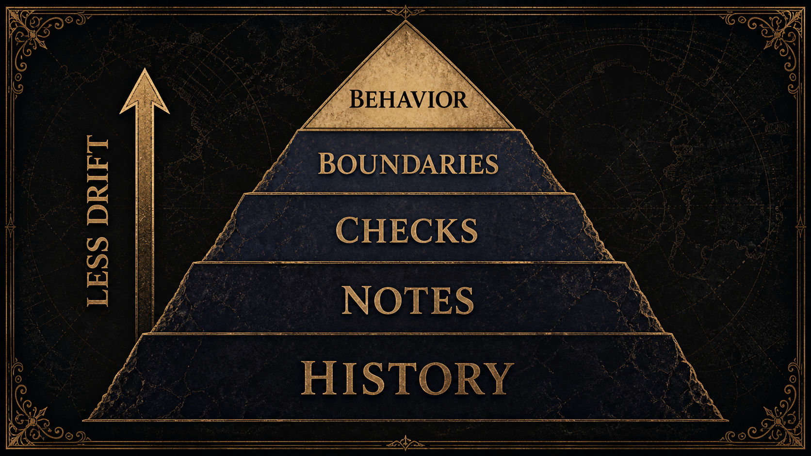

### 10.2 Claim classes

Every material claim belongs to one class. Formal claims concern notation and boundaries. Technical claims concern present system behavior. Operational claims concern current runtime or availability state. Empirical claims concern measured human or social effects. Interpretive claims concern symbolic meaning. Philosophical claims concern the project’s declared stance.

Each class has a different admissible evidence type. Mixing classes is the root of most whitepaper inflation. An empirical paper can support the design rationale for agency-preserving reflection, but it cannot certify Selemene’s user benefit. A green system check can support structural validity, but it cannot certify psychological outcome. A philosophical principle can guide design, but it cannot certify operational readiness.

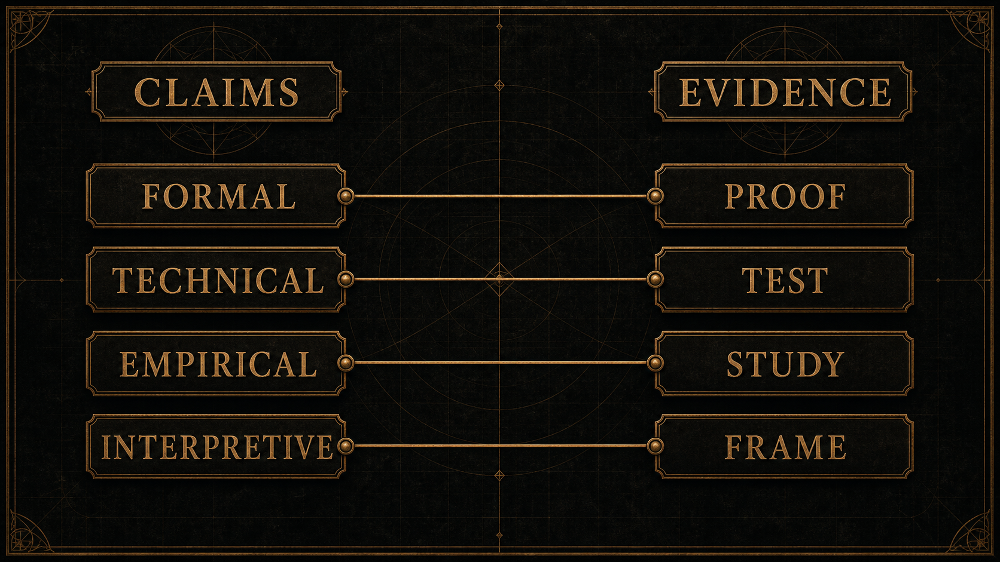

### 10.3 Structural validity

Structural validity asks whether an artifact has the right shape: required fields are present, sensitive material is scoped, outputs are labeled, and refusal states are representable. This is the lowest layer of trust. It can prove that the container is coherent. It cannot prove that the reflection is meaningful.

### 10.4 Engine-level correctness

Engine-level correctness asks whether a specific lens performed the transformation it claims to perform. For a temporal lens, this may mean the right calendar relation or period calculation. For a symbolic lens, it may mean deterministic handling of selections, spreads, lines, or archetypal mappings. For a media-aware lens, it may mean correct handling of consent, input quality, fallback, and non-diagnostic language.

### 10.5 Witness review

Witness review asks whether the artifact preserves authorship. The key failure modes are subtle: flattering certainty, implied advice, hidden diagnosis, moral pressure, unearned intimacy, dramatic overinterpretation, or language that makes the practitioner feel decoded rather than invited into inquiry. A witness can be strong. It cannot be coercive.

LLM-mediated reflection research is useful here because it foregrounds user-directed exploration and adaptive scaffolding rather than replacement of the user’s own interpretation [@song2025exploreself]. Selemene adopts that posture narrowly: generated witness language should support inquiry, not simulate a therapist, guru, oracle, or final judge.

### 10.6 Cultural review

Cultural review asks whether symbolic systems are handled as situated traditions rather than flattened content libraries. This includes checking whether terms are named accurately, whether living traditions are reduced to aesthetics, whether modern adaptations are confused with ancient authority, and whether the paper claims universality where it only has interpretive context. Computational hermeneutics supports this stance by treating cultural outputs as situated, plural, and evaluation-sensitive rather than context-free truths [@kommers2026computationalHermeneutics].

### 10.7 Practitioner-centered evaluation

Practitioner-centered evaluation asks different questions from technical testing. Did the artifact help the practitioner notice something? Did it preserve agency? Was the boundary clear? Did the practitioner understand which parts were computed, symbolic, generated, uncertain, or refused? Did the system invite authorship rather than dependence?

These are empirical questions. They require study, feedback, and field evidence. They should not be answered by technical success alone. Socio-technical evaluation work is useful precisely because it warns against treating model behavior as a substitute for downstream human requirements [@liao2025rethinkingEvaluation].

### 10.8 Methodological exclusions

This paper does not test whether symbolic systems predict life events. It does not test clinical outcomes. It does not estimate therapeutic effect. It does not claim that generated artifacts improve well-being. It does not treat user fascination, fluent prose, or visual intensity as proof of truth. Those questions would require different study designs, participant protections, preregistered outcome definitions where applicable, and independent review.

The current methodological claim is narrower: a symbolic-computational reflection system can be described, bounded, evaluated structurally, and governed so that its claims remain legible.

This exclusion becomes sharper in the presence of ambitious source theories. The fact that a framework is philosophically fertile, personally meaningful, historically influential, or aesthetically coherent does not determine its evidence class. Selemene therefore uses a source-quality ladder:

$$
\mathrm{influence}
\;<\;
\mathrm{interpretive\ frame}
\;<\;
\mathrm{scholarly\ source}
\;<\;
\mathrm{empirical\ evidence}
\;<\;
\mathrm{current\ system\ behavior}
$$

The ladder is not a value ranking. A lineage source may matter deeply while still carrying less public claim authority than a current behavioral check or a peer-reviewed empirical study. This keeps the paper from confusing importance with admissibility.

### 10.9 Review protocol

A release-quality Selemene artifact should pass a layered review protocol before it is treated as mature. The review begins with form: the artifact must have a clear inquiry context, declared lens family, visible omissions, provenance, and boundary language. It then moves to language: the witness must avoid commands, diagnosis, prediction, moral pressure, and unearned certainty. It then moves to cultural handling: symbols must be framed as situated lenses, not universal facts. Finally, it moves to practitioner comprehension: a reader should be able to state what was computed, what was interpreted, what was generated, what was omitted, and what remains theirs to decide.

The protocol is deliberately not a single score. A single score would invite false precision. Instead, each layer produces a bounded verdict: pass, qualified pass, revise, or refuse. A qualified pass is not a failure if the qualification is visible. In reflective systems, honest incompleteness is often safer than polished overreach.

### 10.10 Evaluation matrix

The evaluation matrix can be summarized as follows:

| Layer | Question | Evidence type | Failure mode |
|---|---|---|---|
| Boundary | Is the artifact allowed to exist in this form? | Input, consent, refusal, and claim checks | Unsafe output is generated anyway. |
| Structure | Is the artifact well formed? | Shape, required fields, labels, and omissions | Components blur together. |
| Lens | Did each selected lens do only what it claims? | Engine-level examples and review | Partial material becomes strong claim. |
| Witness | Does the voice preserve authorship? | Language review and refusal review | The artifact becomes advice or authority. |
| Culture | Are symbolic sources handled responsibly? | Source comparison and expert review when needed | Tradition becomes decoration. |
| Comprehension | Can the practitioner understand the boundary? | Reader testing or structured feedback | The user trusts more than the artifact earns. |
| Field use | Does extended use preserve agency? | Extended field study where appropriate | Reflection becomes dependence. |

This matrix lets Selemene make progress without inflating its claims. Structural and lens-level evidence can mature before practitioner outcome evidence exists. Practitioner studies can later strengthen human-centered claims without being confused with the mechanical fact that an artifact rendered.

Let the review verdict for artifact \(A\) be:

$$
\nu(A)=
\min_{d \in D_{\mathrm{review}}} r_d(A)
$$

where \(D_{\mathrm{review}}\) is the review-dimension set and \(r_d(A)\in\{0,\tfrac{1}{2},1\}\) is the rating for dimension \(d\). The minimum rule prevents a beautiful artifact from compensating for a failed consent, boundary, or cultural-care dimension.

### 10.11 Human outcome claims

Human outcome claims require special care. A practitioner may report that a mirror was meaningful, clarifying, uncomfortable, or useful. Such reports matter, but they do not automatically prove broad benefit. They are situated accounts of encounter. A stronger claim would require defined outcomes, recruitment criteria, comparison conditions where appropriate, and ethical oversight suited to the sensitivity of the material.

Selemene can still be serious before those studies exist. A telescope did not become useful only after every astronomy question was settled; its value came from giving observers a better instrument. Selemene’s present claim is instrument-level: it proposes a disciplined way to structure reflective material. Claims about what the instrument does to people over time remain future empirical work.

### 10.12 Evaluation of refusal

Refusal should itself be evaluated. Many systems test only successful outputs. Selemene must test whether it refuses in the right places and whether the refusal preserves agency. A refusal that says “I cannot help” may be technically safe but reflectively poor. A better refusal names the boundary and offers a safe adjacent inquiry.

For example, if the practitioner asks for a prediction, the system can refuse the prediction while offering to examine assumptions, timing, fear, desire, and available choices. If the practitioner asks for diagnosis, the system can refuse clinical interpretation while offering reflective questions about lived experience and encouraging appropriate professional support without simulating that support. The refusal is part of the witness craft.

## 11. Cultural and Traditional-Source Boundaries

Selemene draws from living, historical, and modern symbolic systems. That creates a responsibility to avoid flattening traditions into interchangeable aesthetics or claiming universality where only interpretation is present. Each tradition should be handled as a source of structured meaning, cultural practice, and symbolic language, not as a blank asset library.

The safest public claim is modest: Selemene uses computational structure to render symbolic perspectives for self-inquiry. It does not claim that symbolic systems are scientifically validated predictors of life events, health, relationship outcomes, or financial decisions.

### 11.1 Tradition is not decoration

When a symbolic system enters software, it can easily be stripped of history, practice, controversy, lineage, and context. A diagram becomes an icon. A card becomes a content block. A calendar becomes a score. Selemene must resist that flattening. The role of computation is to structure encounter, not to launder complexity away.

### 11.2 Modern adaptation must be named as adaptation

Many contemporary symbolic systems are modern syntheses, reinterpretations, or hybrid practices. That does not make them invalid as reflective lenses. It does mean they should not be presented as timeless, universal, or culturally uncontested. Public language should distinguish tradition, adaptation, computation, and practitioner experience.

### 11.3 Ambiguity is a feature

Symbolic systems often work through productive ambiguity. A symbol can be precise without being singular. It can point without closing. In Selemene, ambiguity is not a defect to be eliminated by synthesis. It is a reflective condition to be preserved until the practitioner decides what, if anything, becomes actionable.

### 11.4 Strong form requires stronger review

The more culturally specific a claim becomes, the stronger its review obligation becomes. A broad design statement may need only careful wording. A named traditional interpretation may need source comparison. A contested historical claim may need specialist review. A practice recommendation may be out of scope entirely. This graded review keeps the system from using beauty as a license to simplify what deserves reverence, disagreement, or silence.

### 11.5 Translation and language

Language is not a neutral container. Symbolic systems often change when translated. A term may carry ritual, poetic, technical, lineage, or regional meanings that do not map cleanly into another language. Selemene should therefore treat translation as interpretation, not as a mechanical substitution of words. When a term is uncertain, contested, or used in a modern adaptation, the safer artifact names that uncertainty instead of smoothing it away.

This matters for witness output as well. A prompt that sounds respectful in one language can sound presumptive in another. A metaphor that feels precise in one tradition can feel appropriative or hollow in another. Cultural review therefore includes tone, translation, and metaphor, not just factual naming.

### 11.6 The practitioner’s living context

Traditional-source boundaries do not end with historical accuracy. The practitioner’s living context also matters. A symbol may carry one meaning in a source tradition, another in contemporary practice, and another in the practitioner’s personal history. Selemene should not force these meanings into a single official answer. It should let the artifact disclose the lens and then invite the practitioner to test resonance, resistance, and relevance.

This is another reason the system avoids universalizing claims. The same artifact can be meaningful to one person, inert to another, and uncomfortable to a third. That variability is not a defect to be hidden. It is part of the interpretive situation.

## 12. Ecosystem Expression

A reflection engine becomes real through interfaces. Some interfaces are fast and lightweight. Others are immersive, narrative, visual, auditory, or exportable. Some are designed for private daily use; others for longer-form inquiry. What matters is that every surface preserves the same grammar: the engine computes or frames; the witness does not prescribe; the practitioner authors meaning.

The ecosystem goal is coherence across surfaces without dependency on any single interface. The practitioner should be able to enter through a small prompt, a full reading, a symbolic artifact, a daily practice, a media interaction, or an exported record and still encounter the same boundary: this is a mirror, not a command.

### 12.1 Surface independence

Surface independence means the philosophy does not depend on one device, application, or format. A reflection can begin as a brief consultation, become a longer artifact, appear as a visual form, recur through daily practice, or remain private as a local record. The same boundary should hold everywhere. If a surface makes the system more seductive but less honest, the surface is not mature.

### 12.2 Artifact continuity

Artifact continuity means reflection can accumulate without becoming surveillance. A practitioner should be able to carry forward context, compare prior outputs, and notice changes across time. But continuity should serve authorship, not dependency. The system should remember only what it is allowed to remember, reveal how context is being used, and permit the practitioner to reject, revise, or discard inherited framing.

### 12.3 Expression after boundary

The ecosystem can become beautiful, multisensory, and expansive. It can use image, sound, text, ritual form, and interactive practice. But expression must come after boundary. The more powerful the artifact, the more visible its limits must be. Otherwise the system becomes theater with a memory.

### 12.4 Locality and exposure

Different surfaces imply different exposure. A private local note, a generated image, an audio artifact, and a shared report do not carry the same risk. Selemene’s ecosystem model should therefore treat exposure as a design dimension. The more widely an artifact can travel, the more carefully it should carry its boundary, provenance, and consent assumptions.

This is especially important for media-aware artifacts. A visual or auditory artifact can be detached from its original context and interpreted by someone who never saw the boundary. A portable artifact should therefore include enough reader-facing context to prevent it from becoming a free-floating claim.

### 12.5 Multiplicity without fragmentation

The ecosystem may support multiple forms of encounter: brief, extended, visual, auditory, daily, relational, private, or exportable. Multiplicity becomes fragmentation when each surface invents its own truth model. Selemene avoids this by keeping a common grammar across surfaces. The lens may change. The artifact form may change. The boundary does not.

This principle also protects the practitioner from surface authority. A rich interface should not be treated as more true than a simple one. It may be more immersive, more expressive, or better suited to a particular practice, but truth status depends on evidence, boundary, and authorship, not production value.

## 13. Roadmap of Inquiry

The conceptual roadmap is sequential because honesty has dependencies. First, the system must preserve clear boundaries around claims. Second, the engines must make their partiality visible. Third, consent and provenance must travel with sensitive inputs. Fourth, cultural review must prevent symbolic flattening. Fifth, evaluation must distinguish technical success from human meaning.

Only after those disciplines are stable should Selemene expand expressive surfaces. Expansion without boundary creates spectacle. Boundary without expression creates sterile machinery. The project aims for the harder synthesis: expressive enough to matter, bounded enough to trust, and humble enough to return authorship to the practitioner.

### 13.1 Near-term inquiry

The near-term work is to make boundary conditions more explicit. Every lens should be able to say what it needs, what it can produce, what it cannot produce, and what happens when material is missing or unsafe. This is not glamorous work, but it is the foundation for trustworthy expression. Without it, the system can appear mature while silently confusing declared possibility with verified capability.

Near-term work also includes sharper claim language. Public artifacts should distinguish conceptual vision, implemented behavior, current availability, and future research. This prevents the paper from making the same mistake it critiques: converting symbolic coherence into unearned certainty.

### 13.2 Medium-term inquiry

The medium-term work is semantic maturity. Each lens should be reviewed not only for whether it produces output, but for whether the output faithfully represents the lens’s stated logic. Symbolic selections should preserve their own internal structure. Temporal lenses should show their assumptions. Media-aware lenses should label quality and uncertainty. Synthetic lenses should report omissions rather than silently reweighting the remaining material.

This phase is where Selemene becomes more than a collection of interesting mirrors. It becomes a coherent reflection instrument whose parts can be compared, combined, and refused without losing their specific boundaries.

### 13.3 Long-term inquiry

The long-term work is field evidence. Once artifacts are structurally mature and ethically bounded, Selemene can ask human-centered questions: Do practitioners understand the boundary? Does use preserve agency? Which artifact forms support reflection without dependence? How do cultural backgrounds affect interpretation? Which witness registers invite authorship, and which become too persuasive?

These questions require humility because their answers may refute design assumptions. A beautiful artifact may be confusing. A minimal artifact may be more empowering. A deeply symbolic artifact may need stronger cultural framing. A continuity feature may feel helpful to some practitioners and intrusive to others. Long-term inquiry must be prepared to change the system.

### 13.4 Success condition

The success condition is not that Selemene becomes the most persuasive interpreter. It is that Selemene becomes a disciplined mirror: technically inspectable, culturally careful, ethically bounded, and experientially alive. It should help practitioners see their own interpretive machinery more clearly, then return the authorship of meaning to them.

## 14. Conclusion

Selemene Engine proposes that reflective computation can be rigorous without becoming reductive. Its contribution is not a claim that machines know the self better than the self does. Its contribution is a structured environment in which temporal, symbolic, somatic, geometric, and narrative lenses can be computed or rendered without being mistaken for fate.

The engine reflects what is active. The practitioner authors what it means.

The hardest part of this proposal is not the computation alone. It is the refusal to let computation borrow more authority than it has earned. Selemene’s central discipline is to hold several truths together: symbols can matter without predicting; bodies can guide inquiry without becoming diagnostic objects; generated language can be useful without becoming an oracle; memory can support continuity without becoming surveillance; beauty can deepen attention without replacing discernment.

If the system remains faithful to that discipline, its novelty is not merely a set of engines. Its novelty is a form of reflective infrastructure in which computation, embodiment, symbolic tradition, provenance, consent, and witness language are made mutually accountable. The purpose is not to automate meaning. The purpose is to give meaning-making a clearer instrument.

## 15. References

References will include only sources that support the specific methodological claim for which they are cited. Research sources support framing, evaluation, and design discipline; they do not validate prediction, diagnosis, therapy, divination accuracy, or guaranteed transformation.

## Appendix A: Notation and Derivations

### A.1 Notation

| Symbol | Meaning |
|---|---|
| \(v\) | Boundary grammar version |
| \(z\) | Candidate input, intermediate object, or artifact |
| \(\mathcal{B}_v\) | Public boundary grammar for version \(v\) |
| \(V_v\) | Boundary validation function |
| \(i\) | Engine index |
| \(X_i\) | Input domain for engine \(i\) |
| \(Y_i\) | Structured artifact space for engine \(i\) |
| \(E_i\) | Explicit failure, refusal, or unavailable states |
| \(q\) | Practitioner inquiry context |
| \(S\) | Selected engine set |
| \(M\) | Multi-engine result family |
| \(M_{i,a}\) | Capability evidence value for engine \(i\) on axis \(a\) |
| \(Q_i(A^\ast)\) | Claim qualification floor for engine \(i\) across required axes |
| \(O_t\) | Omitted lens set at time \(t\) |
| \(\Delta_t\) | Degraded or qualified input record |
| \(\sigma(t)\) | Synthesis score with omissions removed and reported |
| \(W_\ell\) | Witness function at register or depth level \(\ell\) |
| \(\mathcal{R}_\ell\) | Restraint policy for witness level \(\ell\) |
| \(\alpha\) | Authorship preservation measure |
| \(A\) | Reflective artifact |
| \(r\) | Request or inquiry event |
| \(m\) | Sensitive material, such as media or biometric context |
| \(C(r,m)\) | Consent predicate for request \(r\) and media \(m\) |
| \(G_p\) | Provenance graph |
| \(\Pi(A)\) | Disallowed-claim predicate |

### A.2 Worked example: temporal lens

Let a temporal lens receive a time-place inquiry \(x_i \in X_i\). If the required fields are present and the boundary check accepts the object:

$$
V_v(x_i)=\mathrm{accept}(x_i)
$$

the engine may produce:

$$
f_i(x_i)=y_i,\quad y_i \in Y_i
$$

The witness may then frame \(y_i\) as timing context:

$$
W_\ell(\{y_i\},c) \rightarrow A
$$

but the artifact must not turn timing context into command:

$$
\Pi(A)=0
$$

The allowed public sentence is of the form “this interval may be used as reflective timing context.” The disallowed sentence is of the form “this interval determines what the practitioner should do.”

### A.3 Worked example: media-aware lens

Let a media-aware lens require material \(m\). Before interpretation:

$$
C(r,m)=
\forall s \in \mathrm{scopes}(m),\;
s \in \mathrm{grant}(r) \land \mathrm{fresh}(r)
$$

If consent is absent:

$$
C(r,m)=0 \Rightarrow f_i(x_i)=e_i,\quad e_i \in E_i
$$

The omitted lens set records the absence:

$$
i \in O_t
$$

and the rendered artifact must include the omission rather than silently replacing it with invented certainty:

$$
R(t)=\left(\sigma(t),O_t,\Delta_t\right)
$$

### A.4 Provenance graph

$$
G_p = (N, E, \tau)
$$

where \(N\) is the set of artifact nodes, \(E\) is the set of derivation edges, and \(\tau\) labels each node or edge with its origin class.

For a simple reflective artifact:

$$
N =
\{n_{\mathrm{input}}, n_{\mathrm{engine}}, n_{\mathrm{witness}}, n_{\mathrm{artifact}}\}
$$

$$
E =
\{(n_{\mathrm{input}},n_{\mathrm{engine}}),
(n_{\mathrm{engine}},n_{\mathrm{witness}}),
(n_{\mathrm{witness}},n_{\mathrm{artifact}})\}
$$

The labels \(\tau\) should distinguish practitioner-supplied context, computed material, generated framing, omitted material, degraded material, and refusals.

### A.5 Boundary rule

An output should be published only when its construction is bounded:

$$
B(A) = C(r,m) \land P(A) \land \neg D(A)
$$

where \(P(A)\) means the artifact has inspectable provenance and \(D(A)\) means the artifact contains disallowed prescriptive, diagnostic, predictive, or outcome-guaranteeing language.

Using \(\Pi(A)\) for the broader disallowed-claim predicate:

$$
B(A) = C(r,m) \land P(A) \land \neg \Pi(A)
$$

### A.6 Rejected claim example

Suppose a generated artifact contains a sentence equivalent to “this symbolic output predicts a future event.” Then:

$$
\Pi(A)=1
$$

and therefore:

$$
\mathrm{allow}(A)=0
$$

The artifact may be revised into reflective language only if the witness transform preserves ambiguity and agency:

$$
\Pi(W_\ell(M,c))=0
\quad\land\quad
\alpha(W_\ell(M,c)) \geq \alpha_{\min}
$$

### A.7 Authorship measure

Authorship preservation can be decomposed into reviewable surface features:

$$
\alpha(A)=
\omega_q q(A)+\omega_p p(A)+\omega_s s(A)+\omega_o o(A)+\omega_d d(A)
$$

where \(q(A)\) measures question orientation, \(p(A)\) measures plurality, \(s(A)\) measures source clarity, \(o(A)\) measures omission visibility, and \(d(A)\) measures disagreement affordance. The weights \(\omega\) are review parameters, not claims about consciousness.

### A.8 Figure-ground ratio

A reflective artifact should not overwhelm the practitioner with generated framing. Let \(g(A)\) be generated witness language and \(l(A)\) be lens-grounded material. A figure-ground ratio can be used as a review heuristic:

$$
\gamma(A)=\frac{g(A)}{g(A)+l(A)}
$$

When \(\gamma(A)\) approaches \(1\), the artifact risks becoming free-floating prose. When \(\gamma(A)\) approaches \(0\), it may become raw output without reflection. The desirable range depends on the artifact type, but the ratio should be inspectable.

### A.9 Scale-recursive interpretation

A symbolic pattern may appear at several scales: a daily choice, a relationship, a practice rhythm, a recurring motif, or an institutional frame. Selemene should not treat scale recurrence as proof. It may treat recurrence as a prompt for careful comparison.

Let \(\mathcal{S}\) be a set of scales and \(p\) a candidate pattern. A recurrence observation is:

$$
\mathrm{rec}(p)=\{s \in \mathcal{S}\mid p \in \mathrm{patterns}(s)\}
$$

The pattern becomes reviewable only when its occurrences are described, not merely asserted:

$$
|\mathrm{rec}(p)| \geq 2
\;\not\Rightarrow\;
\mathrm{truth}(p)
$$

The allowed inference is weaker:

$$
|\mathrm{rec}(p)| \geq 2
\Rightarrow
\mathrm{compare}(p,\mathrm{rec}(p))
$$

This rule protects the paper from a common symbolic fallacy: seeing the same form twice and treating resemblance as evidence. Recurrence authorizes comparison, not certainty.

### A.10 Phase transition discipline

The inquiry lifecycle can be modeled as a monotone transition system when each phase preserves the boundary conditions of the previous phase.

$$
T_j:\Omega_j \rightarrow \Omega_{j+1}
$$

For a transition to be admissible:

$$
\mathrm{adm}(T_j)=
V_v(\Omega_j)\land C_j \land P_j \land \neg \Pi_j
$$

If any condition fails, the transition should return an explicit refusal or degraded state:

$$
\neg \mathrm{adm}(T_j)
\Rightarrow
T_j(\Omega_j)=e_j,\quad e_j \in E
$$

This converts depth into discipline. A later phase may be richer, but it is not allowed to erase the limits of an earlier phase.

### A.11 Lineage graph

Lineage can be represented as a provenance graph without turning influence into proof. Let:

$$
G_L=(N_L,E_L,\tau_L,\rho_L)
$$

where \(N_L\) is a set of lineage nodes, \(E_L\) is a set of directed conditioning edges, \(\tau_L\) assigns each node a type, and \(\rho_L\) records the relation between a lineage node and a public claim.

The allowed node types are intentionally broad:

$$
\tau_L(n)\in
\{\mathrm{relation},\mathrm{text},\mathrm{practice},\mathrm{constraint},\mathrm{translation},\mathrm{review}\}
$$

An edge \((n_a,n_b)\in E_L\) means that one node enabled, constrained, translated, contested, or carried another. It does not mean that the first node proves the second. The core anti-inflation rule is:

$$
\mathrm{influence}(n,A)\not\Rightarrow \mathrm{proof}(A)
$$

When a public claim \(c\) depends on a lineage node \(n\), the dependency must be typed:

$$
\rho_L(n,c)\in
\{\mathrm{conceptual},\mathrm{historical},\mathrm{methodological},\mathrm{empirical},\mathrm{formal}\}
$$

Only empirical or formal dependencies can support empirical or formal claims:

$$
\mathrm{class}(c)\in\{\mathrm{empirical},\mathrm{formal}\}
\Rightarrow
\exists n\in N_L:
\rho_L(n,c)=\mathrm{class}(c)
$$

Conceptual lineage may motivate a frame, vocabulary, or design posture. It cannot certify that an artifact benefits a practitioner, that a symbolic relation is true, or that an engine is operationally mature. In short:

$$
\mathrm{lineage}(A)\neq \mathrm{authority}(A)
$$

This equation is one of the paper’s practical safeguards. It lets Selemene remain authored without becoming personality-driven, situated without becoming provincial, and symbolically deep without becoming unverifiable.

## Appendix B: Engine Family Notes

This appendix describes the sixteen-engine model at the family level. It does not assert that every lens has the same maturity, evidence, or operational status. The aim is to define what each family contributes to the reflective grammar and what public boundary must accompany it.

### B.1 Temporal family

Temporal lenses work with date, time, cycle, interval, rhythm, recurrence, and symbolic calendars. Their contribution is orientation. They help the practitioner ask what kind of attention belongs to a moment, what pattern has repeated, what interval is ending or beginning, and how time itself is being interpreted.

The boundary is that timing is not command. A temporal artifact may name a phase, relation, or rhythm. It may not claim that the phase determines an outcome. The safest language is invitational: “this timing can be used as a reflective context.” Unsafe language turns timing into fate.

Temporal lenses are valuable because human life is not experienced as neutral sequence. Morning, threshold, anniversary, deadline, moon, season, age, and recurrence all affect meaning. A computational temporal lens can structure these relations without claiming that they remove choice.

### B.2 Archetypal family

Archetypal lenses work with recurring images, roles, figures, motifs, cards, gates, lines, or symbolic types. Their contribution is pattern recognition. They give the practitioner a way to externalize a question and encounter it through a form that is not merely autobiographical.

The boundary is that an archetype is not an identity sentence. It can illuminate a pattern without defining the person. A symbolic type can be a prompt, not a prison. The witness should avoid “you are” formulations when “this lens suggests” or “one possible reading is” preserves agency more honestly.

Archetypal lenses also require cultural care. Some symbols come from living traditions, some from modern systems, and some from hybrid adaptation. The artifact should not present all symbols as if they came from the same source or carried the same authority.

### B.3 Somatic family

Somatic lenses work with body-adjacent context: breath, rhythm, posture of attention, sensory state, media, or other embodied material. Their contribution is grounding. They remind the practitioner that meaning is made by an embodied being, not by an abstract mind floating above circumstance.

The boundary is non-clinical. A somatic lens may invite noticing; it may not diagnose. It may say that a signal is weak, absent, degraded, or reflective only. It may not convert body-adjacent material into claims about disease, pathology, treatment, or certainty.

Somatic lenses should also be consent-heavy. A date can be processed with relatively low exposure; a face image, voice sample, or body-adjacent signal is different. The system should treat such material as sensitive even when the practitioner offers it casually.

### B.4 Geometric family

Geometric lenses work with proportion, symmetry, topology, shape, and spatial relation. Their contribution is form. They let the practitioner see an inquiry as arrangement rather than as prose alone. Geometry can clarify relation, balance, emphasis, and tension.

The boundary is that form is not proof. A beautiful geometric artifact can feel inevitable. That feeling should not be mistaken for evidence. The artifact should make clear whether the form was generated from selected symbolic material, a deterministic rule, or an aesthetic choice.

Geometric lenses are especially useful when words become too linear. Some reflective questions are better encountered as center and periphery, crossing and enclosure, spiral and return, symmetry and break. Geometry provides a language of relation without pretending to settle interpretation.

### B.5 Resonance family

Resonance lenses work with sound, rhythm, tone, pattern, repetition, and sensory continuity. Their contribution is temporal embodiment. Sound can hold attention differently from text. It can mark a practice, open or close an inquiry, or render a symbolic pattern as rhythm.

The boundary is that resonance is not therapy by default. A sound artifact may be contemplative, aesthetic, or reflective. It should not claim treatment effect, physiological guarantee, or clinical entrainment unless a separate evidence standard is met. The paper does not make such claims.

Resonance lenses also raise accessibility questions. Not every practitioner hears, processes, or wants sound in the same way. A mature resonance artifact should have alternatives or clear descriptions so that the reflective function is not locked inside a single sensory channel.

### B.6 Relational family

Relational lenses work with declared roles, shared questions, and multi-subject contexts. Their contribution is differentiation. They can help reveal where meanings are shared, projected, inherited, or held differently by different people.

The boundary is non-presumption. A relational artifact must not assume romance, hierarchy, compatibility, blame, destiny, or obligation from the mere presence of more than one subject. It should honor the declared relationship type and mapping goal while preserving each subject’s independence.

Relational lenses are high-risk because people can use interpretation to pressure others. The witness should therefore avoid verdicts about who is right, who is evolved, who must change, or what the relation is destined to become. The safer artifact returns questions about pattern, role, care, boundary, and authorship.

### B.7 Narrative family

Narrative lenses work with sequence, motif, contrast, recurrence, and reflective arc. Their contribution is coherence. They help the practitioner hold multiple outputs together without reducing them to a list.

The boundary is anti-totalizing. A story can make a person feel known, but it can also become a cage. Selemene’s narrative lens should keep its own status visible: this is an arrangement of selected material, not the final story of a life. The practitioner may rewrite it.

Narrative maturity means including contradictions. A flat story says, “this is the pattern.” A better reflective story says, “this pattern appears here, is challenged there, and may mean different things depending on what the practitioner recognizes or refuses.” Good narrative keeps the door open.

## Appendix C: Review Rubric

This rubric is intended for reviewers of Selemene artifacts. It is public-facing and does not depend on private implementation knowledge. Each row can be assessed as pass, qualified pass, revise, or refuse.

| Dimension | Pass condition | Qualified condition | Refuse condition |
|---|---|---|---|
| Boundary clarity | The artifact states what kind of mirror it is. | The boundary is present but not prominent. | The artifact implies prediction, diagnosis, or command. |
| Source clarity | Computed, selected, generated, omitted, and practitioner-supplied material are distinguishable. | Most sources are clear, but one class is ambiguous. | The artifact hides origin in a way that changes trust. |
| Consent | Sensitive material is used only inside visible scope. | Sensitive material is absent or partially unavailable and clearly labeled. | Sensitive material is used without adequate permission. |
| Partiality | Missing, weak, degraded, or refused material is visible. | Partiality is named but not easy to notice. | The artifact appears complete while material is missing. |
| Witness voice | The language invites inquiry and preserves agency. | The voice is mostly safe but too certain in places. | The voice commands, diagnoses, predicts, flatters, or pressures. |
| Cultural care | Symbols are framed as situated lenses. | Cultural context is thin but not misleading. | The artifact universalizes, appropriates, or fabricates authority. |
| Practitioner comprehension | A reader can tell what remains theirs to decide. | The reader may need a short explanatory note. | The artifact transfers authority to the system. |

### C.1 Boundary clarity questions

A reviewer should ask: Does the artifact state whether it is temporal, symbolic, somatic, relational, geometric, resonance-based, narrative, or synthetic? Does it identify whether the result is computed, selected, generated, or framed? Does it avoid making one lens sound like a total account of the practitioner?

If the answer is unclear, the artifact should be revised before publication or use in a high-sensitivity context. A boundary that exists only in the designer’s mind is not a boundary the practitioner can rely on.

### C.2 Witness voice questions

A reviewer should mark any sentence that begins to sound like command, fate, diagnosis, moral ranking, or hidden certainty. The most dangerous sentences are often elegant. “You are meant to...” can be more harmful than a clumsy error because it carries the music of authority. Selemene should prefer phrasing that gives the practitioner room to answer back.

Good witness phrasing often uses conditional or invitational forms: “one way to read this,” “this may be useful as a question,” “notice whether this fits,” “the selected lenses do not determine an outcome,” or “this material is insufficient for that claim.” Such phrasing is not weakness. It is precision about the kind of thing being offered.

### C.3 Cultural care questions

A reviewer should ask whether the artifact treats symbolic material as situated. Does it distinguish tradition from modern adaptation? Does it avoid presenting contested systems as universal science? Does it avoid using sacred or culturally specific language merely as aesthetic charge? Does it make space for disagreement?

When cultural confidence is low, the artifact should use modest language. The system can still offer a reflective lens without claiming mastery of a tradition. Humility is not a lack of seriousness; it is what seriousness looks like when the subject deserves care.

### C.4 Practitioner comprehension questions

A reviewer should imagine a careful practitioner reading the artifact without access to its internal machinery. Could they tell what was used? Could they tell what was not used? Could they tell whether the artifact is advice, reflection, or refusal? Could they disagree without feeling that they are resisting authority?

If a practitioner cannot tell these things, the artifact is not yet safe enough. The aim is not merely to avoid legal risk. The aim is to preserve the practitioner’s authorship at the moment the artifact becomes personally meaningful.

## Appendix D: Artifact Review Questions

This appendix provides a compact review checklist for future whitepaper revisions and public artifacts.

### D.1 Claim discipline

1. What is the strongest sentence in the artifact?
2. What evidence type would be needed to support it?
3. Does the artifact currently have that evidence?
4. If not, can the sentence be weakened without losing the idea?
5. Is any philosophical claim being written as if it were empirical?
6. Is any technical capability being written as if it were human benefit?
7. Is any operational observation being written as if it were durable state?

### D.2 Consent discipline

1. Does the artifact involve sensitive material?
2. Is the scope of that material visible?
3. Is retention or reuse implied?
4. Could the practitioner revoke or reject future use?
5. Does the artifact remain useful if sensitive material is omitted?
6. Are omissions shown in ordinary language?
7. Is local or external use clear to the practitioner?

### D.3 Witness discipline

1. Does the artifact end by returning agency?
2. Are questions stronger than commands?
3. Does the artifact preserve multiple possible interpretations?
4. Does it avoid flattering certainty?
5. Does it avoid unearned intimacy?
6. Does it avoid telling the practitioner who they are?
7. Does it leave silence available?

### D.4 Figure discipline

1. Does the figure explain a real relationship in the paper?
2. Could the figure be misunderstood as proof?
3. Does the caption keep the claim bounded?
4. Does the figure avoid private implementation terms?
5. Does it remain legible without decorative excess?
6. Does it support the reader’s understanding more than prose alone?
7. Is the source of the figure’s structure recorded?

### D.5 Revision discipline

Future revisions should preserve the paper’s central correction: private evidence can guide drafting, but reader-facing artifacts should present only the coherent framework and its boundaries. The workrooms matter; they keep the framework honest. But the public paper must show the instrument, not the backstage.
